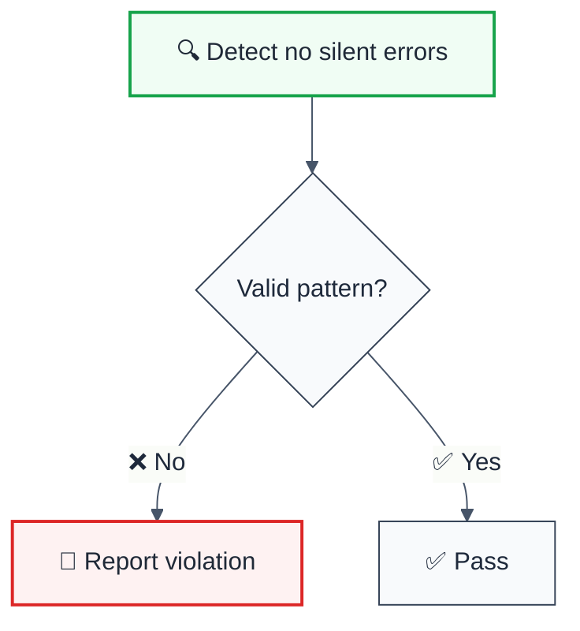

import { FalseNegativeCTA, WhenNotToUse, RuleBadges } from "@/components/RuleComponents";

<RuleBadges typeAware={false} typeAwareStatus="unaware" />

> **Keywords:** no silent errors, error-handling, ESLint rule, JavaScript, TypeScript, SonarQube RSPEC-1186

ESLint Rule: no-silent-errors with LLM-optimized suggestions and auto-fix capabilities.

## Quick Summary

| Aspect         | Details                                      |
| -------------- | -------------------------------------------- |
| **Severity**   | Error (code quality)                        |
| **Auto-Fix**   | ❌ No                                        |
| **Category**   | Error-handling |
| **ESLint MCP** | ✅ Optimized for ESLint MCP integration      |
| **Best For**   | Production applications                      |
| **Suggestions** | ✅ 4 available           |

## Rule Details




### Why This Matters

| Issue                | Impact                                | Solution                    |
| -------------------- | ------------------------------------- | --------------------------- |
| 🔒 **Security/Code Quality** | [Specific issue] | [Solution approach] |
| 🐛 **Maintainability** | [Impact] | [Fix] |
| ⚡ **Performance**   | [Impact] | [Optimization] |

## Configuration

**No configuration options available.**

## Examples

### ❌ Incorrect

```typescript
// Example of incorrect usage
```

### ✅ Correct

```typescript
// Example of correct usage
```

## Configuration Examples

### Basic Usage

```javascript
// eslint.config.mjs
export default [
  {
    rules: {
      'reliability/no-silent-errors': 'error',
    },
  },
];
```

## LLM-Optimized Output

```
🚨 no silent errors | Description | MEDIUM
   Fix: Suggestion | Reference
```

## Related Rules

- [`rule-name`](./rule-name.md) - Description

## Further Reading

- **[Reference](https://example.com)** - Description
<WhenNotToUse />

<FalseNegativeCTA />

## Known False Negatives

The following patterns are **not detected** due to static analysis limitations:

### Dynamic Variable References

**Why**: Static analysis cannot trace values stored in variables or passed through function parameters.

```typescript
// ❌ NOT DETECTED - Value from variable
const value = externalSource();
processValue(value); // Variable origin not tracked
```

**Mitigation**: Implement runtime validation and review code manually. Consider using TypeScript branded types for validated inputs.

### Wrapped or Aliased Functions

**Why**: Custom wrapper functions or aliased methods are not recognized by the rule.

```typescript
// ❌ NOT DETECTED - Custom wrapper
function myWrapper(data) {
  return internalApi(data); // Wrapper not analyzed
}
myWrapper(unsafeInput);
```

**Mitigation**: Apply this rule's principles to wrapper function implementations. Avoid aliasing security-sensitive functions.

### Imported Values

**Why**: When values come from imports, the rule cannot analyze their origin or construction.

```typescript
// ❌ NOT DETECTED - Value from import
import { getValue } from './helpers';
processValue(getValue()); // Cross-file not tracked
```

**Mitigation**: Ensure imported values follow the same constraints. Use TypeScript for type safety.