> **Keywords:** prototype pollution, [CWE-915](https://cwe.mitre.org/data/definitions/915.html), security, ESLint rule, object injection, bracket notation, property injection, auto-fix, LLM-optimized, code security
**CWE:** [CWE-74](https://cwe.mitre.org/data/definitions/74.html)  
**OWASP Mobile:** [OWASP Mobile Top 10](https://owasp.org/www-project-mobile-top-10/)

Detects `variable[key]` as a left- or right-hand assignment operand (prototype pollution). This rule is part of [`eslint-plugin-secure-coding`](https://www.npmjs.com/package/eslint-plugin-secure-coding) and provides LLM-optimized error messages with fix suggestions.

**🚨 Security rule** | **💡 Provides LLM-optimized guidance** | **⚠️ Set to error in `recommended`**

## Quick Summary

| Aspect            | Details                                                                          |
| ----------------- | -------------------------------------------------------------------------------- |
| **CWE Reference** | [CWE-915](https://cwe.mitre.org/data/definitions/915.html) (Prototype Pollution) |
| **Severity**      | Critical (security vulnerability)                                                |
| **Auto-Fix**      | ⚠️ Suggests fixes (manual application)                                           |
| **Category**      | Security                                                                         |
| **ESLint MCP**    | ✅ Optimized for ESLint MCP integration                                          |
| **Best For**      | All applications, especially those handling user input for object properties     |

## Vulnerability and Risk

**Vulnerability:** Object injection (specifically Prototype Pollution) occurs when user input is used to access or modify properties of an object, particularly using bracket notation (e.g., `obj[userInput]`) without validation.

**Risk:** Attackers can modify critical properties like `__proto__`, `constructor`, or `prototype`, affecting the behavior of all objects in the application. This can lead to Denial of Service (DoS), bypass of security checks, or even Remote Code Execution (RCE) depending on how the polluted properties are used.

## Rule Details

This rule detects dangerous use of bracket notation with dynamic property names that can lead to prototype pollution attacks.

```mermaid
%%{init: {
  'theme': 'base',
  'themeVariables': {
    'primaryColor': '#f8fafc',
    'primaryTextColor': '#1e293b',
    'primaryBorderColor': '#334155',
    'lineColor': '#475569',
    'c0': '#f8fafc',
    'c1': '#f1f5f9',
    'c2': '#e2e8f0',
    'c3': '#cbd5e1'
  }
}}%%
flowchart TD
    A[🔍 Detect Bracket Notation] --> B{Dynamic Property?}
    B -->|Yes| C[🚨 Prototype Pollution Risk]
    B -->|No| D[✅ Literal Property - Safe]

    C --> E{Dangerous Property?}
    E -->|__proto__| F[⚠️ Prototype Pollution]
    E -->|constructor| G[⚠️ Method Injection]
    E -->|Other| H[⚠️ Property Injection]

    F --> I[💡 Suggest Map/Object.create]
    G --> I
    H --> J[💡 Suggest whitelisting]

    I --> K[📝 LLM-Optimized Guidance]
    J --> K
```



## Error Message Format

The rule provides **LLM-optimized error messages** (Compact 2-line format) with actionable security guidance:

```text
🔒 [CWE-915](https://cwe.mitre.org/data/definitions/915.html) OWASP:A01 CVSS:9.8 | Object Injection detected | CRITICAL [SOC2,PCI-DSS,ISO27001]
   Fix: Review and apply the recommended fix | https://owasp.org/Top10/A01_2021/
```

### Message Components

| Component | Purpose | Example |
| :--- | :--- | :--- |
| **Risk Standards** | Security benchmarks | [CWE-915](https://cwe.mitre.org/data/definitions/915.html) [OWASP:A01](https://owasp.org/Top10/A01_2021-Injection/) [CVSS:9.8](https://nvd.nist.gov/vuln-metrics/cvss/v3-calculator?vector=AV:N/AC:L/PR:N/UI:N/S:U/C:H/I:H/A:H) |
| **Issue Description** | Specific vulnerability | `Object Injection detected` |
| **Severity & Compliance** | Impact assessment | `CRITICAL [SOC2,PCI-DSS,ISO27001]` |
| **Fix Instruction** | Actionable remediation | `Follow the remediation steps below` |
| **Technical Truth** | Official reference | [OWASP Top 10](https://owasp.org/Top10/A01_2021-Injection/) |

## Configuration

| Option                | Type       | Default                                     | Description                                 |
| --------------------- | ---------- | ------------------------------------------- | ------------------------------------------- |
| `allowLiterals`       | `boolean`  | `false`                                     | Allow bracket notation with literal strings |
| `additionalMethods`   | `string[]` | `[]`                                        | Additional object methods to check          |
| `dangerousProperties` | `string[]` | `['__proto__', 'prototype', 'constructor']` | Properties to consider dangerous            |

## Examples

### ❌ Incorrect

```typescript
// Prototype pollution - CRITICAL risk
obj[userInput] = value; // If userInput is "__proto__", pollutes all objects

// Constructor manipulation - HIGH risk
config[userKey] = func; // If userKey is "constructor", injects methods

// Property injection - MEDIUM risk
settings[dynamicKey] = data; // Uncontrolled property addition
```

### ✅ Correct

```typescript
// Use Map for dynamic key-value storage
const config = new Map<string, any>();
config.set(userKey, value);

// Use Object.create(null) for clean objects
const safeObj = Object.create(null);
safeObj[userKey] = value; // Safe because no prototype

// Property whitelisting
const ALLOWED_KEYS = ['name', 'age', 'email', 'role'];
if (ALLOWED_KEYS.includes(userKey)) {
  obj[userKey] = value;
}

// hasOwnProperty check
if (obj.hasOwnProperty(userKey)) {
  const value = obj[userKey]; // Safe access
}
```

## Prototype Pollution Prevention

### Understanding the Attack

```javascript
// Attacker controls userInput = "__proto__"
// This pollutes ALL objects in the application
obj[userInput] = { malicious: () => console.log('HACKED') };

// Now ALL objects have the malicious property
const innocent = {};
console.log(innocent.malicious); // Function exists!
```

### Safe Alternatives

1. **Map for Key-Value Storage**

   ```typescript
   const config = new Map<string, any>();
   config.set(userKey, value);
   const value = config.get(userKey);
   ```

2. **Object.create(null)**

   ```typescript
   const safeObject = Object.create(null); // No prototype
   safeObject[userKey] = value;
   ```

3. **Property Whitelisting**
   ```typescript
   const ALLOWED_PROPS = ['name', 'age', 'email'];
   if (ALLOWED_PROPS.includes(prop)) {
     obj[prop] = value;
   }
   ```

## Security Impact

### Prototype Pollution Attacks

```javascript
// Pollute Object.prototype
const obj = {};
obj[userInput] = maliciousFunction;
// If userInput = "__proto__", ALL objects are polluted

// Constructor injection
obj[userInput] = maliciousConstructor;
// If userInput = "constructor", object creation is compromised

// Property shadowing
Object.prototype[userInput] = maliciousValue;
// All property access can be manipulated
```

### Real-World Impact

- **Data Manipulation** - Alter application data structures
- **Method Injection** - Add malicious methods to all objects
- **Information Disclosure** - Access sensitive object properties
- **Denial of Service** - Break application functionality

## Migration Guide

### Phase 1: Discovery

```javascript
{
  rules: {
    'secure-coding/detect-object-injection': 'warn'
  }
}
```

### Phase 2: Replace Dynamic Access

```typescript
// Replace object access
obj[key] → use Map or whitelisting

// Replace assignments
obj[key] = value → map.set(key, value)
```

### Phase 3: Add Validation

```typescript
// Implement property validation
function isValidProperty(prop: string): boolean {
  const ALLOWED = ['name', 'value', 'type'];
  return ALLOWED.includes(prop) && !prop.startsWith('_');
}
```

### Phase 4: Secure Implementation

```typescript
// Use secure patterns
const config = new Map();
const safeObj = Object.create(null);
```

## Advanced Protection

### Deep Prototype Protection

```typescript
// Freeze prototypes (careful - affects entire application)
Object.freeze(Object.prototype);
Object.freeze(Array.prototype);

// Or use a security library
import { secureObject } from 'security-utils';
const safeObj = secureObject.create();
```

### Type-Safe Access

```typescript
// TypeScript: strict property access
interface SafeConfig {
  [key: string]: never; // No index signature
  name: string;
  value: number;
}

const config: SafeConfig = { name: '', value: 0 };
// config[userKey] = value; // TypeScript error!
```

## Testing Security

```typescript
// Test prototype pollution attempts
const pollutionAttempts = [
  '__proto__',
  'prototype',
  'constructor',
  '__defineGetter__',
  '__defineSetter__',
];

for (const prop of pollutionAttempts) {
  expect(() => {
    const obj = {};
    obj[prop] = 'malicious';
    return obj.hasOwnProperty('malicious');
  }).toBe(false); // Should not pollute
}
```

## Comparison with Alternatives

| Feature                           | detect-object-injection | eslint-plugin-security | eslint-plugin-sonarjs |
| --------------------------------- | ----------------------- | ---------------------- | --------------------- |
| **Prototype Pollution Detection** | ✅ Yes                  | ⚠️ Limited             | ⚠️ Limited            |
| **CWE Reference**                 | ✅ [CWE-915](https://cwe.mitre.org/data/definitions/915.html) included     | ⚠️ Limited             | ⚠️ Limited            |
| **LLM-Optimized**                 | ✅ Yes                  | ❌ No                  | ❌ No                 |
| **ESLint MCP**                    | ✅ Optimized            | ❌ No                  | ❌ No                 |
| **Fix Suggestions**               | ✅ Detailed             | ⚠️ Basic               | ⚠️ Basic              |

## Related Rules

- [`detect-eval-with-expression`](./detect-eval-with-expression.md) - Prevents code injection via eval()
- [`detect-child-process`](./detect-child-process.md) - Prevents command injection
- [`detect-non-literal-fs-filename`](./detect-non-literal-fs-filename.md) - Prevents path traversal
- [`no-unsafe-dynamic-require`](./no-unsafe-dynamic-require.md) - Prevents unsafe module loading
- [`detect-non-literal-regexp`](./detect-non-literal-regexp.md) - Prevents ReDoS attacks

## Known False Negatives

The following patterns are **not detected** due to static analysis limitations:

### Property from Variable

**Why**: Property names stored in variables not traced.

```typescript
// ❌ NOT DETECTED - Property from variable
const prop = userInput;
obj[prop] = value;
```

**Mitigation**: Validate keys before any bracket access.

### Nested Object Access

**Why**: Deep property chains not fully analyzed.

```typescript
// ❌ NOT DETECTED - Nested access
obj.nested[userKey] = value;
```

**Mitigation**: Apply whitelisting to all levels.

### Object.assign with Spread

**Why**: Spread of user objects may pollute.

```typescript
// ❌ NOT DETECTED - Object spread
const result = { ...userObject }; // May contain __proto__
```

**Mitigation**: Use safe merge utilities.

### JSON.parse Pollution

**Why**: Parsed JSON can introduce prototype keys.

```typescript
// ❌ NOT DETECTED - JSON pollution
const obj = JSON.parse(userJson); // May have __proto__
```

**Mitigation**: Use JSON.parse with reviver. Filter keys.

## Further Reading

- **[Prototype Pollution Attacks](https://portswigger.net/web-security/prototype-pollution)** - Prototype pollution guide
- **[JavaScript Prototype Security](https://developer.mozilla.org/en-US/docs/Web/JavaScript/Inheritance_and_the_prototype_chain)** - Prototype chain security
- **[CWE-915: Object Prototype Modification](https://cwe.mitre.org/data/definitions/915.html)** - Official CWE entry
- **[ESLint MCP Setup](https://eslint.org/docs/latest/use/mcp)** - Enable AI assistant integration
