import { FalseNegativeCTA, WhenNotToUse } from "@/components/RuleComponents";

> **Keywords:** no insecure redirects, security, ESLint rule, JavaScript, TypeScript, CWE-601

ESLint Rule: no-insecure-redirects. This rule is part of [`eslint-plugin-secure-coding`](https://www.npmjs.com/package/eslint-plugin-secure-coding).

## Quick Summary

| Aspect            | Details                                                                    |
| ----------------- | -------------------------------------------------------------------------- |
| **CWE Reference** | [CWE-601](https://cwe.mitre.org/data/definitions/601.html) (Open Redirect) |
| **Severity**      | Medium (security vulnerability)                                            |
| **Auto-Fix**      | ❌ No                                                                      |
| **Category**      | Security                                                                   |
| **ESLint MCP**    | ✅ Optimized for ESLint MCP integration                                    |
| **Best For**      | Web applications with redirection logic                                    |

## Vulnerability and Risk

**Vulnerability:** Insecure redirects (also known as Open Redirects) occur when an application redirects the user to a URL specified by untrusted user input without validation.

**Risk:** Attackers can redirect users to phishing sites (to steal credentials) or malicious sites (to download malware), leveraging the trust the user has in the original domain.

## Rule Details

```mermaid
%%{init: {
  'theme': 'base',
  'themeVariables': {
    'primaryColor': '#f8fafc',
    'primaryTextColor': '#1e293b',
    'primaryBorderColor': '#334155',
    'lineColor': '#475569',
    'c0': '#f8fafc',
    'c1': '#f1f5f9',
    'c2': '#e2e8f0',
    'c3': '#cbd5e1'
  }
}}%%
flowchart TD
    A[🔍 Detect no insecure redirects] --> B{Valid pattern?}
    B -->|❌ No| C[🚨 Report violation]
    B -->|✅ Yes| D[✅ Pass]

    classDef startNode fill:#f0fdf4,stroke:#16a34a,stroke-width:2px,color:#1f2937
    classDef errorNode fill:#fef2f2,stroke:#dc2626,stroke-width:2px,color:#1f2937

    class A startNode
    class C errorNode
```



### Why This Matters

| Issue                        | Impact           | Solution            |
| ---------------------------- | ---------------- | ------------------- |
| 🔒 **Security/Code Quality** | [Specific issue] | [Solution approach] |
| 🐛 **Maintainability**       | [Impact]         | [Fix]               |
| ⚡ **Performance**           | [Impact]         | [Optimization]      |

## Configuration

**No configuration options available.**

## Examples

### ❌ Incorrect

```typescript
// Example of incorrect usage
```

### ✅ Correct

```typescript
// Example of correct usage
```

## Configuration Examples

### Basic Usage

```javascript
// eslint.config.mjs
export default [
  {
    rules: {
      'secure-coding/no-insecure-redirects': 'error',
    },
  },
];
```

## LLM-Optimized Output

```
🚨 no insecure redirects | Description | MEDIUM
   Fix: Suggestion | Reference
```

## Related Rules

- [`rule-name`](./rule-name.md) - Description


<WhenNotToUse />

## Known False Negatives

<FalseNegativeCTA />

The following patterns are **not detected** due to static analysis limitations:

### Values from Variables

**Why**: Values stored in variables are not traced.

```typescript
// ❌ NOT DETECTED - Value from variable
const value = userInput;
dangerousOperation(value);
```

**Mitigation**: Validate all user inputs.

### Wrapper Functions

**Why**: Custom wrappers not recognized.

```typescript
// ❌ NOT DETECTED - Wrapper
myWrapper(userInput); // Uses dangerous API internally
```

**Mitigation**: Apply rule to wrapper implementations.

### Dynamic Invocation

**Why**: Dynamic calls not analyzed.

```typescript
// ❌ NOT DETECTED - Dynamic
obj[method](userInput);
```

**Mitigation**: Avoid dynamic method invocation.

## Further Reading

- **[OWASP Unvalidated Redirects Cheat Sheet](https://cheatsheetseries.owasp.org/cheatsheets/Unvalidated_Redirects_and_Forwards_Cheat_Sheet.html)** - Protection guide
- **[CWE-601: URL Redirection to Untrusted Site](https://cwe.mitre.org/data/definitions/601.html)** - Official CWE entry
