> **Keywords:** require secure defaults, security, ESLint rule, [CWE-1188](https://cwe.mitre.org/data/definitions/1188.html), secure-by-default, configuration, hardened
> **CWE:** [CWE-1188: Insecure Default Initialization](https://cwe.mitre.org/data/definitions/1188.html)  
> **OWASP Mobile:** [OWASP Mobile Top 10 M8: Security Misconfiguration](https://owasp.org/www-project-mobile-top-10/)

ESLint Rule: require-secure-defaults. This rule is part of [`eslint-plugin-secure-coding`](https://www.npmjs.com/package/eslint-plugin-secure-coding).

## Quick Summary

| Aspect         | Details                                 |
| -------------- | --------------------------------------- |
| **Severity**   | Medium (Security Hardening)             |
| **Auto-Fix**   | ❌ No (requires configuration review)   |
| **Category**   | Security / Configuration                |
| **ESLint MCP** | ✅ Optimized for ESLint MCP integration |
| **Best For**   | All applications                        |

## Vulnerability and Risk

**Vulnerability:** Insecure default initialization occurs when an application or its dependent libraries are configured with security features explicitly disabled (e.g., `secure: false`, `strictSSL: false`).

**Risk:** Software should be secure by default. Developers often disable security features during development and inadvertently leave these insecure settings in production code, leaving the application vulnerable to various attacks depending on the disabled feature.

## Error Message Format

The rule provides **LLM-optimized error messages** (Compact 2-line format) with actionable security guidance:

```text
🔒 CWE-1188 OWASP:M8 | Insecure secure defaults detected | MEDIUM [Hardening]
   Fix: Enforce "Secure by Default" principle; enable security features | https://cwe.mitre.org/data/definitions/1188.html
```

### Message Components

| Component                 | Purpose                | Example                                                                                                               |
| :------------------------ | :--------------------- | :-------------------------------------------------------------------------------------------------------------------- |
| **Risk Standards**        | Security benchmarks    | [CWE-1188](https://cwe.mitre.org/data/definitions/1188.html) [OWASP:M8](https://owasp.org/www-project-mobile-top-10/) |
| **Issue Description**     | Specific vulnerability | `Insecure secure defaults detected`                                                                                   |
| **Severity & Compliance** | Impact assessment      | `MEDIUM [Hardening]`                                                                                                  |
| **Fix Instruction**       | Actionable remediation | `Enforce "Secure by Default" principle`                                                                               |
| **Technical Truth**       | Official reference     | [Insecure Initialization](https://cwe.mitre.org/data/definitions/1188.html)                                           |

## Rule Details

This rule helps identify instances where common property names associated with security (like `secure`, `strictSSL`, `verify`) are explicitly set to `false`.

```mermaid
%%{init: {
  'theme': 'base',
  'themeVariables': {
    'primaryColor': '#f8fafc',
    'primaryTextColor': '#1e293b',
    'primaryBorderColor': '#334155',
    'lineColor': '#475569',
    'c0': '#f8fafc',
    'c1': '#f1f5f9',
    'c2': '#e2e8f0',
    'c3': '#cbd5e1'
  }
}}%%
flowchart TD
    A[Object Property] --> B{Key is 'secure', 'verify', etc?}
    B -->|Yes| C{Value is false?}
    C -->|Yes| D[🚨 Insecure Default Override]
    C -->|No| E[✅ Maintaining Secure State]
    B -->|No| F[🟡 Standard Configuration]
```



### Why This Matters

| Issue            | Impact                          | Solution                                                       |
| ---------------- | ------------------------------- | -------------------------------------------------------------- |
| 🛡️ **Hardening** | Weakened security posture       | Always use the most secure settings available                  |
| 🕵️ **Detection** | Insecure settings hidden in dev | Audit all configuration objects for security overrides         |
| 🚀 **Stability** | Features behave unexpectedly    | Use environment-specific configs with production-safe defaults |

## Configuration

This rule has no configuration options in the current version.

## Examples

### ❌ Incorrect

```javascript
// Disabling secure cookies
const sessionOptions = {
  cookie: {
    secure: false, // ❌ HIGH RISK
    httpOnly: true,
  },
};

// Disabling SSL validation in a request library
const clientOptions = {
  strictSSL: false, // ❌ HIGH RISK
  timeout: 5000,
};

// Disabling signature verification
const jwtConfig = {
  verify: false, // ❌ HIGH RISK
};
```

### ✅ Correct

```javascript
// Enabling secure cookies (default should be true)
const sessionOptions = {
  cookie: {
    secure: true,
    httpOnly: true,
  },
};

// Keeping SSL validation enabled
const clientOptions = {
  strictSSL: true,
  timeout: 5000,
};

// Enforcing JWT signature verification
const jwtConfig = {
  verify: true,
};
```

## Known False Negatives

The following patterns are **not detected** due to static analysis limitations:

### Non-Literal Values

**Why**: This rule only checks for explicit boolean `false` literals.

```javascript
const isDev = process.env.NODE_ENV === 'development';
const options = {
  secure: isDev ? false : true, // ❌ NOT DETECTED
};
```

**Mitigation**: Use environment-specific configuration files that are strictly audited.

### Unique Property Names

**Why**: Many libraries use custom names for their security settings.

**Mitigation**: Regularly audit the documentation for all sensitive libraries and ensure security-related settings are hardened.

## References

- [CWE-1188: Insecure Default Initialization](https://cwe.mitre.org/data/definitions/1188.html)
- [OWASP Secure Product Design - Secure by Default](https://owasp.org/www-project-secure-product-design/docs/Design_Principles#secure-by-default)
- [NIST Security by Design Principles](https://csrc.nist.gov/publications/detail/sp/800-160/vol-1/final)
