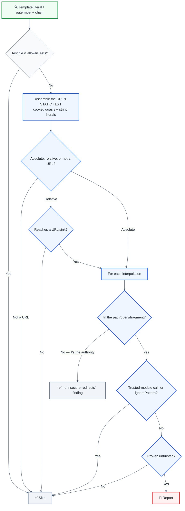

import { FalseNegativeCTA, WhenNotToUse, RuleBadges } from "@/components/RuleComponents";

<RuleBadges typeAware={false} typeAwareStatus="unaware" />

**CWE:** [CWE-116](https://cwe.mitre.org/data/definitions/116.html)  
**OWASP Mobile:** [M4: Insufficient Input/Output Validation](https://owasp.org/www-project-mobile-top-10/)

Detects unescaped URL parameters that can lead to Cross-Site Scripting (XSS) or open redirect vulnerabilities. This rule is part of [`eslint-plugin-browser-security`](https://www.npmjs.com/package/eslint-plugin-browser-security) and provides LLM-optimized error messages that AI assistants can automatically fix.

⚠️ This rule **_warns_** by default in the `recommended` config.

## Quick Summary

| Aspect            | Details                                                                         |
| ----------------- | ------------------------------------------------------------------------------- |
| **CWE Reference** | [CWE-79](https://cwe.mitre.org/data/definitions/79.html) (Cross-site Scripting) |
| **Severity**      | High (security vulnerability)                                                   |
| **Auto-Fix**      | ✅ Yes (suggests encodeURIComponent or URLSearchParams)                         |
| **Category**   | Security |
| **ESLint MCP**    | ✅ Optimized for ESLint MCP integration                                         |
| **Best For**      | All web applications constructing URLs, API clients, redirect handlers          |

## Vulnerability and Risk

**Vulnerability:** Constructing URLs by concatenating unescaped user input can allow attackers to inject special characters that alter the meaning of the URL.

**Risk:** This leads to multiple vulnerabilities:

- **Cross-Site Scripting (XSS):** If the URL is reflected in the page (e.g., `href`), attackers can inject `javascript:` URIs.
- **Open Redirect:** Attackers can redirect users to malicious sites if the input controls the domain or path.
- **Parameter Injection:** Attackers can inject additional query parameters to override settings.

## Error Message Format

The rule provides **LLM-optimized error messages** (Compact 2-line format) with actionable security guidance:

```text
⚠️ CWE-79 OWASP:A05 CVSS:6.1 | Cross-site Scripting (XSS) detected | MEDIUM [SOC2,PCI-DSS,GDPR,ISO27001]
   Fix: Review and apply the recommended fix | https://owasp.org/Top10/A05_2021/
```

### Message Components

| Component | Purpose | Example |
| :--- | :--- | :--- |
| **Risk Standards** | Security benchmarks | [CWE-79](https://cwe.mitre.org/data/definitions/79.html) [OWASP:A05](https://owasp.org/Top10/A05_2021-Injection/) [CVSS:6.1](https://nvd.nist.gov/vuln-metrics/cvss/v3-calculator?vector=AV%3AN%2FAC%3AL%2FPR%3AN%2FUI%3AN%2FS%3AU%2FC%3AH%2FI%3AH%2FA%3AH) |
| **Issue Description** | Specific vulnerability | `Cross-site Scripting (XSS) detected` |
| **Severity & Compliance** | Impact assessment | `MEDIUM [SOC2,PCI-DSS,GDPR,ISO27001]` |
| **Fix Instruction** | Actionable remediation | `Follow the remediation steps below` |
| **Technical Truth** | Official reference | [OWASP Top 10](https://owasp.org/Top10/A05_2021-Injection/) |

## Rule Details

Unescaped URL parameters can allow attackers to inject malicious code or manipulate URLs for phishing attacks. This rule detects URL construction patterns where user input is directly concatenated or interpolated without proper encoding.

### Why This Matters

| Issue                 | Impact                                 | Solution                     |
| --------------------- | -------------------------------------- | ---------------------------- |
| 🔒 **Security**       | XSS attacks via URL parameters         | Use encodeURIComponent       |
| 🐛 **Open Redirect**  | Phishing attacks via redirect URLs     | Validate and encode URLs     |
| 🔐 **Data Integrity** | Malformed URLs can break functionality | URLSearchParams              |
| 📊 **Compliance**     | Violates security best practices       | Always encode URL parameters |

## What the rule decides, and how

Two structural questions. Neither one looks at how anything is spelled.

### 1. Is this an **encoding position**?

The URL's static text is assembled from the template's cooked quasis and the
string literals of a `+` chain — the URL's *value*, not the expression's printed
source — and each interpolation is recorded at its offset in that text. A hole
counts only when it lands in the **path, query or fragment**.

A hole in the authority chooses the scheme or host. That is an open redirect
(CWE-601) and belongs to `no-insecure-redirects` / `require-url-validation`, so
`` `https://${host}/v1/status` `` is not reported here.

Absolute text (`https://…`, `//…`) is a URL wherever it is written. Relative
text (`/v1/items?…`) is only a URL once it reaches a sink — `fetch`, `new URL`,
`new Request`, `axios`/`ky`, `xhr.open(method, url)`, or a JSX `href`/`src`/
`action`/`formAction`/`poster` — resolved through one binding hop.

### 2. Is the value **untrusted**?

Proven, never guessed:

| Evidence | Example |
| --- | --- |
| a `location` read | `location.search`, `location['hash']`, `document.referrer` |
| a URL container read | `new URLSearchParams(location.search).get('q')`, `new URL(location.href).pathname` |
| a request member | `req.query.q`, `request.body.url` |
| a DOM read | `document.getElementById('q').value`, `event.target.value` in an installed handler, `ref.current.value` on a `useRef` |
| a form field | `new FormData(form).get('email')` |
| a parameter of an **exported** function | `export function build(term) {…}` |

An unknown call is opaque — a value passed *into* a function is not the value
that comes back out. That single rule is what makes `encodeURIComponent(q)`,
`qs.stringify(o)` and `input.toFixed(2)` clean without any of them being named.

### Deliberately NOT reported

- a parameter of a **module-private** helper — its call sites are in the file
- a parameter whose type is a closed set: `'asc' | 'desc'`, `number`, `boolean`
- arithmetic: `` `?page=${page + 1}` ``
- the same-origin parts of a URL: `location.origin`, `.protocol`, `.host`, and
  `const { origin } = new URL(location.href)`
- a shadowed global — a local `class URLSearchParams` is an in-memory map

## Examples

### ❌ Incorrect

```typescript
// A query value read back out of the address bar
const q = new URLSearchParams(location.search).get('q');
const url = `https://api.example.com/v1/search?q=${q}`; // ❌

// Text the user typed, off a resolved element
const field = document.getElementById('site-search');
const url = `https://api.example.com/v1/search?term=${field.value}`; // ❌

// An exported builder: its callers are outside this module
export function buildSearchUrl(term) {
  return `https://api.example.com/v1/search?term=${term}`; // ❌
}

// Concatenation, with the untrusted operand in TRAILING position
const url = 'https://internal.example.com/v1/report?filter=' + req.query.filter; // ❌

// A relative URL, once a sink makes it one
export function loadPage(slug) {
  return fetch(`/api/v1/pages?slug=${slug}`); // ❌
}
```

### ✅ Correct

```typescript
// Encode the component
const url = `https://api.example.com/v1/search?q=${encodeURIComponent(req.query.q)}`; // ✅

// Or build the query as an object and let URLSearchParams serialise it
const params = new URLSearchParams({ q: req.query.q, page: '2' });
const url = `https://api.example.com/v1/search?${params.toString()}`; // ✅

// Encode a path segment too — `../` and `%2e%2e` walk a route table
const url = `https://docs.example.com/v2/pages/${encodeURI(slug)}/content`; // ✅

// A number cannot carry a URL metacharacter
export function nextPageUrl(page) {
  return `https://api.example.com/v1/items?page=${page + 1}`; // ✅
}

// A closed set is knowable even across a module boundary
export function sortedUrl(direction: 'asc' | 'desc') {
  return `https://api.example.com/v1/items?sort=${direction}`; // ✅
}
```

## Configuration

```javascript
{
  rules: {
    'browser-security/no-unescaped-url-parameter': ['error', {
      allowInTests: false,                    // Allow in test files
      trustedLibraries: ['url', 'querystring'], // Module specifiers, resolved through imports
      ignorePatterns: []                     // Additional safe patterns to ignore
    }]
  }
}
```

## Options

| Option | Type | Default | Description |
| ------ | ---- | ------- | ----------- |
| `allowInTests` | `boolean` | `false` | Allow unescaped URL parameters in test files |
| `trustedLibraries` | `string[]` | `["url","querystring"]` | Modules whose exports produce already-encoded URL text |
| `ignorePatterns` | `string[]` | `[]` | Additional safe patterns to ignore |

## Rule Logic Flow




## Best Practices

### 1. Use encodeURIComponent for Query Parameters

```typescript
// ✅ Good - Encodes special characters
const query = 'hello world & more';
const url = `https://example.com?q=${encodeURIComponent(query)}`;
// Result: https://example.com?q=hello%20world%20%26%20more
```

### 2. Use URLSearchParams for Multiple Parameters

```typescript
// ✅ Good - Handles multiple parameters automatically
const params = new URLSearchParams({
  q: 'search term',
  page: '1',
  sort: 'date',
});
const url = `https://example.com?${params}`;
// Result: https://example.com?q=search+term&page=1&sort=date
```

### 3. Use encodeURI for Path Segments

```typescript
// ✅ Good - Encodes path segments (but preserves /)
const path = 'user/profile';
const url = `https://example.com/${encodeURI(path)}`;
// Result: https://example.com/user/profile
```

### 4. Validate Before Encoding

```typescript
// ✅ Good - Validate then encode
function buildRedirectUrl(input: string): string {
  // Validate URL format
  if (!input.startsWith('https://') && !input.startsWith('/')) {
    throw new Error('Invalid redirect URL');
  }
  // Encode if it's a relative path
  if (input.startsWith('/')) {
    return encodeURIComponent(input);
  }
  return input;
}
```

### 5. Use URL Constructor for Complex URLs

```typescript
// ✅ Good - URL constructor handles encoding automatically
const url = new URL('https://example.com');
url.searchParams.set('q', userInput);
url.searchParams.set('page', '1');
const finalUrl = url.toString(); // Automatically encoded
```

## Known false negatives

Deliberate, and each one is a place where the rule would otherwise be guessing.

### An object property

```typescript
const cfg = { q: location.search };
const url = `https://api.example.com/v1/s?q=${cfg.q}`; // ❌ NOT DETECTED
```

**Why:** property-level tracking is not implemented. **Mitigation:** encode at
the interpolation, which is where the contract lives anyway.

### A destructured part of a container

```typescript
const { pathname } = new URL(location.href);
const url = `https://api.example.com/v1/s?p=${pathname}`; // ❌ NOT DETECTED
```

**Why:** a pattern binds a *part* of the initialiser and the resolver cannot say
which part. The alternative — resolving every destructured name to the whole
initialiser — reported `const { origin } = new URL(location.href)`, which is the
one property that carries nothing an attacker chose.

### A parameter of a module-private helper

```typescript
function build(term) {
  return `https://api.example.com/v1/s?term=${term}`; // ❌ NOT DETECTED
}
```

**Why:** every call site is in this file, so the value is knowable here.
Reporting it would fire on every string builder in a codebase. **Mitigation:**
the rule reports at the *exported* boundary instead.

### A wrapper function

```typescript
const url = `https://api.example.com/v1/s?q=${sanitise(q)}`; // ❌ NOT DETECTED
```

**Why:** an unknown call is opaque in both directions — a value passed into a
function is not the value that comes back out. That is the same rule that makes
`encodeURIComponent(q)` clean, and it cannot be one-sided.

### A free identifier with no declaration

```typescript
const url = `https://api.example.com/v1/s?q=${searchParams.get('id')}`; // ❌ NOT DETECTED
```

**Why:** nothing proves `searchParams` is a `URLSearchParams` over inbound text.
The old rule reported this from the spelling `searchParams`, and reported
`const PARAM = 'static'` for the same reason.

## Related Rules

- [`no-unvalidated-user-input`](./no-unvalidated-user-input.md) - Detects unvalidated user input
- [`no-unsanitized-html`](./no-unsanitized-html.md) - Detects unsanitized HTML injection
- [`no-sql-injection`](./no-sql-injection.md) - Detects SQL injection vulnerabilities
- [`no-missing-cors-check`](./no-missing-cors-check.md) - Detects missing CORS validation

## Resources

- [CWE-79: Cross-site Scripting](https://cwe.mitre.org/data/definitions/79.html)
- [OWASP URL Validation Cheat Sheet](https://cheatsheetseries.owasp.org/cheatsheets/Input_Validation_Cheat_Sheet.html)
- [MDN: encodeURIComponent](https://developer.mozilla.org/en-US/docs/Web/JavaScript/Reference/Global_Objects/encodeURIComponent)
- [MDN: URLSearchParams](https://developer.mozilla.org/en-US/docs/Web/API/URLSearchParams)
- [OWASP Open Redirect Prevention](https://cheatsheetseries.owasp.org/cheatsheets/Unvalidated_Redirects_and_Forwards_Cheat_Sheet.html)