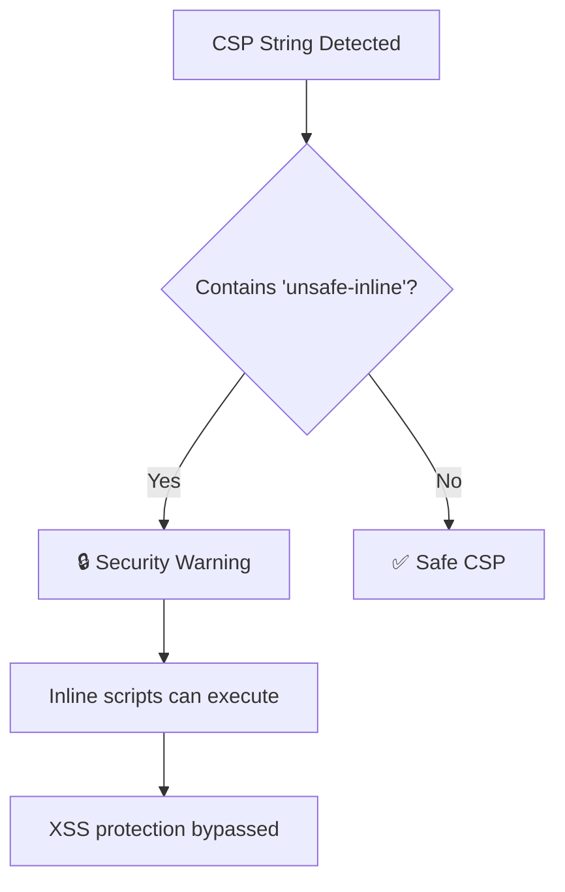

import { FalseNegativeCTA, WhenNotToUse } from "@/components/RuleComponents";

---
title: no-unsafe-inline-csp
description: "Disallow 'unsafe-inline' in Content Security Policy directives."
tags: ['security', 'browser']
category: security
severity: medium
cwe: CWE-79
owasp: "A03:2021"
autofix: false
---

> No Unsafe Inline Csp

Disallow 'unsafe-inline' in Content Security Policy directives.

Disallow 'unsafe-inline' in Content Security Policy directives.

## ⚠️ Security Issue

| Property     | Value                                                                          |
| ------------ | ------------------------------------------------------------------------------ |
| **CWE**      | [CWE-79: Cross-site Scripting](https://cwe.mitre.org/data/definitions/79.html) |
| **OWASP**    | A03:2021 - Injection                                                           |
| **CVSS**     | 7.5 (High)                                                                     |
| **Severity** | HIGH                                                                           |

## 📋 Description

The `'unsafe-inline'` CSP directive allows inline JavaScript and CSS, completely bypassing the protection CSP provides against XSS attacks. This is one of the most common CSP misconfigurations.

## 🔍 What This Rule Detects




## ❌ Incorrect

```javascript
// Literal string with unsafe-inline
const csp = "script-src 'unsafe-inline'";

// Template literal
const policy = `default-src 'self'; style-src 'unsafe-inline'`;

// In HTTP header
res.setHeader('Content-Security-Policy', "script-src 'unsafe-inline'");

// In meta tag content
const meta = { content: "script-src 'unsafe-inline'" };
```

## ✅ Correct

```javascript
// Use nonce-based approach
const csp = "script-src 'self' 'nonce-abc123'";

// Use hash-based approach
const policy = "script-src 'self' 'sha256-xxxxx'";

// Strict CSP without inline
res.setHeader('Content-Security-Policy', "default-src 'self'");
```

## 🛠️ Options

```json
{
  "rules": {
    "@interlace/browser-security/no-unsafe-inline-csp": [
      "error",
      {
        "allowInTests": true
      }
    ]
  }
}
```

| Option         | Type      | Default | Description                    |
| -------------- | --------- | ------- | ------------------------------ |
| `allowInTests` | `boolean` | `true`  | Disable the rule in test files |

## 💡 Why This Matters

CSP is one of the most effective defenses against XSS attacks. Using `'unsafe-inline'` completely undermines this protection by allowing any inline script to execute, which is exactly what CSP was designed to prevent.

### Alternatives to unsafe-inline:

1. **Nonces**: Generate a random nonce per request
2. **Hashes**: Calculate SHA hashes of allowed inline scripts
3. **External scripts**: Move inline scripts to external files

<WhenNotToUse />

<FalseNegativeCTA />

## Known False Negatives

The following patterns are **not detected** due to static analysis limitations:

### CSP from Variable

**Why**: CSP strings from variables not traced.

```typescript
// ❌ NOT DETECTED - CSP from variable
const cspValue = `script-src 'unsafe-inline'`;
res.setHeader('Content-Security-Policy', cspValue);
```

**Mitigation**: Use inline CSP strings in setHeader calls.

### CSP from Configuration

**Why**: Config values not visible.

```typescript
// ❌ NOT DETECTED - From config
const csp = config.contentSecurityPolicy; // May contain unsafe-inline
```

**Mitigation**: Validate CSP config values.

### Framework Abstractions

**Why**: Framework CSP helpers not analyzed.

```typescript
// ❌ NOT DETECTED - Helmet config
helmet({ contentSecurityPolicy: { scriptSrc: ["'unsafe-inline'"] } });
```

**Mitigation**: Review framework CSP configurations.

## 📚 Related Resources

- [MDN: Content-Security-Policy](https://developer.mozilla.org/en-US/docs/Web/HTTP/CSP)
- [OWASP: CSP Cheat Sheet](https://cheatsheetseries.owasp.org/cheatsheets/Content_Security_Policy_Cheat_Sheet.html)
- [CSP Evaluator](https://csp-evaluator.withgoogle.com/)

## Error Message Format

The rule provides **LLM-optimized error messages** (Compact 2-line format) with actionable security guidance:

```text
⚠️ CWE-79 OWASP:A05 CVSS:6.1 | Cross-site Scripting (XSS) detected | MEDIUM [SOC2,PCI-DSS,GDPR,ISO27001]
   Fix: Review and apply the recommended fix | https://owasp.org/Top10/A05_2021/
```

### Message Components

| Component | Purpose | Example |
| :--- | :--- | :--- |
| **Risk Standards** | Security benchmarks | [CWE-79](https://cwe.mitre.org/data/definitions/79.html) [OWASP:A05](https://owasp.org/Top10/A05_2021-Injection/) [CVSS:6.1](https://nvd.nist.gov/vuln-metrics/cvss/v3-calculator?vector=AV%3AN%2FAC%3AL%2FPR%3AN%2FUI%3AN%2FS%3AU%2FC%3AH%2FI%3AH%2FA%3AH) |
| **Issue Description** | Specific vulnerability | `Cross-site Scripting (XSS) detected` |
| **Severity & Compliance** | Impact assessment | `MEDIUM [SOC2,PCI-DSS,GDPR,ISO27001]` |
| **Fix Instruction** | Actionable remediation | `Follow the remediation steps below` |
| **Technical Truth** | Official reference | [OWASP Top 10](https://owasp.org/Top10/A05_2021-Injection/) |