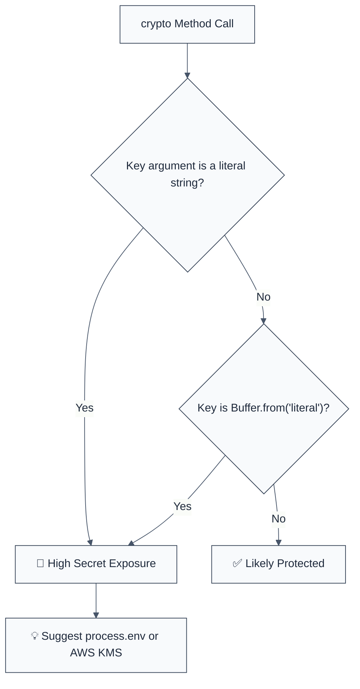

import { FalseNegativeCTA, WhenNotToUse, RuleBadges } from "@/components/RuleComponents";

<RuleBadges typeAware={false} typeAwareStatus="unaware" />

> **Keywords:** no-hardcoded-crypto-key, secrets management, KMS, environment variables, security, ESLint rule, CWE-321, key disclosure
> **CWE:** [CWE-321: Use of Hard-coded Cryptographic Key](https://cwe.mitre.org/data/definitions/321.html)  
> **OWASP:** [OWASP Top 10 A02:2021 - Cryptographic Failures](https://owasp.org/Top10/A02_2021-Cryptographic_Failures/)

## Quick Summary

| Aspect         | Details                                   |
| -------------- | ----------------------------------------- |
| **Severity**   | Critical (Secret Leakage)                 |
| **Auto-Fix**   | ❌ No (requires secrets migration)        |
| **Category**   | Security |
| **ESLint MCP** | ✅ Optimized for ESLint MCP integration   |
| **Best For**   | All applications handling encryption keys |

## Value & investment case

> Why this rule pays for itself. Framework: [`cicd-impact/philosophy.md`](../../../../cicd-impact/philosophy.md).

| Dimension | Value |
| :--- | :--- |
| **CWE** | [CWE-321](https://cwe.mitre.org/data/definitions/321.html) — Use of Hard-coded Cryptographic Key |
| **Feedback-loop tier** | Editor / pre-commit (sub-second) — cheapest layer per the [feedback-loop hierarchy](../../../../cicd-impact/philosophy.md#the-feedback-loop-hierarchy--why-a-high-end-static-analyzer-is-the-highest-leverage-investment) |
| **Defensive-layer leverage** | ~10× cheaper than unit-test · ~1,000× cheaper than production rollback · **10,000+× cheaper than disclosure** — cryptographic key leaks are retroactive: every prior message encrypted with the key is exposed ([cost-ratio anchors](../../../../cicd-impact/philosophy.md#deliverability-axis--quality-risk-and-ma-diligence)) |
| **Niche relevance** | **Critical:** fintech (PCI-DSS), healthtech (HIPAA), cybersecurity · **High:** B2B SaaS, infra/devtools · **Medium:** B2C, marketplaces · **Low:** gaming |
| **Investor-frame impact** | Hardcoded crypto key in version-controlled code = encryption permanently broken; rotation requires every prior message to be re-encrypted (often impossible). One catch at lint-time avoids the entire long-tailed disclosure exposure. |

**Read also:** [`philosophy.md` §investor-frame](../../../../cicd-impact/philosophy.md#the-investor-frame--engineering-efficiency-as-a-portfolio-metric) · [`niche-presets.json`](../../../../cicd-impact/data/niche-presets.json) · [`analyzer-evaluation-framework.md`](../../../../cicd-impact/analyzer-evaluation-framework.md)

## Vulnerability and Risk

**Vulnerability:** Embedding raw cryptographic keys directly in the source code as string literals or static buffers.

**Risk:** Hardcoded keys are permanent "backdoors" into your application's security. They are checked into version control (git), leaked in build artifacts, and become visible to anyone with read access to the repository or the deployed code. Revoking a hardcoded key requires a code deployment, which is slow and leaves past backups/versions vulnerable forever.

## Error Message Format

The rule provides **LLM-optimized error messages** (Compact 2-line format) with actionable security guidance:

```text
🔒 CWE-321 OWASP:A02 | Hardcoded Cryptographic Key detected | CRITICAL [SecretLeak]
   Fix: Move the key to a secure vault (KMS/Secrets Manager) or use environment variables | https://cwe.mitre.org/data/definitions/321.html
```

### Message Components

| Component                 | Purpose                | Example                                                                                                   |
| :------------------------ | :--------------------- | :-------------------------------------------------------------------------------------------------------- |
| **Risk Standards**        | Security benchmarks    | [CWE-321](https://cwe.mitre.org/data/definitions/321.html) [OWASP:A02](https://owasp.org/Top10/A02_2021/) |
| **Issue Description**     | Specific vulnerability | `Hardcoded Key detected`                                                                                  |
| **Severity & Compliance** | Impact assessment      | `CRITICAL [SecretLeak]`                                                                                   |
| **Fix Instruction**       | Actionable remediation | `Move to secure vault/KMS`                                                                                |
| **Technical Truth**       | Official reference     | [Use of Hard-coded Key](https://cwe.mitre.org/data/definitions/321.html)                                  |

## Rule Details

This rule identifies string literals or static `Buffer.from()` calls being passed into the `key` argument of `crypto.createCipheriv()` and `crypto.createDecipheriv()`.




### Why This Matters

| Issue                   | Impact                               | Solution                                                      |
| ----------------------- | ------------------------------------ | ------------------------------------------------------------- |
| 🛡️ **Git Exposure**     | Key leaked to entire dev team/actors | Use `.env` or CI/CD secrets that aren't committed to the repo |
| 🚀 **Ineffective Rev.** | Rotation requires code redeploy      | Use dynamic key loading from a vault for instant rotation     |
| 🔒 **Compliance**       | Violates SOC2/PCI-DSS/HIPAA          | Enforce KMS (AWS/GCP/Azure) for all cryptographic material    |

## Configuration

This rule has no options.

## Examples

### ❌ Incorrect

```javascript
// Hardcoded string as key (DANGEROUS)
const cipher = crypto.createCipheriv(
  'aes-256-gcm',
  'very-secret-hardcoded-key-123',
  iv,
);

// Hardcoded buffer literal
const key = Buffer.from('my-static-key-value');
const dc = crypto.createDecipheriv('aes-256-cbc', key, iv);
```

### ✅ Correct

```javascript
// Loading key from process environment
const key = Buffer.from(process.env.ENCRYPTION_KEY, 'hex');
const cipher = crypto.createCipheriv('aes-256-gcm', key, iv);

// Using a KMS client
const keyFromVault = await secretsManager.getKey('app-master-key');
const dc = crypto.createDecipheriv('aes-256-gcm', keyFromVault, iv);
```

<WhenNotToUse />

<FalseNegativeCTA />

## Known False Negatives

The following patterns are **not detected** due to static analysis limitations:

### Imported Constants

**Why**: If the key is imported from another file as a variable, this rule (which processes one file at a time) doesn't know it's hardcoded.

```javascript
import { KEY } from './config';
crypto.createCipheriv(algo, KEY, iv); // ❌ NOT DETECTED
```

**Mitigation**: Run security scans across the whole codebase and hunt for string literals in `config` or `constants` modules.

### Concatenated Literals

**Why**: If the key is built using `const key = 'part1' + 'part2'`, it may skip basic literal detection.

**Mitigation**: Avoid building secrets via string manipulation; load them as single atoms from your vault.

## References

- [CWE-321: Use of Hard-coded Cryptographic Key](https://cwe.mitre.org/data/definitions/321.html)
- [OWASP Secret Management Cheat Sheet](https://cheatsheetseries.owasp.org/cheatsheets/Secrets_Management_Cheat_Sheet.html)
- [Twelve-Factor App - Config](https://12factor.net/config)