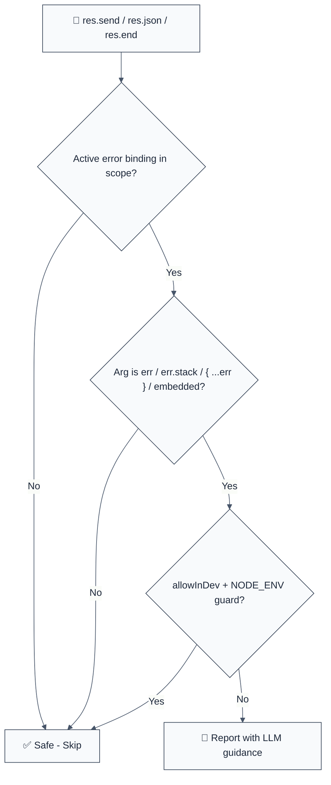

import { FalseNegativeCTA, WhenNotToUse, RuleBadges } from "@/components/RuleComponents";

<RuleBadges typeAware={false} typeAwareStatus="unaware" />

**CWE:** [CWE-209](https://cwe.mitre.org/data/definitions/209.html)  
**OWASP:** [A04:2021 – Insecure Design](https://owasp.org/Top10/A04_2021-Insecure_Design/)

Detects information exposure through error messages: sending a caught error — the raw error object, `err.stack`, a spread `{ ...err }`, or (optionally) `err.message` — to the HTTP client via `res.send()` / `res.json()` / `res.end()`. Stack traces reveal absolute paths, dependency versions and internal module layout; database driver errors leak query text, connection strings and hostnames. This rule is part of [`eslint-plugin-express-security`](https://www.npmjs.com/package/eslint-plugin-express-security) and provides LLM-optimized error messages.

**🚨 Security rule** | **💡 Provides LLM-optimized guidance** | **⚠️ Set to error in `recommended`**

## Quick Summary

| Aspect            | Details                                                                           |
| ----------------- | --------------------------------------------------------------------------------- |
| **CWE Reference** | [CWE-209](https://cwe.mitre.org/data/definitions/209.html) (Sensitive Error Info) |
| **Severity**      | 🟠 MEDIUM (information disclosure, reconnaissance channel)                        |
| **Auto-Fix**      | ❌ Not available (💡 suggestion: send a sanitized generic body)                   |
| **Category**      | Security                                                                          |
| **ESLint MCP**    | ✅ Optimized for ESLint MCP integration                                           |
| **Best For**      | Express route handlers, error middleware, error-first callbacks                   |

## Vulnerability and Risk

**Vulnerability:** Catch blocks and error middleware often echo the caught error straight back to the client (`res.status(500).send(err.stack)` or `res.json({ error: err })`). The response then carries internals that only operators should see.

**Risk:**

- **Reconnaissance:** Stack traces expose absolute file paths, framework versions and internal module layout — a free map for planning further attacks.
- **Credential leakage:** Driver errors routinely embed connection strings, hostnames and query text.
- **Enumeration:** Distinct error details let attackers distinguish "user not found" from "wrong password" and probe internal state.

## Rule Details

The rule tracks error identifiers introduced by `catch (err)` clauses (within the catch block) and by error-first callbacks / error middleware — functions whose FIRST parameter is named `err` or `error` (within the function body). A response-send call on `res` / `response` / `reply` (including chained `res.status(500).json(...)`) whose first argument exposes such a binding is reported.




## Error Message Format

The rule provides **LLM-optimized error messages** with actionable security guidance:

```text
🔒 CWE-209 | Error Details Exposed (CWE-209) | MEDIUM
   The HTTP response includes `err.stack`.
   Fix: Log the error server-side and respond with a generic body | https://cheatsheetseries.owasp.org/cheatsheets/Error_Handling_Cheat_Sheet.html
```

## Configuration

| Option         | Type      | Default | Description                                                      |
| :------------- | :-------- | :------ | :--------------------------------------------------------------- |
| `allowMessage` | `boolean` | `true`  | Allow `err.message` in responses (set `false` for strict policy) |
| `allowInDev`   | `boolean` | `false` | Allow error details inside an if-guard that checks `NODE_ENV`    |

### Example Configuration

```json
{
  "rules": {
    "express-security/no-error-details-in-response": [
      "error",
      {
        "allowMessage": false,
        "allowInDev": true
      }
    ]
  }
}
```

## Examples

### ❌ Incorrect

```typescript
// ❌ Raw stack trace to the client
app.use((err, req, res, next) => {
  res.status(500).send(err.stack);
});

// ❌ Error object serialised into JSON
try {
  await db.insertInvoice(req.body);
} catch (err) {
  res.status(500).json({ error: err, stack: err.stack });
}

// ❌ Spreading the caught error
try {
  await work();
} catch (err) {
  res.status(500).json({ ...err });
}

// ❌ Error-first callback passed raw
fs.readFile(path, (err, data) => {
  if (err) return res.status(500).send(err);
});
```

### ✅ Correct

```typescript
// ✅ Generic body + server-side logging with a correlation id
app.use((err, req, res, next) => {
  const incidentId = crypto.randomUUID();
  logger.error({ incidentId, err, path: req.path }, 'unhandled request error');
  res.status(500).json({ error: 'Internal Server Error', incidentId });
});

// ✅ err.message is allowed by default (human-readable, curated)
try {
  await work();
} catch (err) {
  res.status(400).json({ error: err.message });
}

// ✅ Delegate to the error middleware
try {
  res.json(await loadReport(req.params.id));
} catch (err) {
  next(err);
}
```

## Security Impact

| Vulnerability               | CWE | OWASP    | CVSS | Impact                             |
| --------------------------- | --- | -------- | ---- | ---------------------------------- |
| Sensitive Error Information | 209 | A04:2021 | 5.3  | Information disclosure             |
| Information Exposure        | 200 | A01:2021 | 5.3  | Internal system details leaked     |
| Debug Information (related) | 489 | A05:2021 | 7.5  | Reconnaissance for further attacks |

## Why This Matters

### Real-World Exploits

Verbose error pages are stage one of nearly every published web-app penetration report: a single stack trace identifies the ORM, its version, the file layout and often the database engine — narrowing exploit selection from thousands of candidates to a handful. Automated scanners specifically fingerprint Express apps by their default error output.

### Prevention Strategy

1. **Central error middleware:** One sanitizing handler; route code calls `next(err)`.
2. **Correlation ids:** Return a random incident id to the client; log the full error against it server-side.
3. **Strict mode:** Set `allowMessage: false` once messages are curated, so raw driver messages can't slip through.

<WhenNotToUse />

<FalseNegativeCTA />

## Known False Negatives

The following patterns are **not detected** due to static analysis limitations:

### Serialization wrappers

**Why**: The error is passed through a function call before sending.

```typescript
// ❌ NOT DETECTED
res.send(serialize(err));
```

### Computed member access

**Why**: `err['stack']` is not resolved.

```typescript
// ❌ NOT DETECTED
res.send(err['stack']);
```

### Renamed bindings

**Why**: Only the original catch/callback identifier is tracked.

```typescript
// ❌ NOT DETECTED
const failure = err;
res.send(failure.stack);
```

## Related Rules

- [`no-exposed-debug-endpoints`](./no-exposed-debug-endpoints) - Prevents exposed debug/admin routes.
- [`no-host-header-in-links`](./no-host-header-in-links) - Prevents Host-header poisoning of mailed links.
- [`no-sensitive-data-in-query`](./no-sensitive-data-in-query) - Prevents secrets in query strings.

## Further Reading

- **[CWE-209: Generation of Error Message Containing Sensitive Information](https://cwe.mitre.org/data/definitions/209.html)**
- **[OWASP: Error Handling Cheat Sheet](https://cheatsheetseries.owasp.org/cheatsheets/Error_Handling_Cheat_Sheet.html)**
- **[Express: Error handling best practices](https://expressjs.com/en/guide/error-handling.html)**

## ⚙️ Options

| Option | Type | Default | Description |
| ------ | ---- | ------- | ----------- |
| `allowMessage` | `boolean` | `true` | Allow err.message in responses |
| `allowInDev` | `boolean` | `false` | Allow error details inside an if-guard checking NODE_ENV |