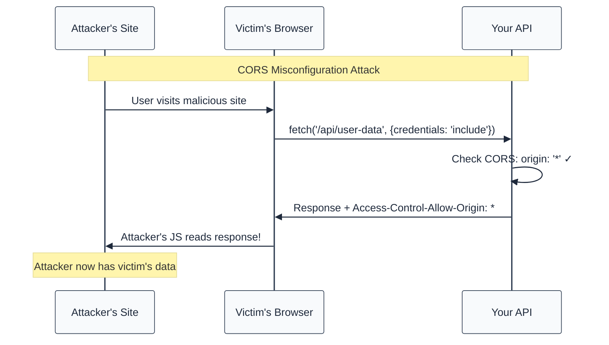
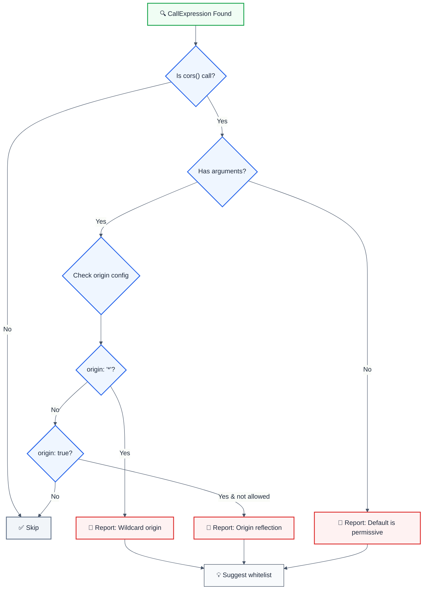

import { FalseNegativeCTA, WhenNotToUse } from "@/components/RuleComponents";

---
title: no-permissive-cors
description: Detects overly permissive CORS configurations in Express.js applications
tags: ['security', 'express']
category: security
severity: medium
cwe: CWE-942
autofix: false
---

> **Keywords:** CORS, cross-origin resource sharing, CWE-942, security, ESLint rule, origin validation, wildcard CORS, Access-Control-Allow-Origin, auto-fix, LLM-optimized

Detects overly permissive CORS configurations in Express.js applications

Detects overly permissive CORS configurations in Express.js applications. This rule is part of [`eslint-plugin-express-security`](https://www.npmjs.com/package/eslint-plugin-express-security) and provides LLM-optimized error messages.

⚠️ This rule **_errors_** by default in the `recommended` config.

## Quick Summary

| Aspect            | Details                                          |
| ----------------- | ------------------------------------------------ |
| **CWE Reference** | CWE-942 (Permissive Cross-domain Policy)         |
| **Severity**      | 🔴 High                                          |
| **Auto-Fix**      | ✅ Yes (suggests origin whitelist)               |
| **Category**   | Security |
| **Best For**      | Express.js APIs, REST services, web applications |

## Value & investment case

> Why this rule pays for itself. Framework: [`cicd-impact/philosophy.md`](../../../../cicd-impact/philosophy.md).

| Dimension | Value |
| :--- | :--- |
| **CWE** | [CWE-942](https://cwe.mitre.org/data/definitions/942.html) — Permissive Cross-domain Policy with Untrusted Domains |
| **Feedback-loop tier** | Editor / pre-commit (sub-second) — cheapest layer per the [feedback-loop hierarchy](../../../../cicd-impact/philosophy.md#the-feedback-loop-hierarchy--why-a-high-end-static-analyzer-is-the-highest-leverage-investment) |
| **Defensive-layer leverage** | ~10× cheaper than unit-test · ~1,000× cheaper than production rollback · 10,000+× cheaper than customer disclosure ([cost-ratio anchors](../../../../cicd-impact/philosophy.md#deliverability-axis--quality-risk-and-ma-diligence)) |
| **Niche relevance** | **Critical:** B2B SaaS (multi-tenant API surface), fintech (regulatory cross-origin restrictions) · **High:** B2C, marketplaces, healthtech · **Medium:** infra/devtools, gaming |
| **Investor-frame impact** | `Access-Control-Allow-Origin: *` with credentials → CSRF + cross-tenant data leakage. For B2B SaaS this is a single-incident multi-customer disclosure; for fintech, often a regulatory violation. Catch at lint-time prevents the misconfiguration entirely. |

**Read also:** [`philosophy.md` §investor-frame](../../../../cicd-impact/philosophy.md#the-investor-frame--engineering-efficiency-as-a-portfolio-metric) · [`niche-presets.json`](../../../../cicd-impact/data/niche-presets.json) · [`analyzer-evaluation-framework.md`](../../../../cicd-impact/analyzer-evaluation-framework.md)

## Vulnerability and Risk

**Vulnerability:** Misconfigured CORS policies using wildcard `*` origin or reflecting the `Origin` header without validation allow any website to access your API.

**Risk:** Attackers can create malicious websites that force users' browsers to make requests to your vulnerable API. Since browsers include cookies, attackers can steal sensitive data or perform unauthorized actions.

## How CORS Attacks Work




## Rule Logic Flow




## Detection Patterns

| Pattern                        | Risk        | Description                                  |
| ------------------------------ | ----------- | -------------------------------------------- |
| `origin: '*'`                  | 🔴 Critical | Allows any domain to access your API         |
| `origin: true`                 | 🔴 High     | Reflects request origin, allowing any domain |
| `cors()` (no args)             | 🟡 High     | Uses permissive defaults                     |
| `credentials: true` + wildcard | 🔴 Critical | Enables credential theft                     |

## Examples

### ❌ Incorrect

```javascript
import cors from 'cors';

// Wildcard origin - VULNERABLE
app.use(cors({ origin: '*' }));

// Reflect any origin - VULNERABLE
app.use(cors({ origin: true }));

// No options = permissive defaults - VULNERABLE
app.use(cors());

// Credentials with origin reflection - CRITICAL
app.use(
  cors({
    origin: true,
    credentials: true,
  }),
);
```

### ✅ Correct

```javascript
import cors from 'cors';

// Explicit whitelist - SAFE
app.use(
  cors({
    origin: ['https://app.example.com', 'https://admin.example.com'],
    credentials: true,
  }),
);

// Dynamic validation - SAFE
const allowedOrigins = ['https://app.example.com'];

app.use(
  cors({
    origin: (origin, callback) => {
      if (!origin || allowedOrigins.includes(origin)) {
        callback(null, true);
      } else {
        callback(new Error('Not allowed by CORS'));
      }
    },
    credentials: true,
  }),
);

// Environment-based configuration - SAFE
app.use(
  cors({
    origin: process.env.ALLOWED_ORIGINS?.split(',') || [],
    credentials: true,
  }),
);
```

## Error Message Format

The rule provides **LLM-optimized error messages** (Compact 2-line format) with actionable security guidance:

```text
🔒 CWE-942 OWASP:A01 CVSS:7.5 | CORS Misconfiguration detected | HIGH
   Fix: Review and apply the recommended fix | https://owasp.org/Top10/A01_2021/
```

### Message Components

| Component | Purpose | Example |
| :--- | :--- | :--- |
| **Risk Standards** | Security benchmarks | [CWE-942](https://cwe.mitre.org/data/definitions/942.html) [OWASP:A01](https://owasp.org/Top10/A01_2021-Injection/) [CVSS:7.5](https://nvd.nist.gov/vuln-metrics/cvss/v3-calculator?vector=AV%3AN%2FAC%3AL%2FPR%3AN%2FUI%3AN%2FS%3AU%2FC%3AH%2FI%3AH%2FA%3AH) |
| **Issue Description** | Specific vulnerability | `CORS Misconfiguration detected` |
| **Severity & Compliance** | Impact assessment | `HIGH` |
| **Fix Instruction** | Actionable remediation | `Follow the remediation steps below` |
| **Technical Truth** | Official reference | [OWASP Top 10](https://owasp.org/Top10/A01_2021-Injection/) |

## Configuration

```javascript
{
  rules: {
    "express-security/no-permissive-cors": ["error", {
      allowInTests: false,
      allowOriginTrue: false,
      allowedOrigins: []
    }]
  }
}
```

## Options

| Option            | Type       | Default | Description                                      |
| ----------------- | ---------- | ------- | ------------------------------------------------ |
| `allowInTests`    | `boolean`  | `false` | Allow permissive CORS in test files              |
| `allowOriginTrue` | `boolean`  | `false` | Allow `origin: true` for development             |
| `allowedOrigins`  | `string[]` | `[]`    | Allowed origins that should not trigger warnings |

## Best Practices

### 1. Use Environment Variables

```javascript
const allowedOrigins = process.env.ALLOWED_ORIGINS?.split(',') || [];

app.use(
  cors({
    origin: allowedOrigins,
    credentials: true,
  }),
);
```

### 2. Validate Origin Dynamically

```javascript
app.use(
  cors({
    origin: (origin, callback) => {
      // Allow requests with no origin (same-origin, Postman, etc.)
      if (!origin) return callback(null, true);

      if (allowedOrigins.includes(origin)) {
        callback(null, true);
      } else {
        callback(new Error('Not allowed by CORS'));
      }
    },
  }),
);
```

### 3. Different Origins for Dev/Prod

```javascript
const allowedOrigins =
  process.env.NODE_ENV === 'production'
    ? ['https://app.example.com']
    : ['http://localhost:3000', 'http://localhost:3001'];

app.use(cors({ origin: allowedOrigins }));
```

## Related Rules

- [`no-cors-credentials-wildcard`](./no-cors-credentials-wildcard.md) - Credentials with wildcard origin
- [`require-helmet`](./require-helmet.md) - Security headers

<WhenNotToUse />

<FalseNegativeCTA />

## Known False Negatives

The following patterns are **not detected** due to static analysis limitations:

### Options from Variable

**Why**: CORS options stored in variables are not analyzed.

```typescript
// ❌ NOT DETECTED - Options from variable
const corsOptions = { origin: '*' };
app.use(cors(corsOptions));
```

**Mitigation**: Use inline CORS options. Validate config at startup.

### Dynamic Origin Validation Flaws

**Why**: The logic inside origin validation functions is not analyzed.

```typescript
// ❌ NOT DETECTED - Flawed validation
app.use(
  cors({
    origin: (origin, cb) => {
      // Bug: Substring match allows evil.example.com
      if (origin?.includes('example.com')) {
        cb(null, true);
      }
    },
  }),
);
```

**Mitigation**: Use exact match with allowlist. Implement thorough URL validation.

### Spread Configuration

**Why**: Spread objects hide their configuration.

```typescript
// ❌ NOT DETECTED - Origin in spread
const base = { origin: '*' };
app.use(cors({ ...base }));
```

**Mitigation**: Avoid spreading CORS options. Define inline.

### Framework CORS Wrappers

**Why**: Framework-specific CORS middleware is not recognized.

```typescript
// ❌ NOT DETECTED - Custom CORS middleware
import { setCors } from '@my-framework/middleware';
app.use(setCors({ allowAll: true })); // Permissive!
```

**Mitigation**: Apply rule patterns to framework wrappers. Review framework docs.

### Late Configuration Change

**Why**: Configuration modified after initial setup is not tracked.

```typescript
// ❌ NOT DETECTED - Options modified later
const opts = { origin: ['https://safe.com'] };
if (process.env.DEV) opts.origin = '*'; // Dangerous override!
app.use(cors(opts));
```

**Mitigation**: Use immutable configuration. Validate at startup.

## Resources

- [CWE-942: Permissive Cross-domain Policy](https://cwe.mitre.org/data/definitions/942.html)
- [OWASP CORS Misconfiguration](https://owasp.org/www-community/attacks/CORS_OriginHeaderScrutiny)
- [MDN: Cross-Origin Resource Sharing](https://developer.mozilla.org/en-US/docs/Web/HTTP/CORS)
- [PortSwigger: CORS Security](https://portswigger.net/web-security/cors)