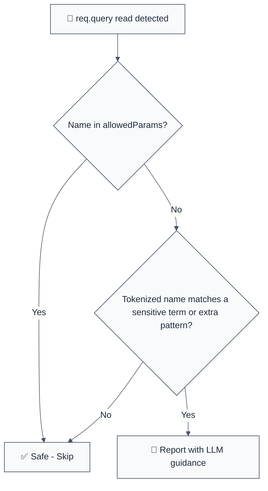

import { FalseNegativeCTA, WhenNotToUse, RuleBadges } from "@/components/RuleComponents";

<RuleBadges typeAware={false} typeAwareStatus="unaware" />

**CWE:** [CWE-598](https://cwe.mitre.org/data/definitions/598.html)  
**OWASP:** [A04:2021 – Insecure Design](https://owasp.org/Top10/A04_2021-Insecure_Design/)

Detects sensitive data carried in the URL query string: reading sensitive-named parameters from `req.query` — via member access (`req.query.password`) or destructuring (`const { password } = req.query`). Query strings land in access logs, proxy logs, browser history and the Referer header of every outbound link, so secrets must travel in a POST body or an Authorization header instead. This rule is part of [`eslint-plugin-express-security`](https://www.npmjs.com/package/eslint-plugin-express-security) and provides LLM-optimized error messages.

**🚨 Security rule** | **💡 Provides LLM-optimized guidance** | **⚠️ Set to error in `recommended`**

## Quick Summary

| Aspect            | Details                                                                              |
| ----------------- | ------------------------------------------------------------------------------------ |
| **CWE Reference** | [CWE-598](https://cwe.mitre.org/data/definitions/598.html) (Sensitive Query Strings) |
| **Severity**      | 🟠 MEDIUM (credential exposure through logs and history)                             |
| **Auto-Fix**      | ❌ Not available (💡 suggestion: move the value to the POST body)                    |
| **Category**      | Security                                                                             |
| **ESLint MCP**    | ✅ Optimized for ESLint MCP integration                                              |
| **Best For**      | Express / Koa route handlers, especially GET routes                                  |

## Vulnerability and Risk

**Vulnerability:** A GET request like `/login?username=alice&password=hunter2` works — and silently copies the password into every access log, proxy log, CDN log, the browser history, and the `Referer` header of any resource the response page loads.

**Risk:**

- **Log exposure:** Anyone with read access to web-server or proxy logs harvests credentials in bulk.
- **Referer leakage:** Third-party scripts and outbound links on the response page receive the full query string.
- **History and caching:** Secrets persist in browser history, bookmarks, and intermediary caches long after the session ends.

## Rule Details

The rule fires on the AST shape `<req>.query.<name>` (request objects `req` / `request` / `ctx`) and on object-pattern destructuring from `<req>.query`. Sensitivity is decided by **tokenizing** the parameter name (camelCase and snake_case both split) and matching whole tokens — so `api_token` and `accessToken` match `token`, while `author` does NOT match `auth` and `cardinality` does NOT match `card`.




Default sensitive terms: `password`, `token`, `secret`, `apiKey`, `api_key`, `auth`, `credential`, `ssn`, `card` (token-matched, trivial plurals included).

## Error Message Format

The rule provides **LLM-optimized error messages** with actionable security guidance:

```text
🔒 CWE-598 | Sensitive Data in Query String (CWE-598) | MEDIUM
   Query parameter 'password' is sensitive. Query strings are stored in access logs, proxy logs, browser history and leak via the Referer header.
   Fix: Move the value to the POST request body (req.body) or an Authorization header | https://cwe.mitre.org/data/definitions/598.html
```

## Configuration

| Option            | Type       | Default | Description                                                               |
| :---------------- | :--------- | :------ | :------------------------------------------------------------------------ |
| `sensitiveParams` | `string[]` | `[]`    | Additional sensitive parameter names (extends the defaults)               |
| `extraPatterns`   | `string[]` | `[]`    | Additional regex patterns (case-insensitive) matched against raw names    |
| `allowedParams`   | `string[]` | `[]`    | Parameter names explicitly allowed in the query (exact, case-insensitive) |

### Example Configuration

```json
{
  "rules": {
    "express-security/no-sensitive-data-in-query": [
      "error",
      {
        "sensitiveParams": ["pin", "session_id"],
        "extraPatterns": ["^x-"],
        "allowedParams": ["token"]
      }
    ]
  }
}
```

## Examples

### ❌ Incorrect

```typescript
// ❌ Credentials via GET query string
app.get('/login', async (req, res) => {
  const { username, password } = req.query;
  await authenticate(username, password);
});

// ❌ API token in the query string
app.get('/api/export', async (req, res) => {
  const apiToken = req.query.api_token;
  res.json(await exportAccountData(apiToken));
});

// ❌ Computed string-literal access is flagged too
const secret = req.query['secret'];
```

### ✅ Correct

```typescript
// ✅ Secrets travel in a POST body
app.post('/login', async (req, res) => {
  const { username, password } = req.body;
  await authenticate(username, password);
});

// ✅ Non-sensitive query fields are fine
const page = req.query.page;

// ✅ Route params are not query strings
const token = req.params.token;

// ✅ Dedicated verification-link route with allowedParams: ['token']
app.get('/verify-email', async (req, res) => {
  await verifyEmailToken(req.query.token);
  res.redirect('/verified');
});
```

## Security Impact

| Vulnerability           | CWE | OWASP    | CVSS | Impact                        |
| ----------------------- | --- | -------- | ---- | ----------------------------- |
| Sensitive Query Strings | 598 | A04:2021 | 6.5  | Credential exposure via logs  |
| Information Exposure    | 200 | A01:2021 | 5.3  | Secrets in history / Referer  |
| Insertion into Log File | 532 | A09:2021 | 5.5  | Long-lived credential records |

## Why This Matters

### Real-World Exploits

Query-string credential leaks are a staple of post-incident reports: access tokens in URLs have been harvested from CDN logs, analytics pipelines and `Referer` headers at major providers — the OAuth implicit flow was deprecated largely because tokens rode in URLs. Logs are typically retained for months and are readable by far more people than the credential store.

### Prevention Strategy

1. **POST for secrets:** Any credential, token or PII goes in the request body over HTTPS.
2. **Authorization header:** Bearer tokens belong in headers, which are not logged by default.
3. **Explicit allowlist:** Single-use, short-lived tokens on dedicated verification routes can be permitted via `allowedParams` — keep the list minimal.

<WhenNotToUse />

<FalseNegativeCTA />

## Known False Negatives

The following patterns are **not detected** due to static analysis limitations:

### Dynamic / computed access

**Why**: The parameter name is not statically known.

```typescript
// ❌ NOT DETECTED
const value = req.query[paramName];
```

### Aliased query objects

**Why**: Only direct `<req>.query` shapes are matched.

```typescript
// ❌ NOT DETECTED
const q = req.query;
const password = q.password;
```

### Non-standard request names

**Why**: Only `req` / `request` / `ctx` are recognized as request objects.

```typescript
// ❌ NOT DETECTED
const password = incoming.query.password;
```

## Related Rules

- [`no-error-details-in-response`](./no-error-details-in-response) - Prevents leaking stack traces.
- [`no-host-header-in-links`](./no-host-header-in-links) - Prevents Host-header poisoning of mailed links.
- [`no-user-controlled-redirect`](./no-user-controlled-redirect) - Prevents open redirects from request data.

## Further Reading

- **[CWE-598: Use of GET Request Method With Sensitive Query Strings](https://cwe.mitre.org/data/definitions/598.html)**
- **[OWASP: Information exposure through query strings in URL](https://owasp.org/www-community/vulnerabilities/Information_exposure_through_query_strings_in_url)**
- **[OWASP: Session Management Cheat Sheet](https://cheatsheetseries.owasp.org/cheatsheets/Session_Management_Cheat_Sheet.html)**

## ⚙️ Options

| Option | Type | Default | Description |
| ------ | ---- | ------- | ----------- |
| `sensitiveParams` | `string[]` | — | Additional sensitive parameter names (extends the defaults) |
| `extraPatterns` | `string[]` | — | Additional regex patterns (case-insensitive) matched against the raw parameter name |
| `allowedParams` | `string[]` | — | Parameter names explicitly allowed in the query string (exact, case-insensitive) |