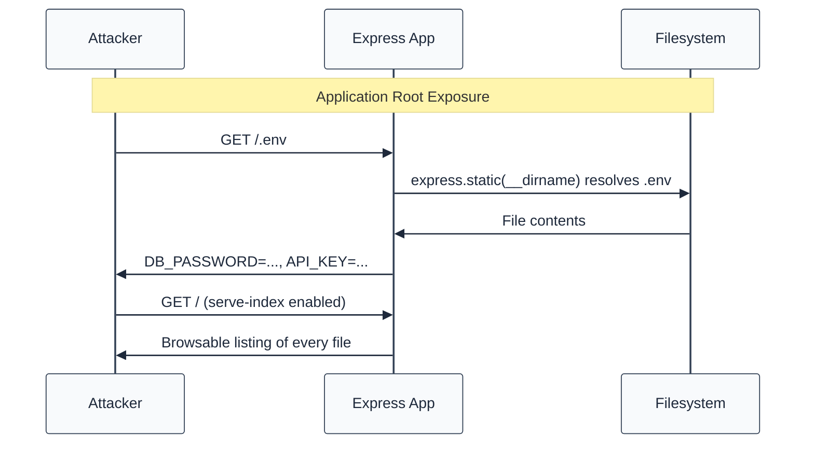
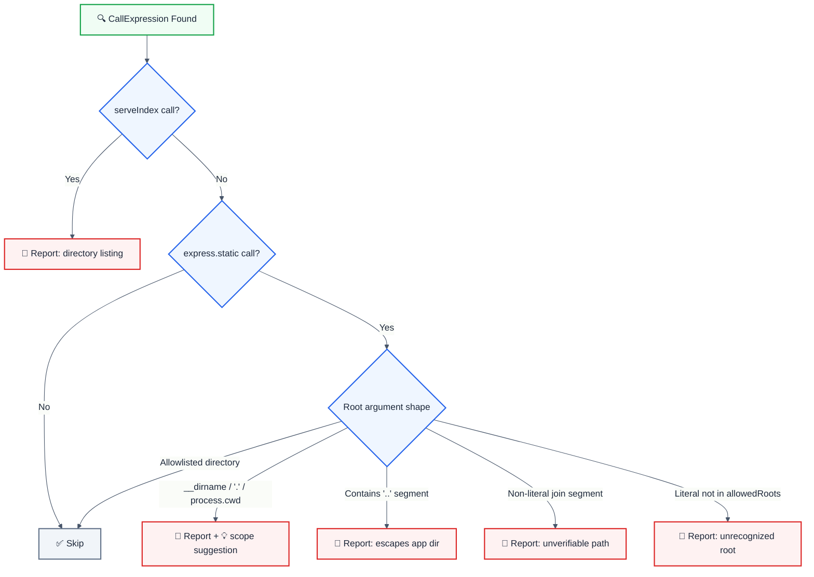

import { FalseNegativeCTA, WhenNotToUse, RuleBadges } from "@/components/RuleComponents";

<RuleBadges typeAware={false} typeAwareStatus="unaware" />

> **Keywords:** static files, express.static, serve-index, directory listing, CWE-548, information exposure, __dirname, path traversal, .env exposure, ESLint rule, LLM-optimized

Detects static-file middleware that serves the application root (`__dirname`, `'.'`, `process.cwd()`, `path.join(__dirname)` with no subdirectory or with `..` segments) and any use of `serve-index` directory listings. This rule is part of [`eslint-plugin-express-security`](https://www.npmjs.com/package/eslint-plugin-express-security) and provides LLM-optimized error messages.

⚠️ This rule **_errors_** by default in the `recommended` config.

## Quick Summary

| Aspect            | Details                                                             |
| ----------------- | ------------------------------------------------------------------- |
| **CWE Reference** | CWE-548 (Exposure of Information Through Directory Listing)         |
| **Severity**      | 🔴 High                                                             |
| **Auto-Fix**      | 💡 Suggestion (scopes the root to `path.join(__dirname, 'public')`) |
| **Category**      | Security                                                            |
| **Best For**      | Express.js apps serving static assets                               |

## Value & investment case

> Why this rule pays for itself. Framework: [`cicd-impact/philosophy.md`](../../../../cicd-impact/philosophy.md).

| Dimension                    | Value                                                                                                                                                                                                                                                                                                  |
| :--------------------------- | :----------------------------------------------------------------------------------------------------------------------------------------------------------------------------------------------------------------------------------------------------------------------------------------------------- |
| **CWE**                      | [CWE-548](https://cwe.mitre.org/data/definitions/548.html) — Exposure of Information Through Directory Listing                                                                                                                                                                                         |
| **Feedback-loop tier**       | Editor / pre-commit (sub-second) — cheapest layer per the [feedback-loop hierarchy](../../../../cicd-impact/philosophy.md#the-feedback-loop-hierarchy--why-a-high-end-static-analyzer-is-the-highest-leverage-investment)                                                                              |
| **Defensive-layer leverage** | ~10× cheaper than unit-test · ~1,000× cheaper than production rollback · 10,000+× cheaper than customer disclosure ([cost-ratio anchors](../../../../cicd-impact/philosophy.md#deliverability-axis--quality-risk-and-ma-diligence))                                                                    |
| **Niche relevance**          | **Critical:** any app with secrets in `.env` / config files (i.e. nearly all) · **High:** B2B SaaS, fintech (compliance exposure) · **Medium:** static marketing sites                                                                                                                                 |
| **Investor-frame impact**    | `express.static(__dirname)` publishes `.env`, `package-lock.json`, `.git` metadata and the server source itself — a one-line misconfiguration that equals a full credential + source-code leak. Directory listings hand attackers a filesystem map. Catch at lint-time prevents the incident entirely. |

**Read also:** [`philosophy.md` §investor-frame](../../../../cicd-impact/philosophy.md#the-investor-frame--engineering-efficiency-as-a-portfolio-metric) · [`niche-presets.json`](../../../../cicd-impact/data/niche-presets.json) · [`analyzer-evaluation-framework.md`](../../../../cicd-impact/analyzer-evaluation-framework.md)

## Vulnerability and Risk

**Vulnerability:** Pointing `express.static()` at the application root (or any path that resolves outside a dedicated asset directory) makes every file in the project publicly downloadable. Adding `serve-index` renders a browsable listing of them.

**Risk:** Attackers download `.env` (API keys, DB credentials), lockfiles (dependency fingerprinting for CVE targeting), `.git` internals (full source history), and the server source itself. This is a complete-compromise primitive that requires no exploit — just a URL.

## How the Attack Works




## Rule Logic Flow




## Detection Patterns

| Pattern                                    | Risk        | Description                             |
| ------------------------------------------ | ----------- | --------------------------------------- |
| `express.static(__dirname)`                | 🔴 Critical | Serves the entire application directory |
| `express.static('.')` / `('..')` / `('/')` | 🔴 Critical | Serves the app root or above            |
| `express.static(process.cwd())`            | 🔴 Critical | Serves the working directory            |
| `express.static(path.join(__dirname))`     | 🔴 Critical | Join with no subdirectory               |
| `path.join(__dirname, '..', 'shared')`     | 🔴 High     | `..` escapes the application directory  |
| `path.join(__dirname, dir)`                | 🟡 Medium   | Non-literal segment — unverifiable      |
| `path.join(__dirname, 'uploads')`          | 🟡 Medium   | Directory not in the allowlist          |
| `serveIndex(...)` (any arguments)          | 🔴 High     | Directory listing enabled               |

## Examples

### ❌ Incorrect

```javascript
const express = require('express');
const serveIndex = require('serve-index');
const path = require('path');

// Application root - VULNERABLE (.env, .git, source all public)
app.use(express.static(__dirname));

// Relative root / cwd - VULNERABLE
app.use(express.static('.'));
app.use(express.static(process.cwd()));

// Join without a subdirectory - VULNERABLE
app.use(express.static(path.join(__dirname)));

// Escaping the app directory - VULNERABLE
app.use(express.static(path.join(__dirname, '..', 'shared')));

// Directory listing - VULNERABLE
app.use(serveIndex('/', { icons: true }));
```

### ✅ Correct

```javascript
const express = require('express');
const path = require('path');

// Dedicated asset directory - SAFE
app.use(
  express.static(path.join(__dirname, 'public'), {
    index: 'index.html',
    dotfiles: 'ignore',
  }),
);

// Any allowlisted root - SAFE
app.use(express.static('public'));
app.use(express.static(path.join(__dirname, 'dist')));
app.use(express.static(path.join(process.cwd(), 'assets')));

// Custom directory via the allowedRoots option - SAFE
// { allowedRoots: ['www'] }
app.use(express.static(path.join(__dirname, 'www')));
```

## Error Message Format

The rule provides **LLM-optimized error messages** (Compact 2-line format) with actionable security guidance:

```text
🔒 CWE-548 | Application Root Served Statically (CWE-548) | HIGH
   Fix: Serve a dedicated asset directory instead: express.static(path.join(__dirname, 'public')) | https://cwe.mitre.org/data/definitions/548.html
```

### Message Components

| Component                 | Purpose                | Example                                                            |
| :------------------------ | :--------------------- | :----------------------------------------------------------------- |
| **Risk Standards**        | Security benchmarks    | [CWE-548](https://cwe.mitre.org/data/definitions/548.html)         |
| **Issue Description**     | Specific vulnerability | `Application Root Served Statically` / `Directory Listing Enabled` |
| **Severity & Compliance** | Impact assessment      | `HIGH` / `MEDIUM`                                                  |
| **Fix Instruction**       | Actionable remediation | `Serve a dedicated asset directory`                                |
| **Technical Truth**       | Official reference     | [CWE-548](https://cwe.mitre.org/data/definitions/548.html)         |

## Configuration

```javascript
{
  rules: {
    "express-security/no-static-root-exposure": ["error", {
      allowedRoots: ["public", "static", "dist", "build", "assets"]
    }]
  }
}
```

## Options

| Option         | Type       | Default                                           | Description                                                                                                                              |
| -------------- | ---------- | ------------------------------------------------- | ---------------------------------------------------------------------------------------------------------------------------------------- |
| `allowedRoots` | `string[]` | `['public', 'static', 'dist', 'build', 'assets']` | Directory names accepted as the first path segment of a static root (replaces the default set; the first entry seeds the fix suggestion) |

## Best Practices

### 1. One Dedicated Asset Directory

```javascript
app.use(
  express.static(path.join(__dirname, 'public'), {
    dotfiles: 'ignore',
    index: 'index.html',
  }),
);
```

### 2. Never Enable Directory Listings in Production

```javascript
// Serve an explicit index or a curated file list instead of serve-index
app.get('/files', (req, res) => res.json(CURATED_FILE_LIST));
```

### 3. Extend the Allowlist Instead of Disabling the Rule

```javascript
// eslint config — the team serves from www/
"express-security/no-static-root-exposure": ["error", { allowedRoots: ["www"] }]
```

## Related Rules

- [`no-exposed-debug-endpoints`](./no-exposed-debug-endpoints.md) - Debug surfaces left reachable
- [`require-helmet`](./require-helmet.md) - Security headers
- [`no-user-controlled-render-locals`](./no-user-controlled-render-locals.md) - Template object injection

<WhenNotToUse />

<FalseNegativeCTA />

## Known False Negatives

The following patterns are **not detected** due to static analysis limitations:

### Root Held in a Variable

**Why**: The rule does not resolve variables to their values (no taint analysis).

```typescript
// ❌ NOT DETECTED - Root behind a variable
const root = __dirname;
app.use(express.static(root));
```

**Mitigation**: Inline the root expression at the express.static() call site.

### Renamed or Destructured static

**Why**: Only the `express.static` member shape is matched.

```typescript
// ❌ NOT DETECTED - Destructured binding
const { static: serveStatic } = require('express');
app.use(serveStatic(__dirname));
```

**Mitigation**: Use the canonical `express.static(...)` form.

### serve-static Package

**Why**: The standalone `serve-static` package is a different module surface.

```typescript
// ❌ NOT DETECTED - serve-static used directly
const serveStatic = require('serve-static');
app.use(serveStatic(__dirname));
```

**Mitigation**: Prefer `express.static` (it wraps serve-static) so the rule can see the root.

### Computed Member Access

**Why**: `express['static']` and `path['join']` are computed accesses that are not matched.

```typescript
// ❌ NOT DETECTED - Computed access
app.use(express['static']('.'));
```

**Mitigation**: Avoid computed access for middleware factories.

## Resources

- [CWE-548: Exposure of Information Through Directory Listing](https://cwe.mitre.org/data/definitions/548.html)
- [OWASP A05:2021 – Security Misconfiguration](https://owasp.org/Top10/A05_2021-Security_Misconfiguration/)
- [Express: Serving static files](https://expressjs.com/en/starter/static-files.html)
- [serve-index on npm](https://www.npmjs.com/package/serve-index)