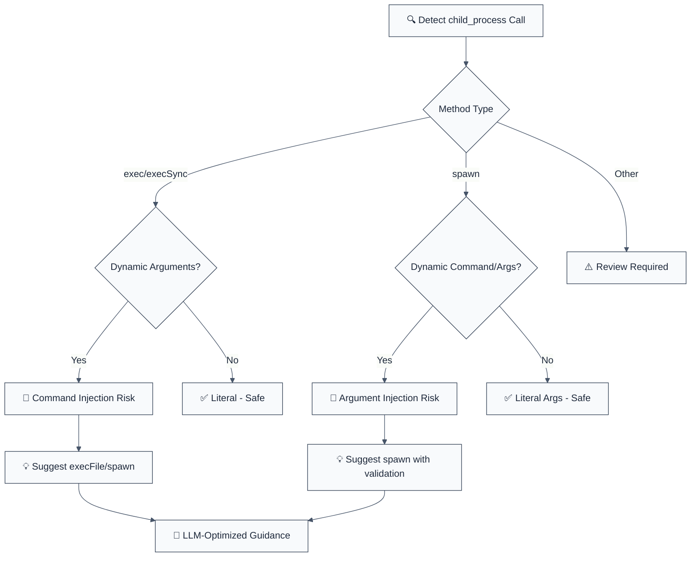

import { FalseNegativeCTA, WhenNotToUse, RuleBadges } from "@/components/RuleComponents";

<RuleBadges typeAware={false} typeAwareStatus="unaware" />

**CWE:** [CWE-693](https://cwe.mitre.org/data/definitions/693.html)  
**OWASP Mobile:** [OWASP Mobile Top 10](https://owasp.org/www-project-mobile-top-10/)

Detects instances of `child_process` & non-literal `exec()` calls that may allow command injection. This rule is part of [`eslint-plugin-node-security`](https://www.npmjs.com/package/eslint-plugin-node-security) and provides LLM-optimized error messages with fix suggestions.

**🚨 Security rule** | **💡 Provides LLM-optimized guidance** | **⚠️ Set to error in `recommended`**

## Quick Summary

| Aspect            | Details                                                                         |
| ----------------- | ------------------------------------------------------------------------------- |
| **CWE Reference** | [CWE-78](https://cwe.mitre.org/data/definitions/78.html) (OS Command Injection) |
| **Severity**      | Critical (security vulnerability)                                               |
| **Auto-Fix**      | ⚠️ Suggests fixes (manual application)                                          |
| **Category**   | Security |
| **ESLint MCP**    | ✅ Optimized for ESLint MCP integration                                         |
| **Best For**      | Node.js applications, deployment scripts, CI/CD tools                           |

## Vulnerability and Risk

**Vulnerability:** Unsafe execution of child processes occurs when user input is passed to functions like `exec`, `spawn`, or `execFile` without proper validation or sanitization.

**Risk:** An attacker can inject arbitrary shell commands (Command Injection), allowing them to execute malicious code on the server with the privileges of the Node.js process. This can lead to full system compromise, data exfiltration, or denial of service.

## Rule Details

This rule detects dangerous use of Node.js child_process methods that can lead to command injection attacks when user input reaches command execution.




### Two different findings

The rule reports **two distinct defects**, and it is worth knowing which one you are looking at because the fixes differ.

**CWE-78 — command injection (`childProcessCommandInjection`).** A shell sits between your command and the OS, so an attacker-steered value can start a *second* process with `;`, `|`, backticks or `$()`. This needs `exec`/`execSync`, an explicit `shell: true`, a shell binary (`sh`, `bash`, `cmd`, …), or an eval flag (`-c`, `-e`, `/c`). The fix is to remove the shell.

**CWE-88 — argument injection (`argumentInjection`).** No shell is involved and no second process can start, but the callee still parses its *own* options. An attacker-steered argv entry that begins with `-` becomes a flag:

```typescript
execFile('git', ['ls-remote', req.query.remote], cb);
// remote = "--upload-pack=touch /tmp/pwned"  → git runs it
```

`--to-command=` (tar), `-o ProxyCommand=` (ssh) and `--upload-file` (curl) are the same class. The rule is deliberately **binary-independent**: a per-program list of dangerous flags is a list of the exploits somebody already published, not of the ones that exist.

Two things end it, and both are recognised:

```typescript
// 1. POSIX end-of-options — everything after `--` is positional
execFile('git', ['ls-remote', '--', req.query.remote], cb);

// 2. The leading character is already fixed by the code
execFile('git', ['clone', `/srv/${req.body.name}`], cb);
```

## Error Message Format

The rule provides **LLM-optimized error messages** (Compact 2-line format) with actionable security guidance:

```text
🔒 CWE-78 OWASP:A05 CVSS:9.8 | OS Command Injection detected | CRITICAL [SOC2,PCI-DSS,ISO27001,NIST-CSF]
   Fix: Review and apply the recommended fix | https://owasp.org/Top10/A05_2021/
```

### Message Components

| Component | Purpose | Example |
| :--- | :--- | :--- |
| **Risk Standards** | Security benchmarks | [CWE-78](https://cwe.mitre.org/data/definitions/78.html) [OWASP:A05](https://owasp.org/Top10/A05_2021-Injection/) [CVSS:9.8](https://nvd.nist.gov/vuln-metrics/cvss/v3-calculator?vector=AV%3AN%2FAC%3AL%2FPR%3AN%2FUI%3AN%2FS%3AU%2FC%3AH%2FI%3AH%2FA%3AH) |
| **Issue Description** | Specific vulnerability | `OS Command Injection detected` |
| **Severity & Compliance** | Impact assessment | `CRITICAL [SOC2,PCI-DSS,ISO27001,NIST-CSF]` |
| **Fix Instruction** | Actionable remediation | `Follow the remediation steps below` |
| **Technical Truth** | Official reference | [OWASP Top 10](https://owasp.org/Top10/A05_2021-Injection/) |

## Configuration

| Option                | Type       | Default | Description                               |
| --------------------- | ---------- | ------- | ----------------------------------------- |
| `allowLiteralStrings` | `boolean`  | `false` | Allow exec() with literal strings         |
| `allowLiteralSpawn`   | `boolean`  | `false` | Allow spawn() with literal arguments      |
| `additionalMethods`   | `string[]` | `[]`    | Additional child_process methods to check |

## Examples

### ❌ Incorrect

```typescript
// Command injection - CRITICAL risk
const { exec } = require('child_process');
exec(`git clone ${userRepo}`, callback); // Attacker can inject: `repo}; rm -rf /;`

// Shell interpretation - HIGH risk
exec(`npm install ${packageName}`, callback); // Command chaining possible

// Synchronous execution - HIGH risk
execSync(`curl ${userUrl}`); // Blocking + injection risk

// Spawn with string command - MEDIUM risk
spawn('bash', ['-c', userCommand]); // Shell interpretation

// Dynamic spawn arguments - MEDIUM risk
spawn(userCommand, [userArg1, userArg2]); // Argument injection
```

### ✅ Correct

```typescript
const exec = myFunction; exec(command);
```

## Method Comparison

| Method       | Security Risk | Safe Usage              | Recommendation            |
| ------------ | ------------- | ----------------------- | ------------------------- |
| `exec()`     | HIGH          | Only with literals      | Avoid for user input      |
| `execSync()` | HIGH          | Only with literals      | Avoid for user input      |
| `execFile()` | LOW           | ✅ Safe with arrays     | Preferred for security    |
| `spawn()`    | MEDIUM        | ✅ Safe with validation | Good for complex commands |
| `execa`      | LOW           | ✅ Best practices       | Recommended library       |

## Security Impact

### Command Injection Attacks

```bash

# Resulting command: git clone repo}; rm -rf /; #
exec(`git clone ${userInput}`); // 💥 Server compromised
```

### Prevention Strategy

1. **Use Arrays** - Pass arguments as separate array elements
2. **Disable Shell** - Set `shell: false` option
3. **Validate Input** - Whitelist allowed characters/patterns
4. **Use Safe Libraries** - Prefer `execa` over native child_process
5. **Sanitize Paths** - Never allow `../` or absolute paths in commands

## Common Patterns & Fixes

### Git Operations

```typescript
// ❌ DANGEROUS
exec(`git clone ${repoUrl}`);

// ✅ SAFE
execFile('git', ['clone', repoUrl], { shell: false });
```

### Package Installation

```typescript
// ❌ DANGEROUS
exec(`npm install ${packageName}`);

// ✅ SAFE
execFile('npm', ['install', packageName], { shell: false });
```

### File Operations

```typescript
// ❌ DANGEROUS
exec(`tar -xzf ${archivePath}`);

// ✅ SAFE
execFile('tar', ['-xzf', archivePath], { shell: false });
```

### Dynamic Commands

```typescript
// ❌ DANGEROUS
exec(`${userCommand} ${userArgs}`);

// ✅ SAFE
const ALLOWED_COMMANDS = ['ls', 'cat', 'head'];
if (ALLOWED_COMMANDS.includes(userCommand)) {
  execFile(userCommand, [userArgs], { shell: false });
}
```

## Migration Guide

### Phase 1: Audit

```javascript
// Enable warnings first
{
  rules: {
    'node-security/detect-child-process': 'warn'
  }
}
```

### Phase 2: Replace exec() calls

```typescript
// Find all exec() usage
exec(command) → execFile(command, [], options)
exec(command + args) → execFile(command, [args], options)
```

### Phase 3: Add validation

```typescript
// Add input validation
function validateCommand(cmd: string): boolean {
  return /^[a-zA-Z0-9_-]+$/.test(cmd);
}
```

### Phase 4: Use safer libraries

```typescript
// Upgrade to execa
import execa from 'execa';
await execa('git', ['clone', repoUrl]);
```

## Advanced Configuration

### Allow Specific Patterns

```javascript
{
  rules: {
    'node-security/detect-child-process': ['error', {
      allowLiteralStrings: true,  // Allow exec('literal command')
      additionalMethods: ['fork'], // Also check fork() calls
    }]
  }
}
```

### Monorepo Setup

```javascript
// Root package.json scripts are usually safe
{
  rules: {
    'node-security/detect-child-process': ['error', {
      allowLiteralStrings: true,
      ignorePaths: ['scripts/**', 'tools/**']
    }]
  }
}
```

## Testing Security

```typescript
// Test command injection attempts
const injectionAttempts = [
  'repo}; rm -rf /; #',
  'repo`rm -rf /`',
  'repo$(rm -rf /)',
  'repo; curl evil.com',
  'repo && evil-command',
];

for (const attempt of injectionAttempts) {
  expect(() => safeClone(attempt)).toThrow();
}
```

## Comparison with Alternatives

| Feature                         | detect-child-process | eslint-plugin-security | eslint-plugin-node |
| ------------------------------- | -------------------- | ---------------------- | ------------------ |
| **Command Injection Detection** | ✅ Yes               | ⚠️ Limited             | ⚠️ Limited         |
| **CWE Reference**               | ✅ CWE-78 included   | ⚠️ Limited             | ⚠️ Limited         |
| **LLM-Optimized**               | ✅ Yes               | ❌ No                  | ❌ No              |
| **ESLint MCP**                  | ✅ Optimized         | ❌ No                  | ❌ No              |
| **Fix Suggestions**             | ✅ Detailed          | ⚠️ Basic               | ⚠️ Basic           |

## Related Rules

- [`detect-eval-with-expression`](./detect-eval-with-expression.md) - Prevents code injection via eval()
- [`detect-non-literal-fs-filename`](./detect-non-literal-fs-filename.md) - Prevents path traversal
- [`detect-object-injection`](./detect-object-injection.md) - Prevents prototype pollution
- [`detect-non-literal-regexp`](./detect-non-literal-regexp.md) - Prevents ReDoS attacks

<WhenNotToUse />

<FalseNegativeCTA />

## Known False Negatives

The following patterns are **not detected** due to static analysis limitations:

### Command from Variable

**Why**: Command strings stored in variables are not traced.

```typescript
// ❌ NOT DETECTED - Command from variable
const cmd = `git clone ${userInput}`;
exec(cmd);
```

**Mitigation**: Build commands only with validated, literal parts.

### Aliased child_process

**Why**: Aliased imports not recognized.

```typescript
// ❌ NOT DETECTED - Aliased import
const cp = require('child_process');
cp.exec(userCommand);
```

**Mitigation**: Use standard import names. Apply rule to wrappers.

### Wrapper Functions

**Why**: Custom wrappers around exec not analyzed.

```typescript
// ❌ NOT DETECTED - Wrapper function
runCommand(userInput); // Uses exec internally
```

**Mitigation**: Apply rule to wrapper implementations.

### Environment Variable Injection

**Why**: env options with user data not checked.

```typescript
// ❌ NOT DETECTED - Env injection
execFile('cmd', [], { env: { PATH: userInput } });
```

**Mitigation**: Validate all environment variable values.

## Further Reading

- **[OWASP Command Injection](https://owasp.org/www-community/attacks/Command_Injection)** - Command injection attack guide
- **[Node.js Child Process Security](https://nodejs.org/api/child_process.html#child_process_security)** - Node.js child_process security
- **[CWE-78: OS Command Injection](https://cwe.mitre.org/data/definitions/78.html)** - Official CWE entry
- **[Execa Library](https://github.com/sindresorhus/execa)** - Safer child process execution
- **[ESLint MCP Setup](https://eslint.org/docs/latest/use/mcp)** - Enable AI assistant integration

## ⚙️ Options

| Option | Type | Default | Description |
| ------ | ---- | ------- | ----------- |
| `allowLiteralStrings` | `boolean` | `false` | Allow exec() with literal strings |
| `allowLiteralSpawn` | `boolean` | `false` | Allow spawn() with literal arguments |
| `additionalMethods` | `string[]` | `[]` | Additional child_process methods to check |
| `taintSources` | `string[]` | `["req","request","ctx","event","process"]` | Identifier roots treated as attacker-reachable (default: req, request, ctx, event, process) |
| `reportUnresolvedCommands` | `boolean` | `false` | Report a command whose provenance cannot be resolved. Restores the pre-inversion "any dynamic argument is dangerous" behaviour. |

## Not a finding

Shapes this rule deliberately stays quiet on, and why. Each is measured, not assumed.

| Code | Why it is silent |
| --- | --- |
| `spawn('ls')` | A literal command names the binary. Nothing a request sends can change which program runs. |
| `var cp = require('child_process');`<br />`function fn () { var cp = /re/; cp.exec(s); }` | The inner `cp` is a RegExp. The module binding is resolved through scope analysis, not matched by name, so an inner declaration of the same name does not inherit the alias. |
| `function run (cp, req) { cp.exec(req.query.q); }` | `cp` is a parameter. Whatever it is, it is not the module. |
| `cp.exec(process.env.DEPLOY_CMD)` | Environment configuration is set by whoever runs the process, not by a request. Set `taintSources` if your threat model differs. |

**If it fires and you disagree**, the useful question is which of the two halves is
wrong: the sink (is this really `child_process`?) or the taint (can a request reach that
argument?). `reportUnresolvedCommands` turns on the stricter "any dynamic argument"
behaviour if you would rather triage more.