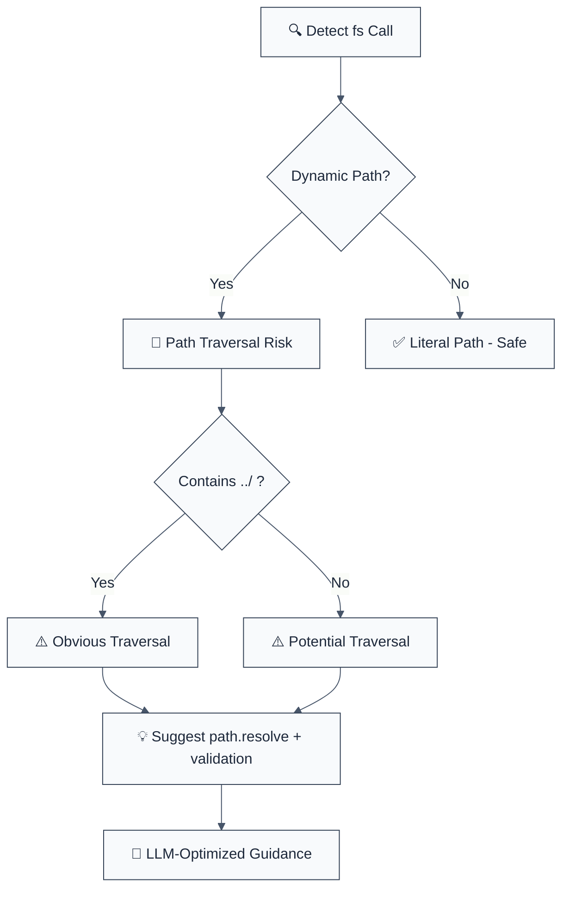

import { FalseNegativeCTA, WhenNotToUse } from "@/components/RuleComponents";

---
title: detect-non-literal-fs-filename
description: Detects variable in filename argument of fs calls, which might allow an attacker to access anything on your system
tags: ['security', 'node']
category: security
severity: medium
cwe: CWE-22
autofix: false
---

> **Keywords:** path traversal, CWE-22, security, ESLint rule, file system, fs module, directory traversal, file access, auto-fix, LLM-optimized, code security

Detects variable in filename argument of fs calls, which might allow an attacker to access anything on your system

**CWE:** [CWE-693](https://cwe.mitre.org/data/definitions/693.html)  
**OWASP Mobile:** [OWASP Mobile Top 10](https://owasp.org/www-project-mobile-top-10/)

Detects variable in filename argument of fs calls, which might allow an attacker to access anything on your system. This rule is part of [`eslint-plugin-node-security`](https://www.npmjs.com/package/eslint-plugin-node-security) and provides LLM-optimized error messages with fix suggestions.

**🚨 Security rule** | **💡 Provides LLM-optimized guidance** | **⚠️ Set to error in `recommended`**

## Quick Summary

| Aspect            | Details                                                                   |
| ----------------- | ------------------------------------------------------------------------- |
| **CWE Reference** | [CWE-22](https://cwe.mitre.org/data/definitions/22.html) (Path Traversal) |
| **Severity**      | High (security vulnerability)                                             |
| **Auto-Fix**      | ⚠️ Suggests fixes (manual application)                                    |
| **Category**   | Security |
| **ESLint MCP**    | ✅ Optimized for ESLint MCP integration                                   |
| **Best For**      | Node.js applications, file processing systems, file upload handlers       |

## Value & investment case

> Why this rule pays for itself. Framework: [`cicd-impact/philosophy.md`](../../../../cicd-impact/philosophy.md).

| Dimension | Value |
| :--- | :--- |
| **CWE** | [CWE-22](https://cwe.mitre.org/data/definitions/22.html) — Improper Limitation of a Pathname to a Restricted Directory (Path Traversal) |
| **Feedback-loop tier** | Editor / pre-commit (sub-second) — cheapest layer per the [feedback-loop hierarchy](../../../../cicd-impact/philosophy.md#the-feedback-loop-hierarchy--why-a-high-end-static-analyzer-is-the-highest-leverage-investment) |
| **Defensive-layer leverage** | ~10× cheaper than unit-test · ~1,000× cheaper than production rollback · 10,000+× cheaper than customer disclosure ([cost-ratio anchors](../../../../cicd-impact/philosophy.md#deliverability-axis--quality-risk-and-ma-diligence)) |
| **Niche relevance** | **Critical:** infra/devtools, B2B SaaS handling user uploads, fintech (document storage) · **High:** healthtech (medical-record file access), marketplaces · **Medium:** B2C |
| **Investor-frame impact** | Path traversal → unauthorized file access (configs, source code, secrets) or unauthorized writes (overwriting system files). Single bug class that often escalates to full system compromise; catch at lint-time is the cheapest possible defense. |

**Read also:** [`philosophy.md` §investor-frame](../../../../cicd-impact/philosophy.md#the-investor-frame--engineering-efficiency-as-a-portfolio-metric) · [`niche-presets.json`](../../../../cicd-impact/data/niche-presets.json) · [`analyzer-evaluation-framework.md`](../../../../cicd-impact/analyzer-evaluation-framework.md)

## Vulnerability and Risk

**Vulnerability:** Using non-literal (dynamic) values for filesystem operations (like opening, reading, or writing files) without strict validation allows users to control file paths.

**Risk:** Attackers can manipulate file paths to access files outside the intended directory (Path Traversal), overwriting critical system files, or disclosing sensitive information (like configuration files or source code).

## Rule Details

This rule detects dangerous use of Node.js fs methods with dynamic paths that can lead to path traversal attacks (also known as directory traversal).




## Error Message Format

The rule provides **LLM-optimized error messages** (Compact 2-line format) with actionable security guidance:

```text
🔒 CWE-22 OWASP:A01 CVSS:7.5 | Path Traversal detected | HIGH [SOC2,PCI-DSS,HIPAA,ISO27001]
   Fix: Review and apply the recommended fix | https://owasp.org/Top10/A01_2021/
```

### Message Components

| Component | Purpose | Example |
| :--- | :--- | :--- |
| **Risk Standards** | Security benchmarks | [CWE-22](https://cwe.mitre.org/data/definitions/22.html) [OWASP:A01](https://owasp.org/Top10/A01_2021-Injection/) [CVSS:7.5](https://nvd.nist.gov/vuln-metrics/cvss/v3-calculator?vector=AV%3AN%2FAC%3AL%2FPR%3AN%2FUI%3AN%2FS%3AU%2FC%3AH%2FI%3AH%2FA%3AH) |
| **Issue Description** | Specific vulnerability | `Path Traversal detected` |
| **Severity & Compliance** | Impact assessment | `HIGH [SOC2,PCI-DSS,HIPAA,ISO27001]` |
| **Fix Instruction** | Actionable remediation | `Follow the remediation steps below` |
| **Technical Truth** | Official reference | [OWASP Top 10](https://owasp.org/Top10/A01_2021-Injection/) |

## Configuration

| Option              | Type       | Default | Description                    |
| ------------------- | ---------- | ------- | ------------------------------ |
| `allowLiterals`     | `boolean`  | `false` | Allow literal string paths     |
| `additionalMethods` | `string[]` | `[]`    | Additional fs methods to check |

## Examples

### ❌ Incorrect

```typescript
// Path traversal - HIGH risk
const { readFile } = require('fs');
readFile(userPath, callback); // Attacker can access ../../../etc/passwd

// Directory traversal - HIGH risk
fs.readdir(userDir, callback); // Can list any directory

// File creation - MEDIUM risk
fs.writeFile(userFile, data, callback); // Can write anywhere
```

### ✅ Correct

```typescript
fs.readFile("/path/to/file.txt", callback);
```

## Path Traversal Prevention

### Basic Protection

```typescript
const path = require('path');

// ❌ Vulnerable
fs.readFile(userInput, callback);

// ✅ Protected
const safePath = path.resolve(SAFE_DIR, userInput);
if (!safePath.startsWith(SAFE_DIR)) {
  return callback(new Error('Invalid path'));
}
fs.readFile(safePath, callback);
```

### Advanced Protection

```typescript
function securePath(baseDir: string, userPath: string): string {
  const resolved = path.resolve(baseDir, userPath);

  // Check if resolved path is within base directory
  if (!resolved.startsWith(baseDir)) {
    throw new Error('Path traversal detected');
  }

  // Additional security: remove any remaining ..
  const normalized = path.normalize(resolved);
  if (normalized.includes('..')) {
    throw new Error('Invalid path segments');
  }

  return resolved;
}
```

## Common Attack Vectors

| Attack            | Example Input                   | Result               |
| ----------------- | ------------------------------- | -------------------- |
| Basic traversal   | `../../../etc/passwd`           | Access system files  |
| Windows traversal | `....\\....\\windows\\system32` | Access Windows files |
| Encoded traversal | `%2e%2e%2f%2e%2e%2fetc/passwd`  | URL-encoded attack   |
| Unicode traversal | `..\\u002f..\\u002fetc/passwd`  | Unicode bypass       |

## Method-Specific Guidance

### File Reading (`readFile`, `readFileSync`)

- Use `path.basename()` to strip directory components
- Combine with safe base directory
- Validate file extensions if needed

### File Writing (`writeFile`, `writeFileSync`)

- Same as reading, but consider separate write directories
- Check disk space and file size limits
- Validate file types on upload

### Directory Operations (`readdir`, `stat`)

- Always resolve and validate directory paths
- Check directory existence and permissions
- Consider rate limiting for directory listings

### Stream Operations (`createReadStream`, `createWriteStream`)

- Apply same path validation as regular file operations
- Be careful with relative paths in streams
- Validate stream destinations

## Security Best Practices

### Directory Structure

```
project/
├── uploads/        # User uploads (read-only from here)
├── public/         # Public files
├── temp/          # Temporary files
└── user-data/     # User-specific data
```

### Path Validation

```typescript
class SecurePath {
  constructor(private baseDir: string) {}

  resolve(userPath: string): string {
    const resolved = path.resolve(this.baseDir, userPath);

    // Security checks
    if (!resolved.startsWith(this.baseDir)) {
      throw new Error('Path traversal attempt');
    }

    // Remove dangerous segments
    const normalized = path.normalize(resolved);
    if (normalized.includes('..') || normalized.includes('\0')) {
      throw new Error('Invalid path');
    }

    return resolved;
  }
}
```

## Migration Guide

### Phase 1: Discovery

```javascript
{
  rules: {
    'node-security/detect-non-literal-fs-filename': 'warn'
  }
}
```

### Phase 2: Implementation

```typescript
// Add security utilities
const SECURE_PATHS = {
  uploads: path.join(__dirname, 'uploads'),
  public: path.join(__dirname, 'public'),
  temp: path.join(__dirname, 'temp')
};

// Replace unsafe calls
fs.readFile(userPath) → fs.readFile(securePath.resolve(userPath))
```

### Phase 3: Testing

```typescript
// Test path traversal attempts
const attacks = [
  '../../../etc/passwd',
  '..\\..\\windows\\system32',
  '....//....//etc/passwd',
];

for (const attack of attacks) {
  expect(() => securePath.resolve(attack)).toThrow();
}
```

## Comparison with Alternatives

| Feature                      | detect-non-literal-fs-filename | eslint-plugin-security | eslint-plugin-node |
| ---------------------------- | ------------------------------ | ---------------------- | ------------------ |
| **Path Traversal Detection** | ✅ Yes                         | ⚠️ Limited             | ⚠️ Limited         |
| **CWE Reference**            | ✅ CWE-22 included             | ⚠️ Limited             | ⚠️ Limited         |
| **LLM-Optimized**            | ✅ Yes                         | ❌ No                  | ❌ No              |
| **ESLint MCP**               | ✅ Optimized                   | ❌ No                  | ❌ No              |
| **Fix Suggestions**          | ✅ Detailed                    | ⚠️ Basic               | ⚠️ Basic           |

## Related Rules

- [`detect-eval-with-expression`](./detect-eval-with-expression.md) - Prevents code injection via eval()
- [`detect-child-process`](./detect-child-process.md) - Prevents command injection
- [`detect-object-injection`](./detect-object-injection.md) - Prevents prototype pollution
- [`detect-non-literal-regexp`](./detect-non-literal-regexp.md) - Prevents ReDoS attacks

<WhenNotToUse />

<FalseNegativeCTA />

## Known False Negatives

The following patterns are **not detected** due to static analysis limitations:

### Path from Variable

**Why**: Path strings from variables not traced.

```typescript
// ❌ NOT DETECTED - Path from variable
const filePath = userInput;
fs.readFile(filePath);
```

**Mitigation**: Validate and sanitize all paths.

### Indirect Path Construction

**Why**: Complex path building not analyzed.

```typescript
// ❌ NOT DETECTED - Indirect
const path = buildPath(base, userInput);
fs.readFile(path);
```

**Mitigation**: Use path whitelisting.

### Custom FS Wrappers

**Why**: FS wrappers not recognized.

```typescript
// ❌ NOT DETECTED - Wrapper
fileManager.read(userPath);
```

**Mitigation**: Apply rule to wrapper implementations.

## Further Reading

- **[OWASP Path Traversal](https://owasp.org/www-community/attacks/Path_Traversal)** - Path traversal attack guide
- **[Node.js File System Security](https://nodejs.org/api/fs.html#file-system)** - Node.js fs module security
- **[CWE-22: Path Traversal](https://cwe.mitre.org/data/definitions/22.html)** - Official CWE entry
- **[ESLint MCP Setup](https://eslint.org/docs/latest/use/mcp)** - Enable AI assistant integration