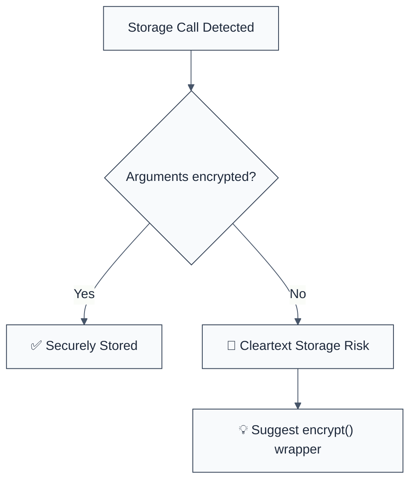

import { FalseNegativeCTA, WhenNotToUse, RuleBadges } from "@/components/RuleComponents";

<RuleBadges typeAware={false} typeAwareStatus="unaware" />

## Quick Summary

| Aspect         | Details                                 |
| -------------- | --------------------------------------- |
| **Severity**   | High (Data at Rest Exposure)            |
| **Auto-Fix**   | ❌ No (requires encryption logic)       |
| **Category**   | Security |
| **ESLint MCP** | ✅ Optimized for ESLint MCP integration |
| **Best For**   | Applications storing PII or tokens      |

## Vulnerability and Risk

**Vulnerability:** Cleartext storage of sensitive information occurs when data is written to persistent storage (files, databases, local storage) without being encrypted first.

**Risk:** If the storage medium is compromised (e.g., stolen device, unauthorized file access, backup leak), attackers can read sensitive data like passwords, session tokens, or PII directly.

## Error Message Format

The rule provides **LLM-optimized error messages** (Compact 2-line format) with actionable security guidance:

```text
🔒 CWE-312 OWASP:M2 | Missing Storage Encryption detected | HIGH [DataAtRest]
   Fix: Wrap sensitive data in an encryption function before calling setItem/writeFile | https://cwe.mitre.org/data/definitions/312.html
```

### Message Components

| Component                 | Purpose                | Example                                                                                                             |
| :------------------------ | :--------------------- | :------------------------------------------------------------------------------------------------------------------ |
| **Risk Standards**        | Security benchmarks    | [CWE-312](https://cwe.mitre.org/data/definitions/312.html) [OWASP:M2](https://owasp.org/www-project-mobile-top-10/) |
| **Issue Description**     | Specific vulnerability | `Missing Storage Encryption detected`                                                                               |
| **Severity & Compliance** | Impact assessment      | `HIGH [DataAtRest]`                                                                                                 |
| **Fix Instruction**       | Actionable remediation | `Wrap data in an encryption function`                                                                               |
| **Technical Truth**       | Official reference     | [Cleartext Storage](https://cwe.mitre.org/data/definitions/312.html)                                                |

## Rule Details

This rule flags `writeFile`/`writeFileSync`/`appendFile`/`appendFileSync` calls that put a credential on disk without an encryption wrapper around the value. Client storage (`localStorage`, `sessionStorage`, `AsyncStorage`) belongs to [`require-secure-credential-storage`](./require-secure-credential-storage); the two rules used to share both receivers and reported every match twice.




### Why This Matters

| Issue                | Impact                                 | Solution                                                |
| -------------------- | -------------------------------------- | ------------------------------------------------------- |
| 🕵️ **Data Exposure** | Physical access leads to data leak     | Encrypt data before writing to disk                     |
| 🚀 **Exfiltration**  | Stored tokens can be stolen and reused | Use authenticated encryption (AES-GCM)                  |
| 🔒 **Compliance**    | Failure to meet GDPR/SOC2 requirements | Implement encryption at rest for all sensitive datasets |

## Configuration

This rule has no configuration options in the current version.

## Examples

### ❌ Incorrect

```javascript
// Writing sensitive data to a file without encryption
fs.writeFile('user_data.json', JSON.stringify(userData));

// Writing a token to disk in cleartext
fs.writeFileSync('session_token.txt', token);
```

### ✅ Correct

```javascript
const x = 42;
```

<WhenNotToUse />

<FalseNegativeCTA />

## Known False Negatives

The following patterns are **not detected** due to static analysis limitations:

### Custom Storage Methods

**Why**: This rule specifically looks for `setItem` and `writeFile`. Custom wrappers or database `save()` methods are not analyzed.

**Mitigation**: Standardize on a few secure storage utilities and audit them centrally.

### Weak Encryption

**Why**: This rule only checks for the _presence_ of a function call containing "encrypt". It does not verify the strength of the algorithm used.

**Mitigation**: Use a trusted crypto library and follow the Node Security Crypto Standard (planned).

## References

- [CWE-312: Cleartext Storage of Sensitive Information](https://cwe.mitre.org/data/definitions/312.html)
- [OWASP Secure Storage Cheat Sheet](https://cheatsheetseries.owasp.org/cheatsheets/Insecure_Storage_Cheat_Sheet.html)

## Not a finding

This rule owns the **filesystem**. Client storage — `localStorage`, `sessionStorage`,
`AsyncStorage` — belongs to
[`require-secure-credential-storage`](./require-secure-credential-storage). Both
require evidence that what is being stored is a credential:

| Code | Why it is silent |
| --- | --- |
| `fs.writeFile(sitemapPath, sitemap)` | A write, but nothing says a credential is in it. |
| `fs.writeFileSync('creds.json', encrypt(password))` | Encrypted on the way out. |
| `const key = fs.readFileSync(path.join(__dirname, './ssl.key'))` | A read, not a write — and reading a TLS key at startup is how TLS works. `key` on its own is deliberately not treated as evidence. |

**If it fires**, either the filename or the value named a credential. If that name is
misleading — a variable called `tokenizer`, say — renaming it is the better fix than a
disable comment, because the next reader will make the same mistake the rule did.