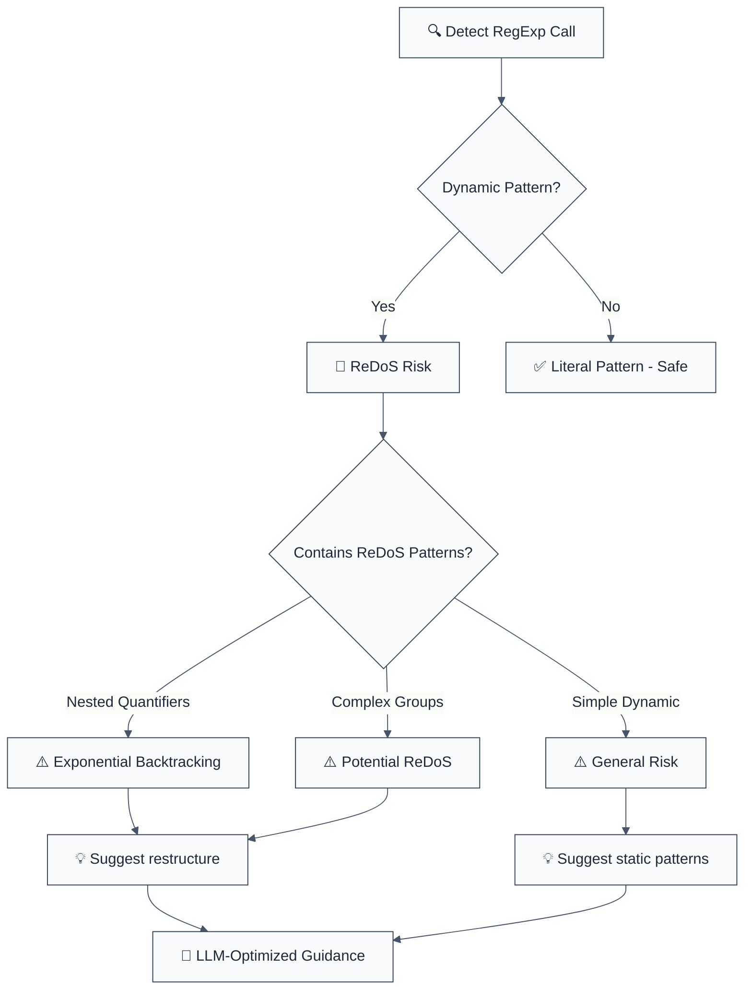

import { FalseNegativeCTA, WhenNotToUse, RuleBadges } from "@/components/RuleComponents";

<RuleBadges typeAware={false} typeAwareStatus="unaware" />

> **Keywords:** ReDoS, CWE-400, security, ESLint rule, regular expression denial of service, RegExp, regex injection, performance, auto-fix, LLM-optimized, code security

Detects RegExp(variable), which might allow an attacker to DOS your server with a long-running regular expression

**CWE:** [CWE-693](https://cwe.mitre.org/data/definitions/693.html)  
**OWASP Mobile:** [OWASP Mobile Top 10](https://owasp.org/www-project-mobile-top-10/)

Detects `RegExp(variable)`, which might allow an attacker to DOS your server with a long-running regular expression. This rule is part of [`eslint-plugin-secure-coding`](https://www.npmjs.com/package/eslint-plugin-secure-coding) and provides LLM-optimized error messages with fix suggestions.

**🚨 Security rule** | **💡 Provides LLM-optimized guidance** | **⚠️ Set to error in `recommended`**

## Quick Summary

| Aspect            | Details                                                                                                   |
| ----------------- | --------------------------------------------------------------------------------------------------------- |
| **CWE Reference** | [CWE-400](https://cwe.mitre.org/data/definitions/400.html) (ReDoS - Regular Expression Denial of Service) |
| **Severity**      | High (performance/security issue)                                                                         |
| **Auto-Fix**      | ⚠️ Suggests fixes (manual application)                                                                    |
| **Category**   | Security |
| **ESLint MCP**    | ✅ Optimized for ESLint MCP integration                                                                   |
| **Best For**      | Applications processing user input with regex, validation libraries                                       |

## Value & investment case

> Why this rule pays for itself. Framework: [`cicd-impact/philosophy.md`](../../../../cicd-impact/philosophy.md).

| Dimension | Value |
| :--- | :--- |
| **CWE** | [CWE-400](https://cwe.mitre.org/data/definitions/400.html) — Uncontrolled Resource Consumption (ReDoS) |
| **Feedback-loop tier** | Editor / pre-commit (sub-second) — cheapest layer per the [feedback-loop hierarchy](../../../../cicd-impact/philosophy.md#the-feedback-loop-hierarchy--why-a-high-end-static-analyzer-is-the-highest-leverage-investment) |
| **Defensive-layer leverage** | ~10× cheaper than unit-test · ~1,000× cheaper than production rollback · 10,000+× cheaper than customer disclosure ([cost-ratio anchors](../../../../cicd-impact/philosophy.md#deliverability-axis--quality-risk-and-ma-diligence)) |
| **Niche relevance** | **Critical:** fintech, infra/devtools (downstream consumers of vulnerable libraries) · **High:** B2B SaaS, cybersecurity · **Medium:** B2C, marketplaces · **Low:** gaming |
| **Investor-frame impact** | A single ReDoS in a fintech / B2B SaaS production system = an outage event with regulatory and ARR-at-risk exposure ($50K–$500K typical incident cost). One catch at lint-time costs ~$0 of CI minutes. See [Acme Pay walk-through](../../../../cicd-impact/worked-example.md). |

**Read also:** [`philosophy.md` §investor-frame](../../../../cicd-impact/philosophy.md#the-investor-frame--engineering-efficiency-as-a-portfolio-metric) · [`niche-presets.json`](../../../../cicd-impact/data/niche-presets.json) · [`analyzer-evaluation-framework.md`](../../../../cicd-impact/analyzer-evaluation-framework.md)

## Vulnerability and Risk

**Vulnerability:** Creating regular expressions from dynamic, untrusted input (e.g., using `new RegExp()`) can lead to the creation of complex or malicious patterns.

**Risk:** Attackers can craft regular expressions that cause catastrophic backtracking (ReDoS - Regular Expression Denial of Service), leading to high CPU usage and making the application unresponsive. In some cases, it might also allow for bypassing validation logic.

## Rule Details

This rule detects dangerous use of RegExp constructor with dynamic patterns that can lead to Regular Expression Denial of Service (ReDoS) attacks.




## Error Message Format

The rule provides **LLM-optimized error messages** (Compact 2-line format) with actionable security guidance:

```text
🔒 CWE-400 OWASP:A06 CVSS:7.5 | Uncontrolled Resource Consumption (ReDoS) detected | HIGH
   Fix: Review and apply the recommended fix | https://owasp.org/Top10/A06_2021/
```

### Message Components

| Component | Purpose | Example |
| :--- | :--- | :--- |
| **Risk Standards** | Security benchmarks | [CWE-400](https://cwe.mitre.org/data/definitions/400.html) [OWASP:A06](https://owasp.org/Top10/A06_2021-Injection/) [CVSS:7.5](https://nvd.nist.gov/vuln-metrics/cvss/v3-calculator?vector=AV%3AN%2FAC%3AL%2FPR%3AN%2FUI%3AN%2FS%3AU%2FC%3AH%2FI%3AH%2FA%3AH) |
| **Issue Description** | Specific vulnerability | `Uncontrolled Resource Consumption (ReDoS) detected` |
| **Severity & Compliance** | Impact assessment | `HIGH` |
| **Fix Instruction** | Actionable remediation | `Follow the remediation steps below` |
| **Technical Truth** | Official reference | [OWASP Top 10](https://owasp.org/Top10/A06_2021-Injection/) |

## Configuration

| Option               | Type       | Default | Description                         |
| -------------------- | ---------- | ------- | ----------------------------------- |
| `allowLiterals`      | `boolean`  | `false` | Allow literal string regex patterns |
| `additionalPatterns` | `string[]` | `[]`    | Additional RegExp creation patterns |
| `maxPatternLength`   | `number`   | `100`   | Maximum allowed pattern length      |

## Examples

### ❌ Incorrect

```typescript
// ReDoS - CRITICAL risk
new RegExp(userInput); // Attacker can cause exponential backtracking

// Complex dynamic patterns - HIGH risk
RegExp(`^${userPattern}$`); // Unvalidated pattern construction

// ReDoS in literal regex - MEDIUM risk
/(a+)+b/.test(input); // Nested quantifiers cause backtracking
```

### ✅ Correct

```typescript
const result = myFunction(pattern);
```

## ReDoS Prevention

### Understanding ReDoS

```javascript
// ❌ Vulnerable: Nested quantifiers
/(a+)+b/.test('aaaaaaaaaaaaaab'); // Exponential backtracking

// ✅ Safe: Restructure
/a+b/.test('aaaaaaaaaaaaaab'); // Linear time
```

### Safe Alternatives

1. **Pre-defined Patterns**

   ```typescript
   const SAFE_PATTERNS = {
     email: /^[a-zA-Z0-9._%+-]+@[a-zA-Z0-9.-]+\.[a-zA-Z]{2,}$/,
     uuid: /^[0-9a-f]{8}-[0-9a-f]{4}-[0-9a-f]{4}-[0-9a-f]{4}-[0-9a-f]{12}$/i,
   };
   ```

2. **Input Escaping**

   ```typescript
   function escapeRegex(string: string): string {
     return string.replace(/[.*+?^${}()|[\]\\]/g, '\\$&');
   }
   ```

3. **Safe Libraries**
   ```typescript
   import safeRegex from 'safe-regex';
   if (safeRegex(userPattern)) {
     new RegExp(userPattern);
   }
   ```

## Common ReDoS Patterns

| Pattern   | Risk     | Example              | Safe Alternative |
| --------- | -------- | -------------------- | ---------------- |
| `(a+)+`   | Critical | `/(a+)+b/`           | `/a+b/`          |
| `(a*)*`   | Critical | `/(a*)*b/`           | `/a*b/`          |
| `(a\|b)*` | High     | Complex alternations | Simplify         |
| `.*`      | Medium   | Greedy matching      | Be specific      |

## Migration Guide

### Phase 1: Discovery

```javascript
{
  rules: {
    'secure-coding/detect-non-literal-regexp': 'warn'
  }
}
```

### Phase 2: Replace Dynamic Construction

```typescript
// Replace dynamic RegExp
new RegExp(userInput) → PATTERNS[userChoice]

// Add escaping for necessary dynamic patterns
new RegExp(escapeRegex(userInput))
```

### Phase 3: Test Performance

```typescript
// Test with potentially malicious inputs
const maliciousInputs = [
  'a'.repeat(10000) + 'b', // Triggers backtracking
  '(a+)+b'.repeat(1000), // Complex patterns
  '[a-z]*'.repeat(100), // Nested quantifiers
];
```

## Comparison with Alternatives

| Feature             | detect-non-literal-regexp | eslint-plugin-security | eslint-plugin-sonarjs |
| ------------------- | ------------------------- | ---------------------- | --------------------- |
| **ReDoS Detection** | ✅ Yes                    | ⚠️ Limited             | ⚠️ Limited            |
| **CWE Reference**   | ✅ CWE-400 included       | ⚠️ Limited             | ⚠️ Limited            |
| **LLM-Optimized**   | ✅ Yes                    | ❌ No                  | ❌ No                 |
| **ESLint MCP**      | ✅ Optimized              | ❌ No                  | ❌ No                 |
| **Fix Suggestions** | ✅ Detailed               | ⚠️ Basic               | ⚠️ Basic              |

## Related Rules

- [`detect-eval-with-expression`](./detect-eval-with-expression.md) - Prevents code injection via eval()
- [`detect-child-process`](./detect-child-process.md) - Prevents command injection
- [`detect-non-literal-fs-filename`](./detect-non-literal-fs-filename.md) - Prevents path traversal
- [`detect-object-injection`](./detect-object-injection.md) - Prevents prototype pollution

<WhenNotToUse />

<FalseNegativeCTA />

## Known False Negatives

The following patterns are **not detected** due to static analysis limitations:

### Values from Variables

**Why**: Values stored in variables are not traced.

```typescript
// ❌ NOT DETECTED - Value from variable
const value = userInput;
dangerousOperation(value);
```

**Mitigation**: Validate all user inputs.

### Wrapper Functions

**Why**: Custom wrappers not recognized.

```typescript
// ❌ NOT DETECTED - Wrapper
myWrapper(userInput); // Uses dangerous API internally
```

**Mitigation**: Apply rule to wrapper implementations.

### Dynamic Invocation

**Why**: Dynamic calls not analyzed.

```typescript
// ❌ NOT DETECTED - Dynamic
obj[method](userInput);
```

**Mitigation**: Avoid dynamic method invocation.

## Further Reading

- **[OWASP ReDoS Attacks](https://owasp.org/www-community/attacks/Regular_expression_Denial_of_Service_-_ReDoS)** - ReDoS attack guide
- **[Safe Regex Library](https://github.com/substack/safe-regex)** - Safe regex patterns
- **[CWE-400: Uncontrolled Resource Consumption](https://cwe.mitre.org/data/definitions/400.html)** - Official CWE entry
- **[ESLint MCP Setup](https://eslint.org/docs/latest/use/mcp)** - Enable AI assistant integration