```mermaid
graph TD
    A[Frontend Team] --> B[UI Package]
    A --> C[Shared Package]
    D[Backend Team] --> C
    D --> E[Core Package]
    A -.->|❌ Blocked| F[Payments Package]
    G[Payments Team] --> F
    G --> C
```

# Enforcing Team Boundaries in a Monorepo with ESLint

> "The payments team broke our build by importing our internal util"

Sound familiar?

In a monorepo, **anyone can import anything**. That's a feature until it becomes a nightmare.

## The Problem

```typescript
// ❌ Team A imports Team B's internal file
import { internalHelper } from '@company/payments/src/internal/helper';

// 6 months later:
// - Team B refactors the file
// - Team A's code breaks
// - Nobody remembers why this import exists
```

## The Solution: Team Boundaries

```javascript
// eslint.config.js
import importNext from 'eslint-plugin-import-next';

export default [
  {
    plugins: { 'import-next': importNext },
    rules: {
      'import-next/enforce-team-boundaries': [
        'error',
        {
          teams: {
            payments: {
              packages: ['@company/payments', '@company/billing'],
              canImport: ['@company/shared', '@company/ui'],
            },
            platform: {
              packages: ['@company/core', '@company/auth'],
              canImport: ['@company/shared'],
            },
            frontend: {
              packages: ['@company/web', '@company/mobile'],
              canImport: ['@company/ui', '@company/shared', '@company/core'],
            },
          },
        },
      ],
    },
  },
];
```

### Result

```bash
src/web/Checkout.tsx
  12:1  error  🏗️ Team boundary violation: 'frontend' team cannot import
               from '@company/payments' (owned by 'payments' team)

               Allowed imports: @company/ui, @company/shared, @company/core
```

## Boundary Patterns

### Pattern 1: Public API Only

```typescript
// ✅ Import from public API
import { processPayment } from '@company/payments';

// ❌ Import from internal path
import { validateCard } from '@company/payments/src/internal/validation';
```

### Pattern 2: Shared Modules

```typescript
// Define what's shared
teams: {
  shared: {
    packages: ['@company/shared', '@company/ui', '@company/utils'],
    isShared: true, // Anyone can import
  },
}
```

### Pattern 3: One-Way Dependencies

```
┌─────────────┐
│  Frontend   │
└──────┬──────┘
       │ can import
       ▼
┌─────────────┐
│    Core     │
└──────┬──────┘
       │ can import
       ▼
┌─────────────┐
│   Shared    │
└─────────────┘
```

## Advanced: File-Level Boundaries

```javascript
'import-next/enforce-team-boundaries': ['error', {
  teams: {
    payments: {
      packages: ['@company/payments'],
      internalPaths: ['**/internal/**', '**/private/**'],
      publicPaths: ['**/api/**', 'index.ts'],
    },
  },
}],
```

Now only `api/` and `index.ts` exports are importable from outside.

## Visualization







## Quick Install


📦 npm install eslint-plugin-import-next


```javascript
import importNext from 'eslint-plugin-import-next';
export default [
  {
    rules: {
      'import-next/enforce-team-boundaries': [
        'error',
        {
          /* config */
        },
      ],
    },
  },
];
```

---

📦 [npm: eslint-plugin-import-next](https://www.npmjs.com/package/eslint-plugin-import-next)
📖 [Rule: enforce-team-boundaries](https://github.com/ofri-peretz/eslint/tree/main/packages/eslint-plugin-import-next/docs/rules/enforce-team-boundaries.md)


⭐ Star on GitHub


---

🚀 **How do you manage boundaries in your monorepo? Share your approach!**

[GitHub](https://github.com/ofri-peretz) | [LinkedIn](https://linkedin.com/in/ofri-peretz)
