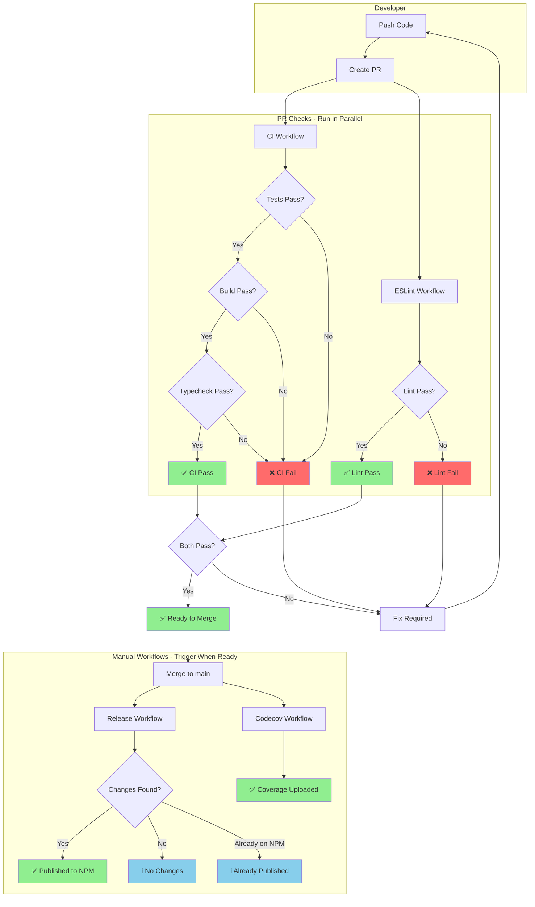
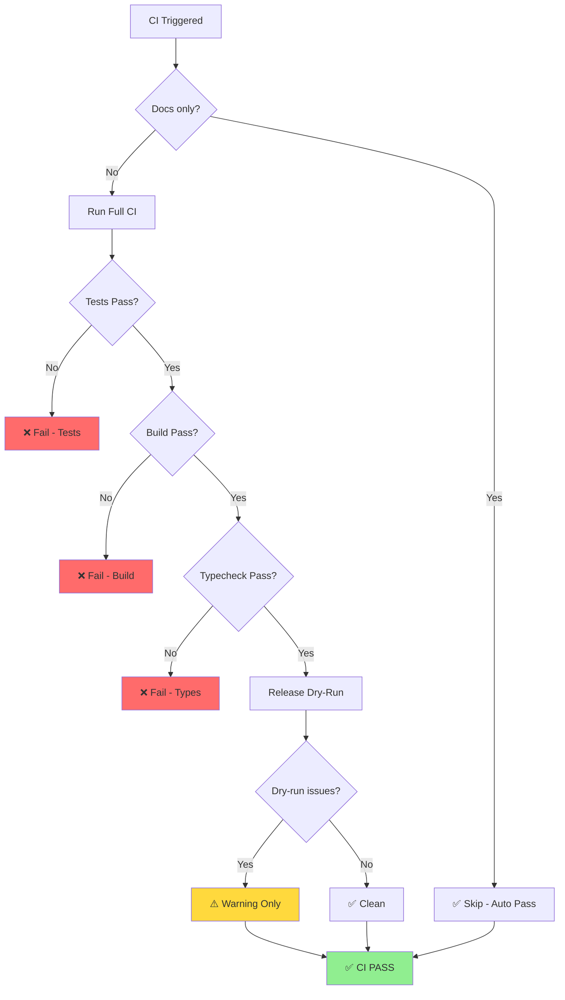
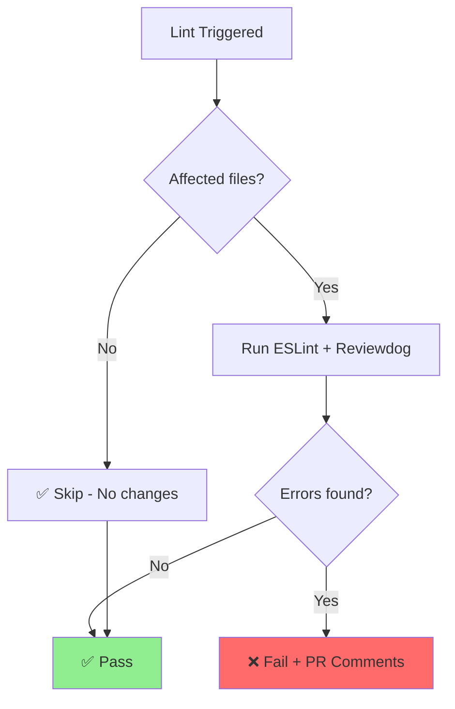
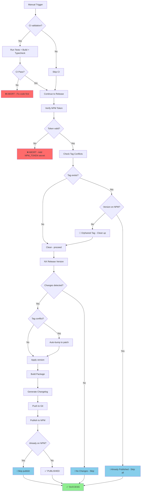
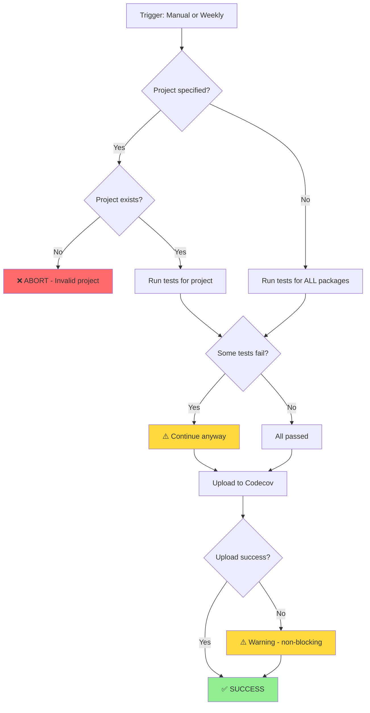
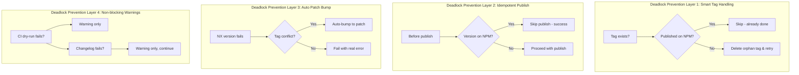
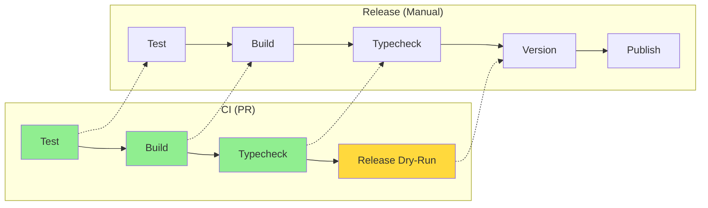
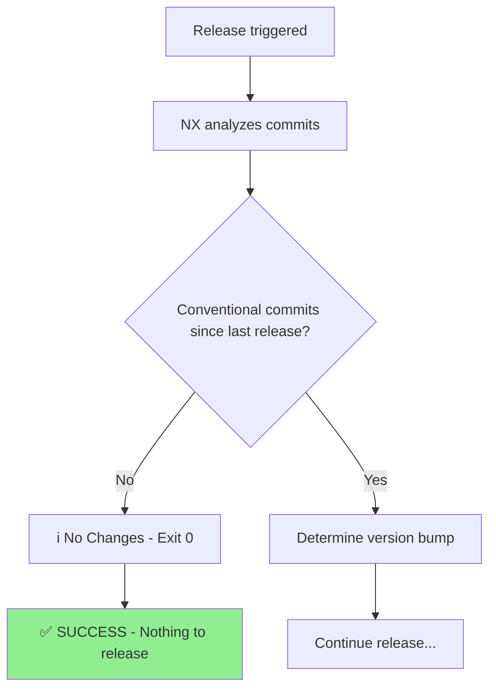
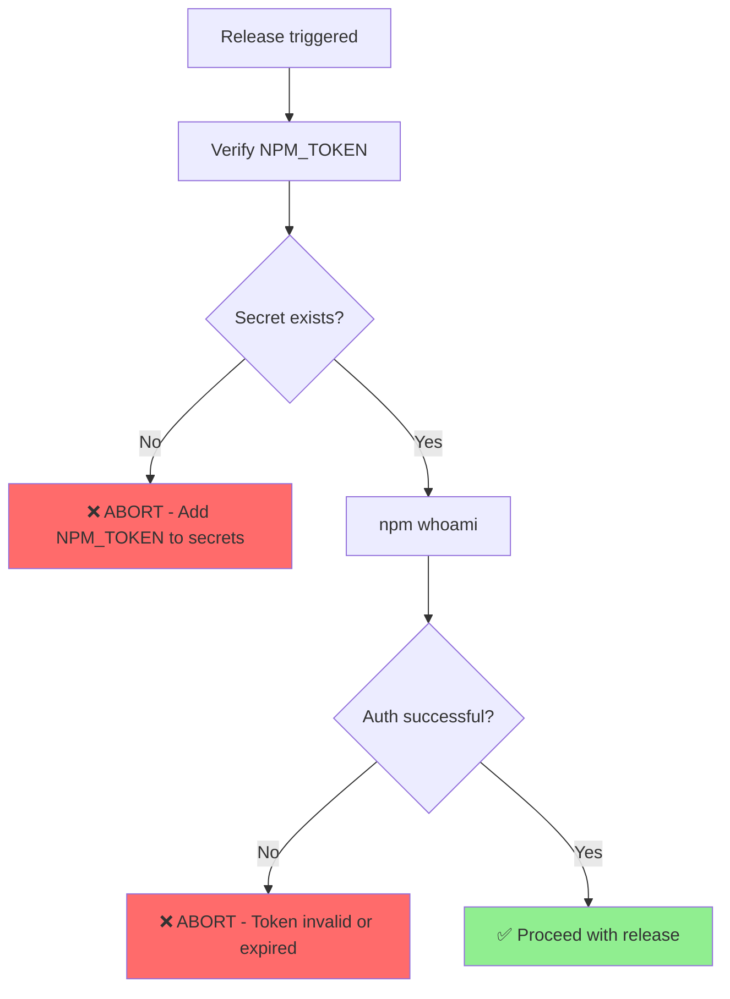
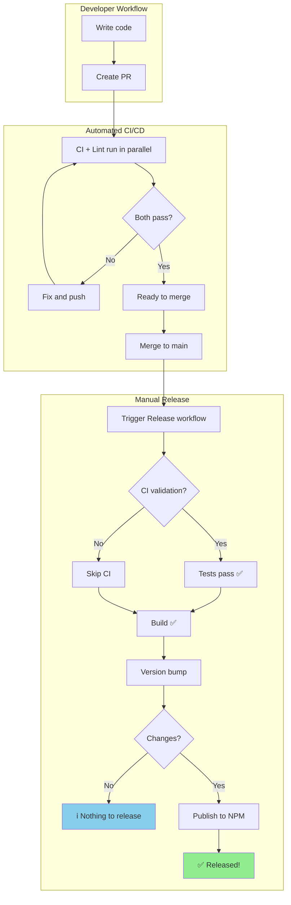

# CI/CD Workflow States & Deadlock Prevention

This document provides a comprehensive visual guide to all workflow states, conditions, and how deadlocks are prevented.

## Guarantee: CI Pass → Manual Triggers Work

> **The Core Promise**: If CI passes on a PR, all manual workflow triggers will either:
>
> 1. ✅ Complete successfully, or
> 2. ℹ️ Report "no changes" (graceful exit, not a failure)

There are **no scenarios** where CI passes but a manual trigger fails with a blocking error.

---

## State Diagram Overview



---

## All Possible States by Workflow

### 1. CI Workflow States



**Key Point**: Release dry-run is **non-blocking** (`continue-on-error: true`). It warns but doesn't fail CI.

---

### 2. ESLint Workflow States



---

### 3. Release Workflow States (The Complex One)



---

### 4. Codecov Workflow States



---

## Deadlock Prevention Mechanisms

### What is a Deadlock?

A deadlock occurs when a workflow can't proceed and can't be fixed without manual intervention that also fails. For example:

```
❌ DEADLOCK EXAMPLE (prevented by smart tag handling):
1. Release creates tag v1.0.0
2. Publish to NPM fails (network error)
3. Next release attempt sees tag exists
4. Refuses to proceed → stuck forever
```

### How We Prevent Deadlocks



---

## CI → Manual Workflow Guarantee Matrix

| CI Validates              | Release Uses          | Match? | Guarantee                    |
| ------------------------- | --------------------- | :----: | ---------------------------- |
| Test passes               | Test (if run-ci=true) |   ✅   | Same test runs               |
| Build passes              | Build                 |   ✅   | Same build runs              |
| Typecheck passes          | Typecheck             |   ✅   | Same typecheck runs          |
| Release dry-run (warning) | Release version       |   ⚠️   | Dry-run catches issues early |

### Why It's Bulletproof



**Legend**:

- 🟢 Green = Validated in CI
- 🟡 Yellow = Warning only (non-blocking)

---

## Edge Case Handling

### Edge Case 1: "No Changes Detected"



**This is NOT a failure.** It means there's nothing new to release.

**Fix options:**

1. Use explicit `version-specifier: patch` to force bump
2. Write conventional commits: `feat:`, `fix:`, etc.

---

### Edge Case 2: Tag Already Published

```mermaid
flowchart TD
    A[Release triggered] --> B[Check existing tags]
    B --> C{eslint-plugin-secure-coding@X.Y.Z exists?}
    C -->|Yes| D[Check NPM]
    C -->|No| E[Clean - proceed normally]

    D --> F{X.Y.Z on NPM?}
    F -->|Yes| G[ℹ️ Already Published - Skip all steps]
    F -->|No| H[🧹 Orphaned tag - clean up]

    H --> E
    G --> I[✅ SUCCESS - No action needed]
    E --> J[Continue release...]

    style I fill:#90EE90
```

**This is NOT a failure.** The release already happened successfully before.

---

### Edge Case 3: NPM Token Issues



**How to fix:**

1. Go to [npmjs.com](https://www.npmjs.com/) → Access Tokens
2. Generate new Granular token with publish permissions
3. Add to GitHub Secrets: Settings → Secrets → Actions → `NPM_TOKEN`

---

## Complete Success Path



---

## Summary: Bulletproof Guarantees

| Scenario                         | CI Passes? | Manual Trigger Result                 |
| -------------------------------- | :--------: | ------------------------------------- |
| Normal release with changes      |     ✅     | ✅ Published                          |
| No conventional commits          |     ✅     | ℹ️ "No changes" (success)             |
| Already published version        |     ✅     | ℹ️ "Already published" (success)      |
| Orphaned tag from failed release |     ✅     | ✅ Auto-cleaned, then published       |
| Missing NPM_TOKEN                |     ✅     | ❌ Fails immediately with clear error |
| Invalid NPM token                |     ✅     | ❌ Fails immediately with clear error |

**The only failures require explicit action:**

- Add `NPM_TOKEN` secret (one-time setup)
- Regenerate expired token (rare)

All other scenarios either succeed or gracefully exit with informative messages.
