> **Keywords:** no-credentials-in-query-params, credentials, URL, query string, security, ESLint rule, CWE-598
> **CWE:** [CWE-598: Use of GET Request with Sensitive Query Strings](https://cwe.mitre.org/data/definitions/598.html)  
> **OWASP Mobile:** [OWASP Mobile Top 10 M1: Improper Credential Usage](https://owasp.org/www-project-mobile-top-10/)

ESLint Rule: no-credentials-in-query-params. This rule is part of [`eslint-plugin-browser-security`](https://www.npmjs.com/package/eslint-plugin-browser-security).

## Quick Summary

| Aspect         | Details                                 |
| -------------- | --------------------------------------- |
| **Severity**   | High (Credential Exposure)              |
| **Auto-Fix**   | ❌ No (requires moving data to Body)    |
| **Category**   | Security |
| **ESLint MCP** | ✅ Optimized for ESLint MCP integration |
| **Best For**   | Web and Mobile applications using APIs  |

## Vulnerability and Risk

**Vulnerability:** Passing sensitive information (like passwords, API keys, or session tokens) within URL query parameters (GET requests).

**Risk:** URL query parameters are frequently stored in browser history, server logs, and web analytics platforms. They are also visible in the `Referer` header sent to third-party sites. An attacker with access to these logs or history can easily recover user credentials.

## Error Message Format

The rule provides **LLM-optimized error messages** (Compact 2-line format) with actionable security guidance:

```text
🔒 CWE-598 OWASP:M1 | Credentials in Query Params detected | HIGH [CredExposure]
   Fix: Do not pass sensitive data in URL; use POST request body or headers | https://cwe.mitre.org/data/definitions/598.html
```

### Message Components

| Component                 | Purpose                | Example                                                                                                             |
| :------------------------ | :--------------------- | :------------------------------------------------------------------------------------------------------------------ |
| **Risk Standards**        | Security benchmarks    | [CWE-598](https://cwe.mitre.org/data/definitions/598.html) [OWASP:M1](https://owasp.org/www-project-mobile-top-10/) |
| **Issue Description**     | Specific vulnerability | `Credentials in Query Params detected`                                                                              |
| **Severity & Compliance** | Impact assessment      | `HIGH [CredExposure]`                                                                                               |
| **Fix Instruction**       | Actionable remediation | `Use POST request body or headers`                                                                                  |
| **Technical Truth**       | Official reference     | [Sensitive Query Strings](https://cwe.mitre.org/data/definitions/598.html)                                          |

## Rule Details

This rule flags strings and template literals that contain common credential keywords (e.g., `password`, `token`, `secret`, `apikey`) followed by an assignment in a URL-like structure (query parameters).

```mermaid
%%{init: {
  'theme': 'base',
  'themeVariables': {
    'primaryColor': '#f8fafc',
    'primaryTextColor': '#1e293b',
    'primaryBorderColor': '#334155',
    'lineColor': '#475569',
    'c0': '#f8fafc',
    'c1': '#f1f5f9',
    'c2': '#e2e8f0',
    'c3': '#cbd5e1'
  }
}}%%
flowchart TD
    A[URL String Detected] --> B{Contains ?}
    B -->|Yes| C{Contains password/token/key?}
    B -->|No| G[✅ Safe URL]
    C -->|Yes| D[🚨 Credential Exposure Risk]
    C -->|No| G
    D --> E[💡 Move to POST Body / Headers]
```



### Why This Matters

| Issue               | Impact                              | Solution                                                   |
| ------------------- | ----------------------------------- | ---------------------------------------------------------- |
| 🕵️ **Leakage**      | Credentials stored in logs/history  | Send sensitive data in request body only                   |
| 🚀 **Exfiltration** | Referer header leaks tokens         | Use `Authorization: Bearer <token>` header                 |
| 🔒 **Compliance**   | Failure to meet security benchmarks | Implement strict transport security and data encapsulation |

## Configuration

This rule has no configuration options in the current version.

## Examples

### ❌ Incorrect

```javascript
// Hardcoded credentials in a query string
const url = '/api/login?username=user&password=pass123';

// Passing a token in the URL for a search query
fetch('/api/search?token=abc123&query=test');
```

### ✅ Correct

```javascript
// Safe URL without credentials
const url = '/api/users?page=1&limit=10';

// Passing sensitive data in the request body (Secure)
fetch('/api/login', {
  method: 'POST',
  body: JSON.stringify({ username: 'user', password: 'password' }),
});

// Passing credentials in an Authorization header (Secure)
fetch('/api/data', {
  headers: {
    Authorization: 'Bearer abc123',
  },
});
```

## Known False Negatives

The following patterns are **not detected** due to static analysis limitations:

### Values from Variables

**Why**: This rule performs simple string matching on literals. It does not trace values stored in variables.

```javascript
// ❌ NOT DETECTED
const pName = 'password';
const pVal = 'secret';
const url = `/api?${pName}=${pVal}`;
```

**Mitigation**: Always use a URL builder library or a secure request utility.

### Dynamic URL Construction

**Why**: If URLs are built using non-literal methods (e.g., `URLSearchParams` object), they might be missed.

```javascript
// ❌ NOT DETECTED
const params = new URLSearchParams();
params.append('password', '123');
const url = '/api?' + params.toString();
```

**Mitigation**: Standardize on a secure API caller that automatically handles sensitive data.

## References

- [CWE-598: Use of GET Request with Sensitive Query Strings](https://cwe.mitre.org/data/definitions/598.html)
- [OWASP: Information exposure through query strings in GET requests](https://owasp.org/www-community/vulnerabilities/Information_exposure_through_query_strings_in_GET_requests)
