> **Keywords:** no disabled certificate validation, SSL, TLS, security, ESLint rule, [CWE-295](https://cwe.mitre.org/data/definitions/295.html), MitM, rejectUnauthorized
> **CWE:** [CWE-295: Improper Certificate Validation](https://cwe.mitre.org/data/definitions/295.html)  
> **OWASP Mobile:** [OWASP Mobile Top 10 M5: Insufficient Communication Layer Security](https://owasp.org/www-project-mobile-top-10/)

ESLint Rule: no-disabled-certificate-validation. This rule is part of [`eslint-plugin-browser-security`](https://www.npmjs.com/package/eslint-plugin-browser-security).

## Quick Summary

| Aspect          | Details                                           |
| --------------- | ------------------------------------------------- |
| **Severity**    | Critical (MitM Risk)                              |
| **Auto-Fix**    | ❌ No (requires fixing infrastructure)            |
| **Category**   | Security |
| **ESLint MCP**  | ✅ Optimized for ESLint MCP integration           |
| **Best For**    | Node.js backend or apps using native network APIs |
| **Suggestions** | ✅ Advice on using custom CAs for private certs   |

## Vulnerability and Risk

**Vulnerability:** Disabling SSL/TLS certificate validation (e.g., setting `rejectUnauthorized: false`) tells the application to ignore errors during the security handshake.

**Risk:** This makes the application highly vulnerable to Man-in-the-Middle (MitM) attacks. An attacker can intercept, view, and modify all traffic between the client and the server, even if the connection appears to be "encrypted".

## Error Message Format

The rule provides **LLM-optimized error messages** (Compact 2-line format) with actionable security guidance:

```text
🔒 CWE-295 OWASP:M5 | Disabled Certificate Validation detected | CRITICAL [MitM,Sniffing]
   Fix: Remove rejectUnauthorized: false; fix certificate issues properly | https://cwe.mitre.org/data/definitions/295.html
```

### Message Components

| Component                 | Purpose                | Example                                                                                                             |
| :------------------------ | :--------------------- | :------------------------------------------------------------------------------------------------------------------ |
| **Risk Standards**        | Security benchmarks    | [CWE-295](https://cwe.mitre.org/data/definitions/295.html) [OWASP:M5](https://owasp.org/www-project-mobile-top-10/) |
| **Issue Description**     | Specific vulnerability | `Disabled Certificate Validation detected`                                                                          |
| **Severity & Compliance** | Impact assessment      | `CRITICAL [MitM,Sniffing]`                                                                                          |
| **Fix Instruction**       | Actionable remediation | `Remove rejectUnauthorized: false`                                                                                  |
| **Technical Truth**       | Official reference     | [Improper Cert Validation](https://cwe.mitre.org/data/definitions/295.html)                                         |

## Rule Details

This rule flags common patterns used to disable certificate validation in Node.js and various HTTP client libraries, as well as dangerous environment variable overrides.

```mermaid
%%{init: {
  'theme': 'base',
  'themeVariables': {
    'primaryColor': '#f8fafc',
    'primaryTextColor': '#1e293b',
    'primaryBorderColor': '#334155',
    'lineColor': '#475569',
    'c0': '#f8fafc',
    'c1': '#f1f5f9',
    'c2': '#e2e8f0',
    'c3': '#cbd5e1'
  }
}}%%
flowchart TD
    A[Networking Config] --> B{rejectUnauthorized: false?}
    B -->|Yes| C[🚨 Critical Security Risk]
    A --> D{NODE_TLS_REJECT_UNAUTHORIZED = '0'?}
    D -->|Yes| E[🚨 Critical Security Risk]
    B -->|No| F[✅ Secure Initialization]
```



### Why This Matters

| Issue              | Impact                          | Solution                                                              |
| ------------------ | ------------------------------- | --------------------------------------------------------------------- |
| 🕵️ **MitM Attack** | Full data interception          | Always keep validation enabled                                        |
| 🚀 **Integrity**   | Malicious code injection        | Verify server identity using trusted certificates                     |
| ⚖️ **Compliance**  | Violation of industry standards | Use private CAs for internal certificates instead of disabling checks |

## Configuration

This rule has no configuration options in the current version.

## Examples

### ❌ Incorrect

```javascript
// Disabling validation in Node.js https agent
const agent = new https.Agent({
  rejectUnauthorized: false,
});

// Disabling validation in axios
axios.get('https://api.example.com', {
  httpsAgent: new https.Agent({ rejectUnauthorized: false }),
});

// Dangerous environment variable override
process.env.NODE_TLS_REJECT_UNAUTHORIZED = '0';
```

### ✅ Correct

```javascript
// Keeping certificate validation enabled (default)
const agent = new https.Agent({
  rejectUnauthorized: true,
});

// Using custom CA for private networks
const agent = new https.Agent({
  ca: fs.readFileSync('path/to/private-ca.crt'),
  rejectUnauthorized: true,
});
```

## Known False Negatives

The following patterns are **not detected** due to static analysis limitations:

### Abstracted Agent Creation

**Why**: If the HTTPS agent is created in a separate module that is not analyzed, the rule might miss the insecure configuration.

```javascript
import { getInsecureAgent } from './utils';
axios.get(url, { httpsAgent: getInsecureAgent() }); // ❌ NOT DETECTED
```

**Mitigation**: Standardize how HTTP clients are instantiated and enforce a global "no-insecure-tls" policy.

### Non-Standard Property Names

**Why**: While common names are covered, some niche libraries might use unique names for this setting.

**Mitigation**: Periodically review library documentation for security-related configuration properties.

## References

- [CWE-295: Improper Certificate Validation](https://cwe.mitre.org/data/definitions/295.html)
- [Node.js Documentation - https.request options](https://nodejs.org/api/https.html#https_https_request_options_callback)
- [OWASP Transport Layer Protection Cheat Sheet](https://cheatsheetseries.owasp.org/cheatsheets/Transport_Layer_Protection_Cheat_Sheet.html)
