> **Keywords:** no-http-urls, HTTPS, cleartext transmission, security, ESLint rule, CWE-319, man-in-the-middle, MITM
> **CWE:** [CWE-319: Cleartext Transmission of Sensitive Information](https://cwe.mitre.org/data/definitions/319.html)  
> **OWASP Mobile:** [OWASP Mobile Top 10 M5: Insecure Communication](https://owasp.org/www-project-mobile-top-10/)

ESLint Rule: no-http-urls. This rule is part of [`eslint-plugin-browser-security`](https://www.npmjs.com/package/eslint-plugin-browser-security).

## Quick Summary

| Aspect         | Details                                 |
| -------------- | --------------------------------------- |
| **Severity**   | High (Insecure Communication)           |
| **Auto-Fix**   | ❌ No (requires server-side HTTPS)      |
| **Category**   | Security |
| **ESLint MCP** | ✅ Optimized for ESLint MCP integration |
| **Best For**   | All production web and mobile apps      |

## Vulnerability and Risk

**Vulnerability:** Using non-encrypted HTTP protocols for network communication instead of the secure HTTPS protocol.

**Risk:** Data transmitted over HTTP is sent in cleartext, making it vulnerable to Man-in-the-Middle (MITM) attacks. Passive attackers can eavesdrop on sensitive data (credentials, session tokens, PII), while active attackers can intercept and inject malicious content into the communication stream.

## Error Message Format

The rule provides **LLM-optimized error messages** (Compact 2-line format) with actionable security guidance:

```text
🔒 CWE-319 OWASP:M5 | Insecure HTTP URL detected | HIGH [CleartextTransmission]
   Fix: Replace http:// with https:// to ensure encrypted communication | https://cwe.mitre.org/data/definitions/319.html
```

### Message Components

| Component                 | Purpose                | Example                                                                                                             |
| :------------------------ | :--------------------- | :------------------------------------------------------------------------------------------------------------------ |
| **Risk Standards**        | Security benchmarks    | [CWE-319](https://cwe.mitre.org/data/definitions/319.html) [OWASP:M5](https://owasp.org/www-project-mobile-top-10/) |
| **Issue Description**     | Specific vulnerability | `Insecure HTTP URL detected`                                                                                        |
| **Severity & Compliance** | Impact assessment      | `HIGH [CleartextTransmission]`                                                                                      |
| **Fix Instruction**       | Actionable remediation | `Replace http:// with https://`                                                                                     |
| **Technical Truth**       | Official reference     | [Cleartext Transmission](https://cwe.mitre.org/data/definitions/319.html)                                           |

## Rule Details

This rule flags any string or template literal that starts with `http://` (excluding `localhost`). It ensures that all remote API calls and resources are fetched over encrypted channels.

```mermaid
%%{init: {
  'theme': 'base',
  'themeVariables': {
    'primaryColor': '#f8fafc',
    'primaryTextColor': '#1e293b',
    'primaryBorderColor': '#334155',
    'lineColor': '#475569',
    'c0': '#f8fafc',
    'c1': '#f1f5f9',
    'c2': '#e2e8f0',
    'c3': '#cbd5e1'
  }
}}%%
flowchart TD
    A[URL String Detected] --> B{Starts with http://?}
    B -->|Yes| C{Is localhost?}
    B -->|No| G[✅ Secure Protocol]
    C -->|Yes| G
    C -->|No| D[🚨 Insecure Transmission Risk]
    D --> E[💡 Upgrade to HTTPS]
```



### Why This Matters

| Issue                | Impact                             | Solution                                   |
| -------------------- | ---------------------------------- | ------------------------------------------ |
| 🕵️ **Eavesdropping** | Sensitive data leaked to network   | Use TLS/SSL (HTTPS) for all traffic        |
| 🚀 **Injection**     | Attackers inject malicious scripts | Enforce HSTS and secure protocol selection |
| 🔒 **Compliance**    | GDPR/App Store security violations | Ensure all endpoints are served over HTTPS |

## Configuration

This rule has no configuration options in the current version.

## Examples

### ❌ Incorrect

```javascript
// Hardcoded insecure API endpoint
const apiUrl = 'http://api.example.com/v1/auth';

// Fetching resource over insecure protocol
fetch('http://images.example.com/user.png');
```

### ✅ Correct

```javascript
// Hardcoded secure API endpoint
const apiUrl = 'https://api.example.com/v1/auth';

// Fetching over secure protocol
fetch('https://images.example.com/user.png');

// Local development is permitted
const devUrl = 'http://localhost:3000';
```

## Known False Negatives

The following patterns are **not detected** due to static analysis limitations:

### Values from Variables

**Why**: This rule performs simple string matching on literals. It does not trace values stored in variables or concatenated strings.

```javascript
// ❌ NOT DETECTED
const protocol = 'http';
const domain = 'api.com';
const url = protocol + '://' + domain;
```

**Mitigation**: Use a global configuration or environment variables that are audited for secure protocols.

### Redirects

**Why**: This rule cannot detect if an HTTPS URL eventually redirects to an insecure HTTP URL.

**Mitigation**: Implement HSTS (HTTP Strict Transport Security) on your servers.

## References

- [CWE-319: Cleartext Transmission of Sensitive Information](https://cwe.mitre.org/data/definitions/319.html)
- [OWASP Transport Layer Protection Cheat Sheet](https://cheatsheetseries.owasp.org/cheatsheets/Transport_Layer_Protection_Cheat_Sheet.html)
