> **Keywords:** no insecure websocket, security, ESLint rule, [CWE-319](https://cwe.mitre.org/data/definitions/319.html), wss, encryption, MitM
> **CWE:** [CWE-319: Cleartext Transmission of Sensitive Information](https://cwe.mitre.org/data/definitions/319.html)  
> **OWASP Mobile:** [OWASP Mobile Top 10 M5: Insufficient Communication Layer Security](https://owasp.org/www-project-mobile-top-10/)


<!-- @rule-summary -->
CWE: [CWE-319](https://cwe.mitre.org/data/definitions/319.html)
<!-- @/rule-summary -->

ESLint Rule: no-insecure-websocket. This rule is part of [`eslint-plugin-browser-security`](https://www.npmjs.com/package/eslint-plugin-browser-security).

## Quick Summary

| Aspect          | Details                                   |
| --------------- | ----------------------------------------- |
| **Severity**    | High (Exposure)                           |
| **Auto-Fix**    | ❌ No (requires protocol update)          |
| **Category**   | Security |
| **ESLint MCP**  | ✅ Optimized for ESLint MCP integration   |
| **Best For**    | Applications using real-time WebSockets   |
| **Suggestions** | ✅ Advice on using secure wss:// protocol |

## Vulnerability and Risk

**Vulnerability:** Cleartext transmission occurs when sensitive data is sent over the network using insecure protocols like `ws://`. Data transmitted this way is not encrypted.

**Risk:** An attacker positioned between the client and the server (Man-in-the-Middle) can intercept, read, and even modify the data being transmitted through the WebSocket connection.

## Error Message Format

The rule provides **LLM-optimized error messages** (Compact 2-line format) with actionable security guidance:

```text
🔒 CWE-319 OWASP:M5 | Insecure WebSocket detected | HIGH [MitM,Sniffing]
   Fix: Use wss:// instead of ws:// for secure WebSocket connections | https://cwe.mitre.org/data/definitions/319.html
```

### Message Components

| Component                 | Purpose                | Example                                                                                                             |
| :------------------------ | :--------------------- | :------------------------------------------------------------------------------------------------------------------ |
| **Risk Standards**        | Security benchmarks    | [CWE-319](https://cwe.mitre.org/data/definitions/319.html) [OWASP:M5](https://owasp.org/www-project-mobile-top-10/) |
| **Issue Description**     | Specific vulnerability | `Insecure WebSocket detected`                                                                                       |
| **Severity & Compliance** | Impact assessment      | `HIGH [MitM,Sniffing]`                                                                                              |
| **Fix Instruction**       | Actionable remediation | `Use wss:// instead of ws://`                                                                                       |
| **Technical Truth**       | Official reference     | [Cleartext Transmission](https://cwe.mitre.org/data/definitions/319.html)                                           |

## Rule Details

WebSockets are often used for real-time communication. Using the insecure `ws://` protocol means all data is transmitted in plain text. This rule flags any string literal or `new WebSocket()` constructor call that uses the `ws://` protocol.

```mermaid
%%{init: {
  'theme': 'base',
  'themeVariables': {
    'primaryColor': '#f8fafc',
    'primaryTextColor': '#1e293b',
    'primaryBorderColor': '#334155',
    'lineColor': '#475569',
    'c0': '#f8fafc',
    'c1': '#f1f5f9',
    'c2': '#e2e8f0',
    'c3': '#cbd5e1'
  }
}}%%
flowchart TD
    A[WebSocket URL] --> B{Starts with ws://?}
    B -->|Yes| C[🚨 Insecure Connection]
    B -->|No| D{Starts with wss://?}
    D -->|Yes| E[✅ Secure Connection]
    D -->|No| F[🟡 Unknown/Relative Protocol]
```



### Why This Matters

| Issue                  | Impact                          | Solution                                     |
| ---------------------- | ------------------------------- | -------------------------------------------- |
| 🔒 **Confidentiality** | Data eavesdropping by attackers | Use `wss://` (TLS/SSL)                       |
| ⚡ **Integrity**       | Data tampering in transit       | Enforce secure protocols in all environments |
| 🤝 **Compliance**      | Violation of security policies  | Audit all live connections for encryption    |

## Configuration

This rule has no configuration options in the current version.

## Examples

### ❌ Incorrect

```javascript
// Insecure WebSocket connection
const socket = new WebSocket('ws://api.example.com/updates');

// Insecure URL as a string literal
const socketUrl = 'ws://chat.internal.net';
```

### ✅ Correct

```javascript
// Secure WebSocket connection
const socket = new WebSocket('wss://api.example.com/updates');

// Secure URL as a string literal
const socketUrl = 'wss://chat.internal.net';

// Dynamic URL with protocol check
const protocol = window.location.protocol === 'https:' ? 'wss:' : 'ws:';
const socket = new WebSocket(`${protocol}//${host}/ws`);
```

## Known False Negatives

The following patterns are **not detected** due to static analysis limitations:

### Abstracted URLs

**Why**: If the URL is constructed dynamically or imported from a configuration file that is not visible to the linter, it might not be detected.

```javascript
import { SOCKET_URL } from './config';
const socket = new WebSocket(SOCKET_URL); // ❌ NOT DETECTED (if SOCKET_URL is 'ws://...')
```

**Mitigation**: Use environment variables or global configuration files that are strictly audited for secure protocols.

### Development Environments

**Why**: Some developers use `ws://` for local development.

**Mitigation**: Use a conditional check to switch between `ws://` and `wss://` based on the environment, ensuring `wss://` is always used in production.

## References

- [CWE-319: Cleartext Transmission of Sensitive Information](https://cwe.mitre.org/data/definitions/319.html)
- [OWASP WebSocket Security Cheat Sheet](https://cheatsheetseries.owasp.org/cheatsheets/Web_Socket_Security_Cheat_Sheet.html)
- [MDN - WebSocket](https://developer.mozilla.org/en-US/docs/Web/API/WebSocket)