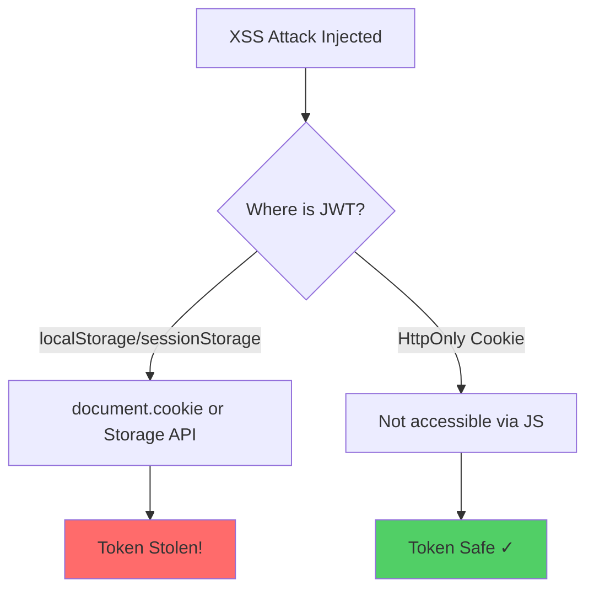

# browser-security/no-jwt-in-storage

> 🔒 Disallow storing JWT tokens in localStorage or sessionStorage
**CWE:** [CWE-311](https://cwe.mitre.org/data/definitions/311.html)  
**OWASP Mobile:** [M9: Insecure Data Storage](https://owasp.org/www-project-mobile-top-10/)

## Rule Details

This rule prevents storing JWT tokens in browser storage (localStorage/sessionStorage). JWTs stored in these locations are fully accessible to JavaScript, making them vulnerable to XSS attacks.

### Why is this dangerous?



When you store JWTs in browser storage:

1. **Any XSS attack can read the token** via `localStorage.getItem('token')`
2. **Tokens can be exfiltrated** to attacker-controlled servers
3. **Attackers can impersonate users** with stolen tokens

## Examples

### ❌ Incorrect

```javascript
// Storing JWT in localStorage
localStorage.setItem('token', jwtToken);
localStorage.setItem('accessToken', response.access_token);
localStorage.setItem('jwt', authResult.jwt);

// Storing in sessionStorage (equally vulnerable)
sessionStorage.setItem('refreshToken', refreshToken);
sessionStorage.setItem('id_token', idToken);

// Direct assignment
localStorage['bearer'] = bearerToken;
localStorage.access_token = token;

// Even with obfuscated keys - if value is a JWT, it's detected
localStorage.setItem('data', 'eyJhbGciOiJIUzI1NiIsInR5cCI6IkpXVCJ9...');
```

### ✅ Correct

```javascript
// Non-sensitive data is fine
localStorage.setItem('theme', 'dark');
localStorage.setItem('locale', 'en-US');
sessionStorage.setItem('searchHistory', JSON.stringify(history));

// Token counters and metadata (not actual tokens)
localStorage.setItem('tokenCount', '5');
localStorage.setItem('tokenExpiry', '1234567890');

// Use HttpOnly cookies instead (set by server)
// Server: res.cookie('token', jwt, { httpOnly: true, secure: true, sameSite: 'strict' })

// Or use in-memory only (cleared on page refresh)
let token = response.jwt; // Not persisted
```

## Options

```json
{
  "browser-security/no-jwt-in-storage": [
    "error",
    {
      "allowInTests": true
    }
  ]
}
```

| Option         | Type      | Default | Description                                        |
| -------------- | --------- | ------- | -------------------------------------------------- |
| `allowInTests` | `boolean` | `true`  | Skip checking in test files (_.test.ts, _.spec.ts) |

## Detection Patterns

The rule detects JWT storage through two mechanisms:

### 1. Key Name Detection

Keys matching these patterns are flagged:

- `jwt`, `token`, `bearer` (exact)
- `access_token`, `accessToken`, `access-token`
- `refresh_token`, `refreshToken`
- `id_token`, `idToken`
- `auth_token`, `authToken`
- Any key ending with `token` (e.g., `userToken`, `apiToken`)

### 2. Value Detection

Values that look like JWTs are detected:

- Matches pattern: `eyJ[...].eyJ[...].[...]` (base64.base64.signature)

### False Positive Prevention

These patterns are explicitly excluded:

- `tokenCount`, `tokenLength`, `tokenSize`
- `tokenLimit`, `tokenMax`, `tokenMin`
- `tokenIndex`, `tokenPosition`

## When Not To Use It

You may disable this rule if:

- Your application doesn't handle authentication
- You're building a demo/prototype without security requirements
- You have specific requirements that mandates browser storage (not recommended)

However, **always prefer HttpOnly cookies** for JWT storage in production.

## Secure Token Storage Alternatives

### Option 1: HttpOnly Cookies (Recommended)

```javascript
// Server-side (Express.js)
res.cookie('token', jwtToken, {
  httpOnly: true, // Not accessible via JavaScript
  secure: true, // HTTPS only
  sameSite: 'strict', // CSRF protection
  maxAge: 3600000, // 1 hour
});

// Client-side - token is automatically sent with requests
fetch('/api/protected', {
  credentials: 'include',
});
```

### Option 2: Memory-Only Storage

```javascript
// Token lives only in memory - cleared on page refresh
class TokenService {
  private token: string | null = null;

  setToken(jwt: string) { this.token = jwt; }
  getToken() { return this.token; }
  clearToken() { this.token = null; }
}
```

## Related

- [CWE-922: Insecure Storage of Sensitive Information](https://cwe.mitre.org/data/definitions/922.html)
- [Auth0: Token Storage](https://auth0.com/docs/secure/security-guidance/data-security/token-storage)
- [`browser-security/no-sensitive-localstorage`](./no-sensitive-localstorage.md) - General sensitive data detection

## Known False Negatives

The following patterns are **not detected** due to static analysis limitations:

### JWT Value from Variable

**Why**: Token values from variables are not traced.

```typescript
// ❌ NOT DETECTED - Value from variable
const value = response.jwt;
localStorage.setItem('data', value);
```

**Mitigation**: Never store JWTs in localStorage.

### Custom Storage Wrappers

**Why**: Storage wrappers not recognized.

```typescript
// ❌ NOT DETECTED - Custom wrapper
myStorage.save('token', jwt); // Uses localStorage internally
```

**Mitigation**: Apply rule to wrapper implementations.

### Obfuscated Key Names

**Why**: Key patterns may not match.

```typescript
// ❌ NOT DETECTED - Obfuscated key
localStorage.setItem('_t', jwt); // Not in key patterns
```

**Mitigation**: Configure additional key patterns.

### Encrypted Tokens

**Why**: Encrypted JWTs don't match pattern.

```typescript
// ❌ NOT DETECTED - Encrypted
localStorage.setItem('data', encrypt(jwt)); // Pattern broken
```

**Mitigation**: Still avoid localStorage for auth data.

## OWASP Mapping

| Category          | ID                                |
| ----------------- | --------------------------------- |
| OWASP Top 10 2021 | A02:2021 - Cryptographic Failures |
| CWE               | CWE-922                           |
| CVSS              | 8.1 (High)                        |
