> **Keywords:** CSRF, CWE-352, security, ESLint rule, CSRF protection, token validation, middleware, Express, Fastify, LLM-optimized, code security

<!-- @rule-summary -->
Detects missing CSRF token validation in POST/PUT/DELETE requests
<!-- @/rule-summary -->

**CWE:** [CWE-352](https://cwe.mitre.org/data/definitions/352.html)  
**OWASP Mobile:** [OWASP Mobile Top 10](https://owasp.org/www-project-mobile-top-10/)

Detects missing CSRF token validation in POST/PUT/DELETE requests. This rule is part of [`eslint-plugin-secure-coding`](https://www.npmjs.com/package/eslint-plugin-secure-coding) and provides LLM-optimized error messages that AI assistants can automatically fix.

💼 This rule is set to **error** by default in the `recommended` config.

## Quick Summary

| Aspect            | Details                                                               |
| ----------------- | --------------------------------------------------------------------- |
| **CWE Reference** | CWE-352 (Cross-Site Request Forgery)                                  |
| **Severity**      | HIGH (security vulnerability)                                         |
| **Auto-Fix**      | ❌ No (requires manual CSRF middleware setup)                         |
| **Category**   | Security |
| **ESLint MCP**    | ✅ Optimized for ESLint MCP integration                               |
| **Best For**      | All web applications with state-changing operations, Express, Fastify |

## Vulnerability and Risk

**Vulnerability:** Cross-Site Request Forgery (CSRF) occurs when an application processes state-changing requests (like creating users or transferring funds) without verifying that the request originated from a trusted source (usually via a CSRF token).

**Risk:** An attacker can trick an authenticated user into visiting a malicious site, which then sends a request to the vulnerable application. The browser automatically includes the user's cookies, causing the application to execute the unauthorized action as the victim.

## Detection Flow

```mermaid
%%{init: {
  'theme': 'base',
  'themeVariables': {
    'primaryColor': '#f8fafc',
    'primaryTextColor': '#1e293b',
    'primaryBorderColor': '#334155',
    'lineColor': '#475569'
  }
}}%%
flowchart TD
    A[🔍 Analyze Route Handler] --> B{Is POST/PUT/DELETE/PATCH?}
    B -->|No| C[✅ Valid: GET/HEAD/OPTIONS]
    B -->|Yes| D{Has CSRF Middleware?}
    D -->|Yes| E[✅ Valid: CSRF protected]
    D -->|No| F{Check Route Arguments}
    F --> G{CSRF in Arguments?}
    G -->|Yes| E
    G -->|No| H{Global CSRF?}
    H -->|Yes| E
    H -->|No| I[❌ Report: Missing CSRF]

    style C fill:#d1fae5,stroke:#059669,stroke-width:2px
    style E fill:#d1fae5,stroke:#059669,stroke-width:2px
    style I fill:#fee2e2,stroke:#dc2626,stroke-width:2px
```



## Why This Matters

| Issue                 | Impact                              | Solution                |
| --------------------- | ----------------------------------- | ----------------------- |
| 🔒 **CSRF Attacks**   | Unauthorized state changes          | Add CSRF middleware     |
| 🔐 **Data Integrity** | Malicious requests from other sites | Validate CSRF tokens    |
| 🍪 **Session Hijack** | Exploit user sessions               | Use CSRF protection     |
| 📊 **Best Practice**  | All state-changing ops need CSRF    | Protect POST/PUT/DELETE |

## Detection Patterns

The rule detects:

- **Express routes**: `app.post()`, `app.put()`, `app.delete()`, `app.patch()`
- **Route handlers without CSRF middleware** in arguments
- **Common CSRF middleware patterns**: `csrf`, `csurf`, `csrfProtection`, `validateCsrf`, `csrfToken`, `csrfMiddleware`
- **Global CSRF middleware**: Applied via `app.use(csrf())`

## Examples

### ❌ Incorrect

```typescript
// Missing CSRF protection on state-changing routes
app.post('/api/users', (req, res) => {
  // ❌ No CSRF middleware
  // Create user
});

router.put('/api/users/:id', (req, res) => {
  // ❌ No CSRF middleware
  // Update user
});

app.delete('/api/users/:id', handler); // ❌ No CSRF middleware
```

### ✅ Correct

```typescript
// CSRF middleware added
app.post('/api/users', csrf(), (req, res) => {
  // ✅ CSRF middleware
  // Create user
});

router.put('/api/users/:id', csrfProtection, (req, res) => {
  // ✅ CSRF middleware
  // Update user
});

// Global CSRF middleware
app.use(csrf({ cookie: true })); // ✅ Global protection
app.post('/api/users', (req, res) => {
  // ✅ Protected by global middleware
  // Create user
});

// GET requests don't need CSRF
app.get('/api/users', (req, res) => {
  // ✅ GET doesn't need CSRF
  // Return users
});
```

## Error Message Format

The rule provides **LLM-optimized error messages** (Compact 2-line format) with actionable security guidance:

```text
🔒 CWE-352 OWASP:A01 CVSS:8.8 | Cross-Site Request Forgery (CSRF) detected | HIGH
   Fix: Review and apply the recommended fix | https://owasp.org/Top10/A01_2021/
```

### Message Components

| Component | Purpose | Example |
| :--- | :--- | :--- |
| **Risk Standards** | Security benchmarks | [CWE-352](https://cwe.mitre.org/data/definitions/352.html) [OWASP:A01](https://owasp.org/Top10/A01_2021-Injection/) CVSS Score |
| **Issue Description** | Specific vulnerability | `Cross-Site Request Forgery (CSRF) detected` |
| **Severity & Compliance** | Impact assessment | `HIGH` |
| **Fix Instruction** | Actionable remediation | `Follow the remediation steps below` |
| **Technical Truth** | Official reference | [OWASP Top 10](https://owasp.org/Top10/A01_2021-Injection/) |

## Configuration

### Default Configuration

```json
{
  "secure-coding/no-missing-csrf-protection": "error"
}
```

### Options

| Option                   | Type       | Default                              | Description                   |
| ------------------------ | ---------- | ------------------------------------ | ----------------------------- |
| `allowInTests`           | `boolean`  | `false`                              | Allow missing CSRF in tests   |
| `csrfMiddlewarePatterns` | `string[]` | `['csrf', 'csurf', ...]`             | CSRF middleware patterns      |
| `protectedMethods`       | `string[]` | `['post', 'put', 'delete', 'patch']` | HTTP methods requiring CSRF   |
| `ignorePatterns`         | `string[]` | `[]`                                 | Additional patterns to ignore |

### Example Configuration

```json
{
  "secure-coding/no-missing-csrf-protection": [
    "error",
    {
      "allowInTests": true,
      "csrfMiddlewarePatterns": ["csrf", "myCustomCsrf"],
      "protectedMethods": ["post", "put", "delete"],
      "ignorePatterns": ["/api/public"]
    }
  ]
}
```

## Best Practices

1. **Protect all state-changing routes**: POST, PUT, DELETE, PATCH
2. **Use middleware**: Leverage Express/Fastify CSRF middleware
3. **Global protection**: Apply CSRF middleware globally when possible
4. **Token validation**: Validate CSRF tokens on every protected request
5. **GET requests**: Don't require CSRF (idempotent operations)

## Known False Negatives

The following patterns are **not detected** due to static analysis limitations:

### Values from Variables

**Why**: Values stored in variables are not traced.

```typescript
// ❌ NOT DETECTED - Value from variable
const value = userInput;
dangerousOperation(value);
```

**Mitigation**: Validate all user inputs.

### Wrapper Functions

**Why**: Custom wrappers not recognized.

```typescript
// ❌ NOT DETECTED - Wrapper
myWrapper(userInput); // Uses dangerous API internally
```

**Mitigation**: Apply rule to wrapper implementations.

### Dynamic Invocation

**Why**: Dynamic calls not analyzed.

```typescript
// ❌ NOT DETECTED - Dynamic
obj[method](userInput);
```

**Mitigation**: Avoid dynamic method invocation.

## Related Rules

- [`no-insecure-cookie-settings`](./no-insecure-cookie-settings.md) - Detects insecure cookie configurations
- [`no-missing-authentication`](./no-missing-authentication.md) - Detects missing authentication

## Resources

- [CWE-352: Cross-Site Request Forgery](https://cwe.mitre.org/data/definitions/352.html)
- [OWASP: CSRF Prevention](https://owasp.org/www-community/attacks/csrf)
- [Express CSRF Protection](https://expressjs.com/en/advanced/best-practice-security.html#use-csrf-protection)