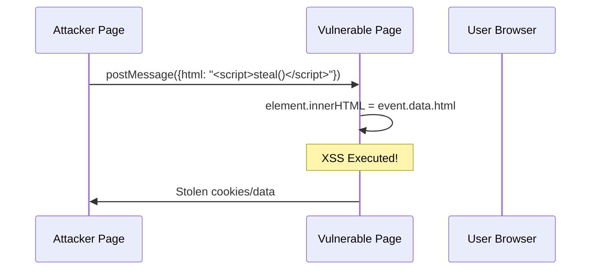

# browser-security/no-postmessage-innerhtml

> 🔒 Disallow using innerHTML with postMessage data

## Rule Details

This rule prevents using `innerHTML`, `outerHTML`, `insertAdjacentHTML()`, or `document.write()` with data received from postMessage events. This pattern enables XSS attacks through malicious messages.

### Why is this dangerous?



When you use innerHTML with postMessage data:

1. **Any window can send messages** to your page
2. **Malicious HTML/scripts are executed** when assigned to innerHTML
3. **Attackers can steal data, session tokens**, and perform actions as the user

## Examples

### ❌ Incorrect

```javascript
// Direct innerHTML with event.data
window.addEventListener('message', (event) => {
  element.innerHTML = event.data;
});

// Nested property access
window.addEventListener('message', (event) => {
  container.innerHTML = event.data.content;
});

// outerHTML is equally dangerous
window.addEventListener('message', (event) => {
  widget.outerHTML = event.data.html;
});

// insertAdjacentHTML
window.addEventListener('message', (event) => {
  list.insertAdjacentHTML('beforeend', event.data);
});

// document.write (rare but dangerous)
window.addEventListener('message', (event) => {
  document.write(event.data);
});
```

### ✅ Correct

```javascript
// Use textContent for plain text
window.addEventListener('message', (event) => {
  if (event.origin !== 'https://trusted.com') return;
  element.textContent = event.data;
});

// Sanitize before using innerHTML
window.addEventListener('message', (event) => {
  if (event.origin !== 'https://trusted.com') return;
  const sanitized = DOMPurify.sanitize(event.data);
  element.innerHTML = sanitized;
});

// Use intermediate variable (sanitized)
window.addEventListener('message', (event) => {
  if (event.origin !== 'https://trusted.com') return;
  const safeHtml = DOMPurify.sanitize(event.data.content);
  container.innerHTML = safeHtml;
});

// Use DOM APIs instead
window.addEventListener('message', (event) => {
  if (event.origin !== 'https://trusted.com') return;
  const text = document.createTextNode(event.data);
  element.appendChild(text);
});
```

## Options

```json
{
  "browser-security/no-postmessage-innerhtml": [
    "error",
    {
      "allowInTests": true
    }
  ]
}
```

| Option         | Type      | Default | Description                                        |
| -------------- | --------- | ------- | -------------------------------------------------- |
| `allowInTests` | `boolean` | `true`  | Skip checking in test files (_.test.ts, _.spec.ts) |

## When Not To Use It

You may disable this rule if:

- You're handling postMessage in a sandbox/isolated context
- You have thorough sanitization that the rule can't detect

However, **always sanitize postMessage data** before rendering as HTML.

## Related Rules

- [`browser-security/require-postmessage-origin-check`](./require-postmessage-origin-check.md) - Require origin validation
- [`browser-security/no-postmessage-wildcard-origin`](./no-postmessage-wildcard-origin.md) - Prevent wildcard targetOrigin
- [`browser-security/no-innerhtml`](./no-innerhtml.md) - General innerHTML prevention

## Known False Negatives

The following patterns are **not detected** due to static analysis limitations:

### Event Data Stored in Variable

**Why**: Data stored in variables not traced.

```typescript
// ❌ NOT DETECTED - Data stored first
window.addEventListener('message', (event) => {
  const html = event.data;
  element.innerHTML = html;
});
```

**Mitigation**: Sanitize before any variable assignment.

### Separate Handler Function

**Why**: Handler internals not analyzed.

```typescript
// ❌ NOT DETECTED - External handler
window.addEventListener('message', handlePostMessage);
```

**Mitigation**: Apply rule to handler implementations.

### Custom Sanitizer

**Why**: Non-standard sanitizers may not be recognized.

```typescript
// ❌ NOT DETECTED - Custom sanitizer
element.innerHTML = mySanitizeFunc(event.data);
```

**Mitigation**: Configure trusted sanitizer names.

## OWASP Mapping

| Category          | ID                   |
| ----------------- | -------------------- |
| OWASP Top 10 2021 | A03:2021 - Injection |
| CWE               | CWE-79               |
| CVSS              | 8.8 (High)           |
