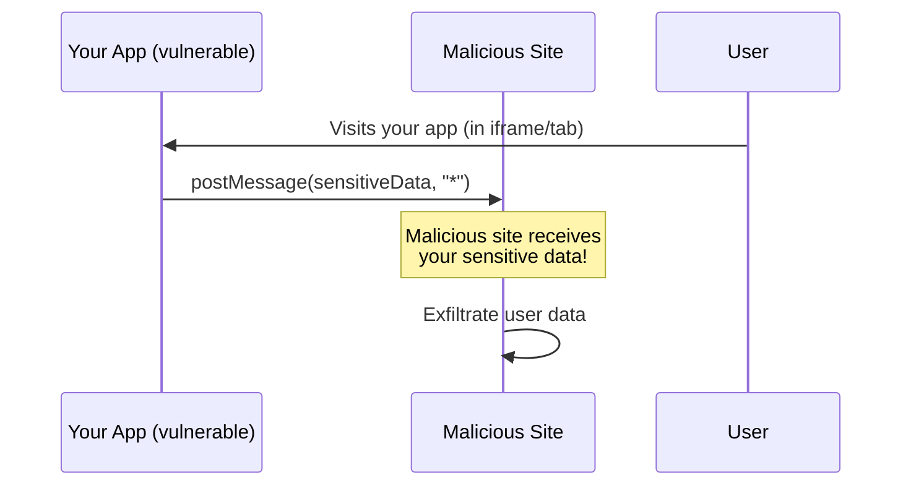

> 🔒 Disallow using wildcard (\*) as targetOrigin in postMessage calls
**CWE:** [CWE-693](https://cwe.mitre.org/data/definitions/693.html)  
**OWASP Mobile:** [OWASP Mobile Top 10](https://owasp.org/www-project-mobile-top-10/)

## Rule Details

This rule prevents using `"*"` as the `targetOrigin` parameter in `postMessage()` calls. Using a wildcard allows **any window** to receive the message, potentially leaking sensitive data to malicious sites.

### Why is this dangerous?



When you use `postMessage(data, "*")`:

1. **Any window** that has a reference to your window can receive the message
2. Attackers can embed your site in an iframe and listen for messages
3. Sensitive data (tokens, user info) can be exfiltrated

## Examples

### ❌ Incorrect

```javascript
// Wildcard allows any window to receive the message
window.postMessage(userData, '*');

// Also dangerous with iframes
iframe.contentWindow.postMessage(authToken, '*');

// Parent window communication
parent.postMessage({ type: 'auth', token: jwt }, '*');

// Window opener
window.opener.postMessage(sensitiveData, '*');

// Options object with wildcard
window.postMessage(data, { targetOrigin: '*' });
```

### ✅ Correct

```javascript
// Specify the exact origin
window.postMessage(userData, 'https://trusted-domain.com');

// iframe with known origin
iframe.contentWindow.postMessage(authToken, 'https://embed.myapp.com');

// Parent window with specific origin
parent.postMessage({ type: 'auth', token: jwt }, 'https://parent.myapp.com');

// Use "/" for same-origin communication
window.postMessage(data, '/');

// Options object with specific origin
window.postMessage(data, { targetOrigin: 'https://trusted-domain.com' });
```

## Options

```json
{
  "browser-security/no-postmessage-wildcard-origin": [
    "error",
    {
      "allowInTests": true
    }
  ]
}
```

| Option         | Type      | Default | Description                                        |
| -------------- | --------- | ------- | -------------------------------------------------- |
| `allowInTests` | `boolean` | `true`  | Skip checking in test files (_.test.ts, _.spec.ts) |

## When Not To Use It

You may disable this rule if:

- Your application only sends non-sensitive public data via postMessage
- You're building a development tool where security isn't a concern
- You have other mechanisms to prevent cross-origin message interception

However, it's generally recommended to **always specify the exact target origin**.

## Related

- [CWE-346: Origin Validation Error](https://cwe.mitre.org/data/definitions/346.html)
- [MDN: postMessage Security Concerns](https://developer.mozilla.org/en-US/docs/Web/API/Window/postMessage#security_concerns)
- [`browser-security/require-postmessage-origin-check`](./require-postmessage-origin-check.md) - Validates origin on message receipt

## Known False Negatives

The following patterns are **not detected** due to static analysis limitations:

### Origin from Variable

**Why**: Origin stored in variables is not analyzed.

```typescript
// ❌ NOT DETECTED - Origin from variable
const origin = '*';
window.postMessage(data, origin);
```

**Mitigation**: Never assign '\*' to origin variables.

### Dynamic Origin Construction

**Why**: Computed origins are not traced.

```typescript
// ❌ NOT DETECTED - Dynamic construction
const target = getTargetOrigin(); // May return '*'
iframe.contentWindow.postMessage(data, target);
```

**Mitigation**: Validate origin before postMessage.

### Wrapper Functions

**Why**: Custom postMessage wrappers not recognized.

```typescript
// ❌ NOT DETECTED - Wrapper function
sendMessage(data, '*'); // Uses postMessage internally
```

**Mitigation**: Apply rule to wrapper implementations.

## OWASP Mapping

| Category          | ID                               |
| ----------------- | -------------------------------- |
| OWASP Top 10 2021 | A01:2021 - Broken Access Control |
| CWE               | CWE-346                          |
| CVSS              | 7.5 (High)                       |
