> 🔒 Disallow storing sensitive data (tokens, passwords) in cookies via JavaScript

<!-- @rule-summary -->
The rule provides LLM-optimized error messages (Compact 2-line format) with actionable security guidance:
<!-- @/rule-summary -->

**CWE:** [CWE-359](https://cwe.mitre.org/data/definitions/359.html)  
**OWASP Mobile:** [OWASP Mobile Top 10](https://owasp.org/www-project-mobile-top-10/)

## Error Message Format

The rule provides **LLM-optimized error messages** (Compact 2-line format) with actionable security guidance:

```text
⚠️ CWE-1004 OWASP:A02 CVSS:5.3 | Sensitive Cookie Without HttpOnly detected | MEDIUM
   Fix: Review and apply the recommended fix | https://owasp.org/Top10/A02_2021/
```

### Message Components

| Component | Purpose | Example |
| :--- | :--- | :--- |
| **Risk Standards** | Security benchmarks | [CWE-1004](https://cwe.mitre.org/data/definitions/1004.html) [OWASP:A02](https://owasp.org/Top10/A02_2021-Injection/) CVSS Score |
| **Issue Description** | Specific vulnerability | `Sensitive Cookie Without HttpOnly detected` |
| **Severity & Compliance** | Impact assessment | `MEDIUM` |
| **Fix Instruction** | Actionable remediation | `Follow the remediation steps below` |
| **Technical Truth** | Official reference | [OWASP Top 10](https://owasp.org/Top10/A02_2021-Injection/) |

## Rule Details

This rule prevents setting sensitive cookies (authentication tokens, session IDs, etc.) via `document.cookie`. Cookies set through JavaScript are accessible to XSS attacks, while server-set cookies with the `HttpOnly` flag are protected.

### Why is this dangerous?

```mermaid
flowchart TD
    A[Attacker injects XSS] --> B{Cookie type?}
    B -->|JavaScript cookie| C[document.cookie accessible]
    C --> D[Token stolen!]
    B -->|HttpOnly cookie| E[document.cookie blocked]
    E --> F[Token safe ✓]

    style D fill:#ff6b6b
    style F fill:#51cf66
```



When you set cookies via JavaScript:

1. **Any XSS attack can read the cookie** via `document.cookie`
2. **No way to add HttpOnly flag** - only the server can set it
3. **Session tokens become vulnerable** to theft

## Examples

### ❌ Incorrect

```javascript
// Setting auth token in cookie via JavaScript
document.cookie = 'token=eyJhbGciOiJIUzI1NiIsInR5cCI6IkpXVCJ9...';

// Session ID
document.cookie = 'sessionId=abc123';

// JWT
document.cookie = 'jwt=eyJ...';

// Access token
document.cookie = 'access_token=' + accessToken;

// With template literal
document.cookie = `refreshToken=${token}; Secure; SameSite=Strict`;

// Even with security attributes, still vulnerable!
document.cookie = 'authToken=xyz; Secure; SameSite=Strict';
```

### ✅ Correct

```javascript
// Non-sensitive cookies are fine
document.cookie = 'theme=dark';
document.cookie = 'locale=en-US';
document.cookie = 'visited=true';

// Set auth tokens via server response:
// Server: res.cookie('token', value, {
//   httpOnly: true,
//   secure: true,
//   sameSite: 'strict'
// });

// Or use fetch to get server-set HttpOnly cookie
await fetch('/api/auth/login', {
  method: 'POST',
  credentials: 'include',
  body: JSON.stringify({ username, password }),
});
// Server sets: Set-Cookie: token=xxx; HttpOnly; Secure; SameSite=Strict
```

## Options

```json
{
  "browser-security/no-sensitive-cookie-js": [
    "error",
    {
      "allowInTests": true,
      "sensitivePatterns": [
        "token",
        "jwt",
        "session",
        "auth",
        "password",
        "secret",
        "api_key",
        "credential"
      ]
    }
  ]
}
```

| Option              | Type       | Default   | Description                     |
| ------------------- | ---------- | --------- | ------------------------------- |
| `allowInTests`      | `boolean`  | `true`    | Skip checking in test files     |
| `sensitivePatterns` | `string[]` | See below | Patterns to detect as sensitive |

### Default Sensitive Patterns

```javascript
[
  'token',
  'jwt',
  'access_token',
  'accessToken',
  'refresh_token',
  'refreshToken',
  'id_token',
  'idToken',
  'auth',
  'session',
  'sessionId',
  'session_id',
  'password',
  'passwd',
  'secret',
  'api_key',
  'apiKey',
  'private_key',
  'privateKey',
  'credential',
  'bearer',
];
```

## When Not To Use It

You may disable this rule if:

- You're implementing a legacy system that requires client-side cookie management
- You're working with non-sensitive cookies only

However, **always prefer server-set HttpOnly cookies** for any authentication-related data.

## Server-Side Cookie Best Practices

### Express.js

```javascript
res.cookie('token', jwtToken, {
  httpOnly: true, // Prevents XSS access
  secure: true, // HTTPS only
  sameSite: 'strict', // CSRF protection
  maxAge: 3600000, // 1 hour
});
```

### NestJS

```typescript
@Post('login')
login(@Res() res: Response) {
  res.cookie('token', jwtToken, {
    httpOnly: true,
    secure: true,
    sameSite: 'strict'
  });
}
```

## Related

- [CWE-1004: Sensitive Cookie Without 'HttpOnly' Flag](https://cwe.mitre.org/data/definitions/1004.html)
- [MDN: Cookie Security](https://developer.mozilla.org/en-US/docs/Web/HTTP/Cookies#security)
- [OWASP: Session Management Cheat Sheet](https://owasp.org/www-project-web-security-testing-guide/latest/4-Web_Application_Security_Testing/06-Session_Management_Testing/02-Testing_for_Cookies_Attributes)

## Known False Negatives

The following patterns are **not detected** due to static analysis limitations:

### Dynamic Cookie Name

**Why**: Computed names not analyzed.

```typescript
// ❌ NOT DETECTED - Dynamic name
const name = 'authToken';
document.cookie = `${name}=${value}`;
```

**Mitigation**: Never set auth cookies client-side.

### Cookie Values from Variables

**Why**: Value patterns in variables not traced.

```typescript
// ❌ NOT DETECTED - Value from variable
const data = jwt;
document.cookie = 'data=' + data;
```

**Mitigation**: Set auth cookies server-side.

### Cookie Library Wrappers

**Why**: Library methods not recognized.

```typescript
// ❌ NOT DETECTED - Library wrapper
js - cookie.set('token', jwt);
```

**Mitigation**: Apply rule to library implementations.

## OWASP Mapping

| Category          | ID                                |
| ----------------- | --------------------------------- |
| OWASP Top 10 2021 | A02:2021 - Cryptographic Failures |
| CWE               | CWE-1004                          |
| CVSS              | 8.1 (High)                        |