> **Keywords:** no sensitive data in cache, browser storage, localStorage, security, ESLint rule, [CWE-200](https://cwe.mitre.org/data/definitions/200.html), information disclosure
> **CWE:** [CWE-200: Exposure of Sensitive Information to an Unauthorized Actor](https://cwe.mitre.org/data/definitions/200.html)  
> **OWASP Mobile:** [OWASP Mobile Top 10 M9: Insecure Data Storage](https://owasp.org/www-project-mobile-top-10/)


<!-- @rule-summary -->
CWE: [CWE-200](https://cwe.mitre.org/data/definitions/200.html)
<!-- @/rule-summary -->

ESLint Rule: no-sensitive-data-in-cache. This rule is part of [`eslint-plugin-browser-security`](https://www.npmjs.com/package/eslint-plugin-browser-security).

## Quick Summary

| Aspect          | Details                                 |
| --------------- | --------------------------------------- |
| **Severity**    | High (Information Disclosure)           |
| **Auto-Fix**    | ❌ No (requires architectural update)   |
| **Category**   | Security |
| **ESLint MCP**  | ✅ Optimized for ESLint MCP integration |
| **Best For**    | Apps handling PII or auth tokens        |
| **Suggestions** | ✅ Advice on using session-only storage |

## Vulnerability and Risk

**Vulnerability:** Information disclosure occurs when sensitive data (like passwords, tokens, or PII) is stored in browser-accessible storage like `localStorage`, `sessionStorage`, or the `Cache` API.

**Risk:** Data in these storages is often persistent and lacks high-fidelity access control. It can be easily accessed by malicious scripts (Cross-Site Scripting - XSS) or anyone with physical access to the device.

## Error Message Format

The rule provides **LLM-optimized error messages** (Compact 2-line format) with actionable security guidance:

```text
🔒 CWE-200 OWASP:M9 | Sensitive Data in Cache detected | HIGH [InfoDisclosure,Privacy]
   Fix: Do not store sensitive data in browser caches; use HttpOnly cookies | https://cwe.mitre.org/data/definitions/200.html
```

### Message Components

| Component                 | Purpose                | Example                                                                                                             |
| :------------------------ | :--------------------- | :------------------------------------------------------------------------------------------------------------------ |
| **Risk Standards**        | Security benchmarks    | [CWE-200](https://cwe.mitre.org/data/definitions/200.html) [OWASP:M9](https://owasp.org/www-project-mobile-top-10/) |
| **Issue Description**     | Specific vulnerability | `Sensitive Data in Cache detected`                                                                                  |
| **Severity & Compliance** | Impact assessment      | `HIGH [InfoDisclosure,Privacy]`                                                                                     |
| **Fix Instruction**       | Actionable remediation | `Do not store sensitive data in browser caches`                                                                     |
| **Technical Truth**       | Official reference     | [Exposure of Sensitive Info](https://cwe.mitre.org/data/definitions/200.html)                                       |

## Rule Details

This rule flags calls to storage methods (`set`, `put`, `store`) where the key name suggests it might contain sensitive information (e.g., keys containing "password", "token", "credit", "ssn").

```mermaid
%%{init: {
  'theme': 'base',
  'themeVariables': {
    'primaryColor': '#f8fafc',
    'primaryTextColor': '#1e293b',
    'primaryBorderColor': '#334155',
    'lineColor': '#475569',
    'c0': '#f8fafc',
    'c1': '#f1f5f9',
    'c2': '#e2e8f0',
    'c3': '#cbd5e1'
  }
}}%%
flowchart TD
    A[Storage Call] --> B{Key Name Analysis}
    B -->|Matches Sensitive Keywords| C[🚨 High Risk Storage]
    B -->|Generic Name| D[✅ Safe Storage]
    C --> E[💡 Suggest Encryption or HttpOnly]
```



### Why This Matters

| Issue              | Impact                         | Solution                                      |
| ------------------ | ------------------------------ | --------------------------------------------- |
| 🕵️ **XSS Impact**  | Tokens stolen via script       | Store tokens in HttpOnly/Secure cookies       |
| 🗄️ **Persistence** | Data stays on public computers | Use session-only variables for sensitive data |
| 🤝 **Trust**       | User data leaked               | Encrypt any mandatory client-side storage     |

## Configuration

This rule has no configuration options in the current version.

## Examples

### ❌ Incorrect

```javascript
// Storing an authentication token in localStorage
localStorage.setItem('user_auth_token', token);

// Storing a password directly
sessionStorage.setItem('temp_password', '123456');

// Using the Cache API to store sensitive data
cache.put('user_profile_data', new Response(JSON.stringify({ ssn: '...' })));
```

### ✅ Correct

```javascript
// Store non-sensitive identifiers instead
localStorage.setItem('user_preferences', JSON.stringify({ theme: 'dark' }));

// For authentication tokens, use HttpOnly cookies (handled on the server)
// Or use short-lived in-memory variables.

// If storage is absolutely necessary, encrypt the data before storing
const encryptedData = encryptSensitiveData(token);
localStorage.setItem('auth_token_encrypted', encryptedData);
```

## Known False Negatives

The following patterns are **not detected** due to static analysis limitations:

### Non-Literal Keys

**Why**: If the storage key is constructed dynamically or passed as a variable, this rule might miss it as it specifically checks literal strings.

```javascript
const KEY_NAME = 'auth_token';
localStorage.setItem(KEY_NAME, data); // ❌ NOT DETECTED
```

**Mitigation**: Standardize storage keys throughout the application and use a centralized storage wrapper.

### Obfuscated Key Names

**Why**: Developers might use non-obvious key names to store sensitive data.

```javascript
localStorage.setItem('xyz123', secret_token); // ❌ NOT DETECTED
```

**Mitigation**: Perform thorough code reviews and use data masking or encryption.

## References

- [CWE-200: Exposure of Sensitive Information](https://cwe.mitre.org/data/definitions/200.html)
- [OWASP HTML5 Security Cheat Sheet - Local Storage](https://cheatsheetseries.owasp.org/cheatsheets/HTML5_Security_Cheat_Sheet.html#local-storage)
- [MDN - Window.localStorage](https://developer.mozilla.org/en-US/docs/Web/API/Window/localStorage)