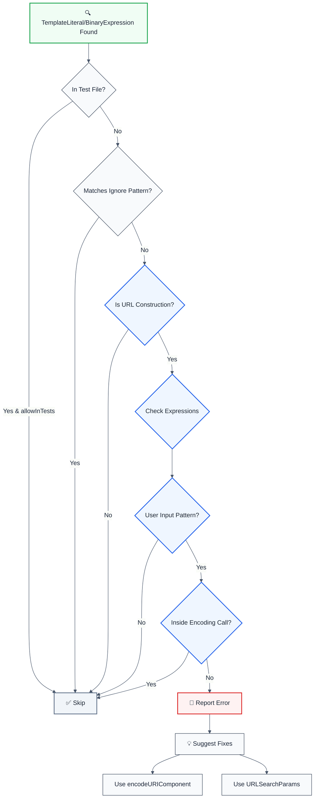

> **Keywords:** URL encoding, CWE-79, security, ESLint rule, URL parameters, encodeURIComponent, URLSearchParams, XSS, open redirect, auto-fix, LLM-optimized, code security

<!-- @rule-summary -->
Detects unescaped URL parameters that can lead to Cross-Site Scripting (XSS) or open redirect vulnerabilities
<!-- @/rule-summary -->

**CWE:** [CWE-116](https://cwe.mitre.org/data/definitions/116.html)  
**OWASP Mobile:** [M4: Insufficient Input/Output Validation](https://owasp.org/www-project-mobile-top-10/)

Detects unescaped URL parameters that can lead to Cross-Site Scripting (XSS) or open redirect vulnerabilities. This rule is part of [`eslint-plugin-secure-coding`](https://www.npmjs.com/package/eslint-plugin-secure-coding) and provides LLM-optimized error messages that AI assistants can automatically fix.

⚠️ This rule **_warns_** by default in the `recommended` config.

## Quick Summary

| Aspect            | Details                                                                         |
| ----------------- | ------------------------------------------------------------------------------- |
| **CWE Reference** | [CWE-79](https://cwe.mitre.org/data/definitions/79.html) (Cross-site Scripting) |
| **Severity**      | High (security vulnerability)                                                   |
| **Auto-Fix**      | ✅ Yes (suggests encodeURIComponent or URLSearchParams)                         |
| **Category**   | Security |
| **ESLint MCP**    | ✅ Optimized for ESLint MCP integration                                         |
| **Best For**      | All web applications constructing URLs, API clients, redirect handlers          |

## Vulnerability and Risk

**Vulnerability:** Constructing URLs by concatenating unescaped user input can allow attackers to inject special characters that alter the meaning of the URL.

**Risk:** This leads to multiple vulnerabilities:

- **Cross-Site Scripting (XSS):** If the URL is reflected in the page (e.g., `href`), attackers can inject `javascript:` URIs.
- **Open Redirect:** Attackers can redirect users to malicious sites if the input controls the domain or path.
- **Parameter Injection:** Attackers can inject additional query parameters to override settings.

## Error Message Format

The rule provides **LLM-optimized error messages** (Compact 2-line format) with actionable security guidance:

```text
⚠️ CWE-79 OWASP:A05 CVSS:6.1 | Cross-site Scripting (XSS) detected | MEDIUM [SOC2,PCI-DSS,GDPR,ISO27001]
   Fix: Review and apply the recommended fix | https://owasp.org/Top10/A05_2021/
```

### Message Components

| Component | Purpose | Example |
| :--- | :--- | :--- |
| **Risk Standards** | Security benchmarks | [CWE-79](https://cwe.mitre.org/data/definitions/79.html) [OWASP:A05](https://owasp.org/Top10/A05_2021-Injection/) [CVSS:6.1](https://nvd.nist.gov/vuln-metrics/cvss/v3-calculator?vector=AV:N/AC:L/PR:N/UI:N/S:U/C:H/I:H/A:H) |
| **Issue Description** | Specific vulnerability | `Cross-site Scripting (XSS) detected` |
| **Severity & Compliance** | Impact assessment | `MEDIUM [SOC2,PCI-DSS,GDPR,ISO27001]` |
| **Fix Instruction** | Actionable remediation | `Follow the remediation steps below` |
| **Technical Truth** | Official reference | [OWASP Top 10](https://owasp.org/Top10/A05_2021-Injection/) |

## Rule Details

Unescaped URL parameters can allow attackers to inject malicious code or manipulate URLs for phishing attacks. This rule detects URL construction patterns where user input is directly concatenated or interpolated without proper encoding.

### Why This Matters

| Issue                 | Impact                                 | Solution                     |
| --------------------- | -------------------------------------- | ---------------------------- |
| 🔒 **Security**       | XSS attacks via URL parameters         | Use encodeURIComponent       |
| 🐛 **Open Redirect**  | Phishing attacks via redirect URLs     | Validate and encode URLs     |
| 🔐 **Data Integrity** | Malformed URLs can break functionality | URLSearchParams              |
| 📊 **Compliance**     | Violates security best practices       | Always encode URL parameters |

## Detection Patterns

The rule detects:

- **Template literals**: URL construction with unescaped user input in template strings
- **String concatenation**: URL construction using `+` operator with unescaped parameters
- **User input patterns**: `req.query`, `req.params`, `userInput`, `searchParams`

## Examples

### ❌ Incorrect

```typescript
// Unescaped in template literal
const url = `https://example.com?q=${req.query.q}`; // ❌ XSS vulnerability

// Unescaped in string concatenation
const url = 'https://example.com?search=' + userInput; // ❌ XSS vulnerability

// Unescaped route parameters
const url = `https://example.com/user/${req.params.id}`; // ❌ Open redirect risk

// Unescaped Next.js searchParams
const url = `https://example.com?redirect=${searchParams.get('url')}`; // ❌ Open redirect
```

### ✅ Correct

```typescript
// Using encodeURIComponent
const url = `https://example.com?q=${encodeURIComponent(req.query.q)}`; // ✅ Safe

// Using URLSearchParams
const params = new URLSearchParams({ q: req.query.q });
const url = `https://example.com?${params}`; // ✅ Safe

// Encoding in string concatenation
const url = 'https://example.com?search=' + encodeURIComponent(userInput); // ✅ Safe

// Encoding route parameters
const url = `https://example.com/user/${encodeURIComponent(req.params.id)}`; // ✅ Safe

// Using URLSearchParams for multiple parameters
const params = new URLSearchParams({
  q: searchParams.get('q'),
  page: searchParams.get('page'),
});
const url = `https://example.com?${params}`; // ✅ Safe
```

## Configuration

```javascript
{
  rules: {
    'secure-coding/no-unescaped-url-parameter': ['error', {
      allowInTests: false,                    // Allow in test files
      trustedLibraries: ['url', 'querystring'], // Trusted URL construction libraries
      ignorePatterns: []                     // Additional safe patterns to ignore
    }]
  }
}
```

## Options

| Option             | Type       | Default                  | Description                                     |
| ------------------ | ---------- | ------------------------ | ----------------------------------------------- |
| `allowInTests`     | `boolean`  | `false`                  | Allow unescaped URL parameters in test files    |
| `trustedLibraries` | `string[]` | `['url', 'querystring']` | Trusted URL construction libraries to recognize |
| `ignorePatterns`   | `string[]` | `[]`                     | Additional safe patterns to ignore              |

## Rule Logic Flow



## Best Practices

### 1. Use encodeURIComponent for Query Parameters

```typescript
// ✅ Good - Encodes special characters
const query = 'hello world & more';
const url = `https://example.com?q=${encodeURIComponent(query)}`;
// Result: https://example.com?q=hello%20world%20%26%20more
```

### 2. Use URLSearchParams for Multiple Parameters

```typescript
// ✅ Good - Handles multiple parameters automatically
const params = new URLSearchParams({
  q: 'search term',
  page: '1',
  sort: 'date',
});
const url = `https://example.com?${params}`;
// Result: https://example.com?q=search+term&page=1&sort=date
```

### 3. Use encodeURI for Path Segments

```typescript
// ✅ Good - Encodes path segments (but preserves /)
const path = 'user/profile';
const url = `https://example.com/${encodeURI(path)}`;
// Result: https://example.com/user/profile
```

### 4. Validate Before Encoding

```typescript
// ✅ Good - Validate then encode
function buildRedirectUrl(input: string): string {
  // Validate URL format
  if (!input.startsWith('https://') && !input.startsWith('/')) {
    throw new Error('Invalid redirect URL');
  }
  // Encode if it's a relative path
  if (input.startsWith('/')) {
    return encodeURIComponent(input);
  }
  return input;
}
```

### 5. Use URL Constructor for Complex URLs

```typescript
// ✅ Good - URL constructor handles encoding automatically
const url = new URL('https://example.com');
url.searchParams.set('q', userInput);
url.searchParams.set('page', '1');
const finalUrl = url.toString(); // Automatically encoded
```

## Known False Negatives

The following patterns are **not detected** due to static analysis limitations:

### Values from Variables

**Why**: Values stored in variables are not traced.

```typescript
// ❌ NOT DETECTED - Value from variable
const value = userInput;
dangerousOperation(value);
```

**Mitigation**: Validate all user inputs.

### Wrapper Functions

**Why**: Custom wrappers not recognized.

```typescript
// ❌ NOT DETECTED - Wrapper
myWrapper(userInput); // Uses dangerous API internally
```

**Mitigation**: Apply rule to wrapper implementations.

### Dynamic Invocation

**Why**: Dynamic calls not analyzed.

```typescript
// ❌ NOT DETECTED - Dynamic
obj[method](userInput);
```

**Mitigation**: Avoid dynamic method invocation.

## Related Rules

- [`no-unvalidated-user-input`](./no-unvalidated-user-input.md) - Detects unvalidated user input
- [`no-unsanitized-html`](./no-unsanitized-html.md) - Detects unsanitized HTML injection
- [`no-sql-injection`](./no-sql-injection.md) - Detects SQL injection vulnerabilities
- [`no-missing-cors-check`](./no-missing-cors-check.md) - Detects missing CORS validation

## Resources

- [CWE-79: Cross-site Scripting](https://cwe.mitre.org/data/definitions/79.html)
- [OWASP URL Validation Cheat Sheet](https://cheatsheetseries.owasp.org/cheatsheets/Input_Validation_Cheat_Sheet.html)
- [MDN: encodeURIComponent](https://developer.mozilla.org/en-US/docs/Web/JavaScript/Reference/Global_Objects/encodeURIComponent)
- [MDN: URLSearchParams](https://developer.mozilla.org/en-US/docs/Web/API/URLSearchParams)
- [OWASP Open Redirect Prevention](https://cheatsheetseries.owasp.org/cheatsheets/Unvalidated_Redirects_and_Forwards_Cheat_Sheet.html)