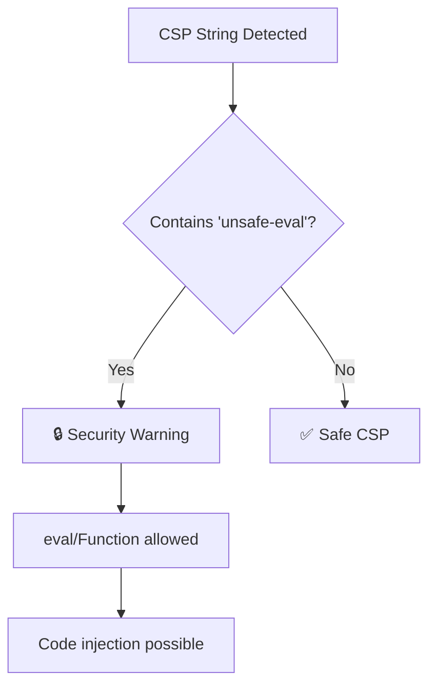

# no-unsafe-eval-csp

Disallow 'unsafe-eval' in Content Security Policy directives.

## ⚠️ Security Issue

| Property     | Value                                                                    |
| ------------ | ------------------------------------------------------------------------ |
| **CWE**      | [CWE-95: Code Injection](https://cwe.mitre.org/data/definitions/95.html) |
| **OWASP**    | A03:2021 - Injection                                                     |
| **CVSS**     | 8.1 (High)                                                               |
| **Severity** | HIGH                                                                     |

## 📋 Description

The `'unsafe-eval'` CSP directive allows the use of `eval()`, `Function()`, and similar dynamic code execution methods. This enables attackers to inject and execute arbitrary JavaScript code.

## 🔍 What This Rule Detects



## ❌ Incorrect

```javascript
// Literal string with unsafe-eval
const csp = "script-src 'unsafe-eval'";

// Combined with other directives
const policy = "default-src 'self'; script-src 'unsafe-eval' 'self'";

// Template literal
const csp = `script-src 'unsafe-eval'`;

// In HTTP header
res.setHeader('Content-Security-Policy', "script-src 'unsafe-eval'");
```

## ✅ Correct

```javascript
// Avoid eval entirely
const csp = "script-src 'self'";

// Use strict CSP
const policy = "default-src 'self'; script-src 'self' 'nonce-abc123'";

// Use WebAssembly-specific directive if needed
const csp = "script-src 'self' 'wasm-unsafe-eval'";
```

## 🛠️ Options

```json
{
  "rules": {
    "@interlace/browser-security/no-unsafe-eval-csp": [
      "error",
      {
        "allowInTests": true
      }
    ]
  }
}
```

| Option         | Type      | Default | Description                    |
| -------------- | --------- | ------- | ------------------------------ |
| `allowInTests` | `boolean` | `true`  | Disable the rule in test files |

## 💡 Why This Matters

`eval()` and `Function()` can execute arbitrary code, making them extremely dangerous when handling any user input. Even if your application doesn't directly use eval, many libraries do, potentially opening attack vectors.

### Common issues requiring unsafe-eval:

1. **Legacy code**: Refactor to use JSON.parse or safer alternatives
2. **Template engines**: Use precompiled templates
3. **Third-party libraries**: Consider alternatives or sandbox them

## 📚 Related Resources

- [MDN: Content-Security-Policy](https://developer.mozilla.org/en-US/docs/Web/HTTP/CSP)
- [CWE-95: Code Injection](https://cwe.mitre.org/data/definitions/95.html)
- [Avoiding eval()](https://developer.mozilla.org/en-US/docs/Web/JavaScript/Reference/Global_Objects/eval#never_use_eval!)
