# no-unsafe-eval-csp

Disallow 'unsafe-eval' in Content Security Policy directives.

## ⚠️ Security Issue

| Property     | Value                                                                    |
| ------------ | ------------------------------------------------------------------------ |
| **CWE**      | [CWE-95: Code Injection](https://cwe.mitre.org/data/definitions/95.html) |
| **OWASP**    | A03:2021 - Injection                                                     |
| **CVSS**     | 8.1 (High)                                                               |
| **Severity** | HIGH                                                                     |

## 📋 Description

The `'unsafe-eval'` CSP directive allows the use of `eval()`, `Function()`, and similar dynamic code execution methods. This enables attackers to inject and execute arbitrary JavaScript code.

## 🔍 What This Rule Detects

```mermaid
flowchart TD
    A[CSP String Detected] --> B{Contains 'unsafe-eval'?}
    B -->|Yes| C[🔒 Security Warning]
    B -->|No| D[✅ Safe CSP]
    C --> E[eval/Function allowed]
    E --> F[Code injection possible]
```



## ❌ Incorrect

```javascript
// Literal string with unsafe-eval
const csp = "script-src 'unsafe-eval'";

// Combined with other directives
const policy = "default-src 'self'; script-src 'unsafe-eval' 'self'";

// Template literal
const csp = `script-src 'unsafe-eval'`;

// In HTTP header
res.setHeader('Content-Security-Policy', "script-src 'unsafe-eval'");
```

## ✅ Correct

```javascript
// Avoid eval entirely
const csp = "script-src 'self'";

// Use strict CSP
const policy = "default-src 'self'; script-src 'self' 'nonce-abc123'";

// Use WebAssembly-specific directive if needed
const csp = "script-src 'self' 'wasm-unsafe-eval'";
```

## 🛠️ Options

```json
{
  "rules": {
    "@interlace/browser-security/no-unsafe-eval-csp": [
      "error",
      {
        "allowInTests": true
      }
    ]
  }
}
```

| Option         | Type      | Default | Description                    |
| -------------- | --------- | ------- | ------------------------------ |
| `allowInTests` | `boolean` | `true`  | Disable the rule in test files |

## 💡 Why This Matters

`eval()` and `Function()` can execute arbitrary code, making them extremely dangerous when handling any user input. Even if your application doesn't directly use eval, many libraries do, potentially opening attack vectors.

### Common issues requiring unsafe-eval:

1. **Legacy code**: Refactor to use JSON.parse or safer alternatives
2. **Template engines**: Use precompiled templates
3. **Third-party libraries**: Consider alternatives or sandbox them

## Known False Negatives

The following patterns are **not detected** due to static analysis limitations:

### CSP from Variable

**Why**: CSP strings from variables not traced.

```typescript
// ❌ NOT DETECTED - CSP from variable
const cspValue = `script-src 'unsafe-eval'`;
res.setHeader('Content-Security-Policy', cspValue);
```

**Mitigation**: Use inline CSP strings in setHeader calls.

### CSP from Configuration

**Why**: Config values not visible.

```typescript
// ❌ NOT DETECTED - From config
res.setHeader('Content-Security-Policy', config.csp);
```

**Mitigation**: Validate CSP config values.

### Framework Middleware

**Why**: CSP middleware configurations not analyzed.

```typescript
// ❌ NOT DETECTED - Helmet config
helmet.contentSecurityPolicy({ directives: { scriptSrc: ["'unsafe-eval'"] } });
```

**Mitigation**: Review framework CSP configurations.

## 📚 Related Resources

- [MDN: Content-Security-Policy](https://developer.mozilla.org/en-US/docs/Web/HTTP/CSP)
- [CWE-95: Code Injection](https://cwe.mitre.org/data/definitions/95.html)
- [Avoiding eval()](https://developer.mozilla.org/en-US/docs/Web/JavaScript/Reference/Global_Objects/eval#never_use_eval!)

## Error Message Format

The rule provides **LLM-optimized error messages** (Compact 2-line format) with actionable security guidance:

```text
🔒 CWE-95 OWASP:A05 CVSS:9.8 | Eval Injection detected | CRITICAL [SOC2,PCI-DSS,ISO27001]
   Fix: Review and apply the recommended fix | https://owasp.org/Top10/A05_2021/
```

### Message Components

| Component | Purpose | Example |
| :--- | :--- | :--- |
| **Risk Standards** | Security benchmarks | [CWE-95](https://cwe.mitre.org/data/definitions/95.html) [OWASP:A05](https://owasp.org/Top10/A05_2021-Injection/) [CVSS:9.8](https://nvd.nist.gov/vuln-metrics/cvss/v3-calculator?vector=AV:N/AC:L/PR:N/UI:N/S:U/C:H/I:H/A:H) |
| **Issue Description** | Specific vulnerability | `Eval Injection detected` |
| **Severity & Compliance** | Impact assessment | `CRITICAL [SOC2,PCI-DSS,ISO27001]` |
| **Fix Instruction** | Actionable remediation | `Follow the remediation steps below` |
| **Technical Truth** | Official reference | [OWASP Top 10](https://owasp.org/Top10/A05_2021-Injection/) |
