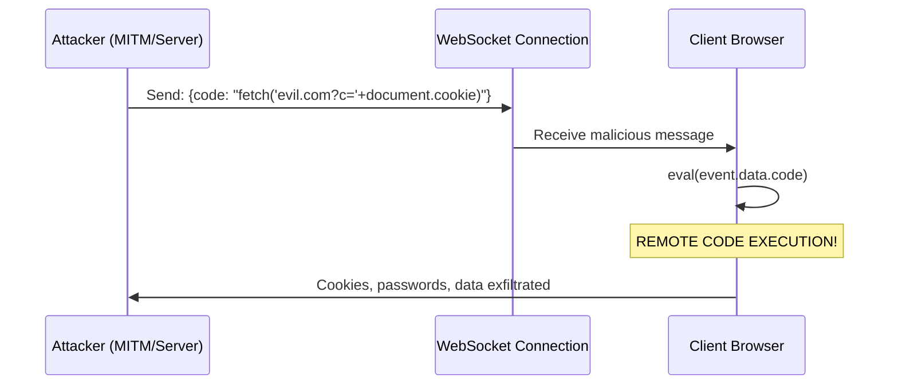

> 🔒 Disallow using eval() or Function() with WebSocket message data
**CWE:** [CWE-319](https://cwe.mitre.org/data/definitions/319.html)  
**OWASP Mobile:** [M5: Insecure Communication](https://owasp.org/www-project-mobile-top-10/)

## Error Message Format

The rule provides **LLM-optimized error messages** (Compact 2-line format) with actionable security guidance:

```text
🔒 CWE-95 OWASP:A05 CVSS:9.8 | Eval Injection detected | CRITICAL [SOC2,PCI-DSS,ISO27001]
   Fix: Review and apply the recommended fix | https://owasp.org/Top10/A05_2021/
```

### Message Components

| Component | Purpose | Example |
| :--- | :--- | :--- |
| **Risk Standards** | Security benchmarks | [CWE-95](https://cwe.mitre.org/data/definitions/95.html) [OWASP:A05](https://owasp.org/Top10/A05_2021-Injection/) [CVSS:9.8](https://nvd.nist.gov/vuln-metrics/cvss/v3-calculator?vector=AV:N/AC:L/PR:N/UI:N/S:U/C:H/I:H/A:H) |
| **Issue Description** | Specific vulnerability | `Eval Injection detected` |
| **Severity & Compliance** | Impact assessment | `CRITICAL [SOC2,PCI-DSS,ISO27001]` |
| **Fix Instruction** | Actionable remediation | `Follow the remediation steps below` |
| **Technical Truth** | Official reference | [OWASP Top 10](https://owasp.org/Top10/A05_2021-Injection/) |

## Rule Details

This rule prevents using `eval()`, `new Function()`, or `Function()` with data received from WebSocket messages. This pattern enables **Remote Code Execution (RCE)** - one of the most severe security vulnerabilities.

### Why is this dangerous?



When you use eval with WebSocket data:

1. **Attacker-controlled code executes** in your application context
2. **Full access to page data** - cookies, localStorage, DOM
3. **Actions performed as the user** - form submissions, API calls
4. **CVSS 9.8 (Critical)** - Maximum severity

## Examples

### ❌ Incorrect

```javascript
// eval() with event.data - CRITICAL RCE
ws.onmessage = (event) => {
  eval(event.data);
};

// new Function() with event.data
ws.onmessage = (event) => {
  const fn = new Function(event.data.code);
  fn();
};

// Function() constructor
socket.addEventListener('message', (event) => {
  const execute = Function(event.data);
  execute();
});

// Nested property
ws.onmessage = (event) => {
  eval(event.data.script);
};
```

### ✅ Correct

```javascript
// Parse as JSON and handle specific actions
ws.onmessage = (event) => {
  const data = JSON.parse(event.data);

  switch (data.action) {
    case 'update':
      updateUI(data.payload);
      break;
    case 'refresh':
      location.reload();
      break;
    default:
      console.warn('Unknown action:', data.action);
  }
};

// Use a command pattern with allowed actions
const handlers = {
  updateUser: (data) => updateUser(data),
  showMessage: (data) => showToast(data.message),
  navigate: (data) => router.push(data.path),
};

ws.onmessage = (event) => {
  const { action, payload } = JSON.parse(event.data);
  const handler = handlers[action];
  if (handler) {
    handler(payload);
  }
};
```

## Options

```json
{
  "browser-security/no-websocket-eval": [
    "error",
    {
      "allowInTests": true
    }
  ]
}
```

| Option         | Type      | Default | Description                                        |
| -------------- | --------- | ------- | -------------------------------------------------- |
| `allowInTests` | `boolean` | `true`  | Skip checking in test files (_.test.ts, _.spec.ts) |

## When Not To Use It

**Never disable this rule in production code.**

The only acceptable scenario is in development tools or REPLs where code execution is the explicit purpose, and even then, extreme caution is needed.

## Related Rules

- [`browser-security/no-eval`](./no-eval.md) - General eval() prevention
- [`browser-security/no-websocket-innerhtml`](./no-websocket-innerhtml.md) - XSS prevention
- [`browser-security/require-websocket-wss`](./require-websocket-wss.md) - Require encrypted connections

## Known False Negatives

The following patterns are **not detected** due to static analysis limitations:

### Data Stored in Variable

**Why**: Event data stored in variables not traced.

```typescript
// ❌ NOT DETECTED - Data stored first
ws.onmessage = (event) => {
  const code = event.data;
  setTimeout(() => eval(code), 100);
};
```

**Mitigation**: Never use eval with external data.

### Handler in Separate Function

**Why**: Handler function internals not analyzed.

```typescript
// ❌ NOT DETECTED - External handler
ws.onmessage = handleMessage; // May use eval internally
```

**Mitigation**: Apply rule to handler implementations.

### Indirect WebSocket Access

**Why**: WebSocket passed through may not be recognized.

```typescript
// ❌ NOT DETECTED - Indirect access
setupHandler(ws, (data) => eval(data.code));
```

**Mitigation**: Review all WebSocket handler patterns.

## OWASP Mapping

| Category          | ID                   |
| ----------------- | -------------------- |
| OWASP Top 10 2021 | A03:2021 - Injection |
| CWE               | CWE-95               |
| CVSS              | **9.8 (Critical)**   |
