# no-worker-message-innerhtml

Disallow using innerHTML with Web Worker message data.

## ⚠️ Security Issue

| Property     | Value                                                                          |
| ------------ | ------------------------------------------------------------------------------ |
| **CWE**      | [CWE-79: Cross-site Scripting](https://cwe.mitre.org/data/definitions/79.html) |
| **OWASP**    | A03:2021 - Injection                                                           |
| **CVSS**     | 7.5 (High)                                                                     |
| **Severity** | HIGH                                                                           |

## 📋 Description

Web Workers can process untrusted data from various sources. Directly rendering Worker message data via `innerHTML` can lead to XSS if the worker processes malicious content.

## 🔍 What This Rule Detects

```mermaid
flowchart TD
    A[Worker Message Handler] --> B{Uses innerHTML?}
    B -->|Yes| C{With event.data?}
    C -->|Yes| D[🔒 XSS Vulnerability]
    C -->|No| E[✅ No Issue]
    B -->|No| E
    D --> F[Malicious worker data]
    F --> G[Script injection]
```



## ❌ Incorrect

```javascript
// onmessage handler with innerHTML
worker.onmessage = (e) => {
  element.innerHTML = e.data;
};

// addEventListener pattern
myWorker.addEventListener('message', (event) => {
  container.innerHTML = event.data;
});

// outerHTML
worker.onmessage = (e) => {
  element.outerHTML = e.data;
};

// insertAdjacentHTML
worker.onmessage = (e) => {
  element.insertAdjacentHTML('beforeend', e.data);
};
```

## ✅ Correct

```javascript
// Use textContent for plain text
worker.onmessage = (e) => {
  element.textContent = e.data;
};

// Sanitize before rendering HTML
worker.onmessage = (e) => {
  const sanitized = DOMPurify.sanitize(e.data);
  element.innerHTML = sanitized;
};

// Parse and validate structured data
worker.onmessage = (e) => {
  const data = JSON.parse(e.data);
  if (isValid(data)) {
    renderData(data);
  }
};
```

## 🛠️ Options

```json
{
  "rules": {
    "@interlace/browser-security/no-worker-message-innerhtml": [
      "error",
      {
        "allowInTests": true
      }
    ]
  }
}
```

| Option         | Type      | Default | Description                    |
| -------------- | --------- | ------- | ------------------------------ |
| `allowInTests` | `boolean` | `true`  | Disable the rule in test files |

## 💡 Why This Matters

Workers process data in the background, often from external sources like APIs or uploaded files. If this data contains malicious HTML/JavaScript and is rendered without sanitization, it enables XSS attacks.

### Worker Data Sources to Consider:

1. **API responses**: Validate server data
2. **File processing**: Sanitize file contents
3. **Third-party integrations**: Never trust external data

## 📚 Related Resources

- [MDN: Web Workers](https://developer.mozilla.org/en-US/docs/Web/API/Worker)
- [DOMPurify](https://github.com/cure53/DOMPurify)
- [OWASP XSS Prevention](https://cheatsheetseries.owasp.org/cheatsheets/Cross_Site_Scripting_Prevention_Cheat_Sheet.html)
