> **Keywords:** require csp headers, Content Security Policy, security, ESLint rule, [CWE-1021](https://cwe.mitre.org/data/definitions/1021.html), XSS, Helmet
> **CWE:** [CWE-1021: Improper Restriction of Rendered-UI Layers or Frames](https://cwe.mitre.org/data/definitions/1021.html)  
> **OWASP Mobile:** [OWASP Mobile Top 10 M8: Security Misconfiguration](https://owasp.org/www-project-mobile-top-10/)


<!-- @rule-summary -->
CWE: [CWE-1021](https://cwe.mitre.org/data/definitions/1021.html)
<!-- @/rule-summary -->

ESLint Rule: require-csp-headers. This rule is part of [`eslint-plugin-browser-security`](https://www.npmjs.com/package/eslint-plugin-browser-security).

## Quick Summary

| Aspect          | Details                                         |
| --------------- | ----------------------------------------------- |
| **Severity**    | Medium (XSS Mitigation)                         |
| **Auto-Fix**    | ❌ No (requires policy definition)              |
| **Category**   | Security |
| **ESLint MCP**  | ✅ Optimized for ESLint MCP integration         |
| **Best For**    | Web servers serving HTML content                |
| **Suggestions** | ✅ Advice on using Helmet for standard policies |

## Vulnerability and Risk

**Vulnerability:** A missing or weak Content Security Policy (CSP) leaves an application vulnerable to Cross-Site Scripting (XSS), clickjacking, and data injection attacks.

**Risk:** Without a CSP, the browser has no way of knowing if a script running on the page is legitimate or has been injected by an attacker. A successful XSS attack can lead to session theft, credential harvesting, and defacement.

## Error Message Format

The rule provides **LLM-optimized error messages** (Compact 2-line format) with actionable security guidance:

```text
🔒 CWE-1021 OWASP:M8 | Missing CSP detected | MEDIUM [XSS Mitigation]
   Fix: Use helmet.contentSecurityPolicy() or set CSP header manually | https://cwe.mitre.org/data/definitions/1021.html
```

### Message Components

| Component                 | Purpose                | Example                                                                                                               |
| :------------------------ | :--------------------- | :-------------------------------------------------------------------------------------------------------------------- |
| **Risk Standards**        | Security benchmarks    | [CWE-1021](https://cwe.mitre.org/data/definitions/1021.html) [OWASP:M8](https://owasp.org/www-project-mobile-top-10/) |
| **Issue Description**     | Specific vulnerability | `Missing CSP detected`                                                                                                |
| **Severity & Compliance** | Impact assessment      | `MEDIUM [XSS Mitigation]`                                                                                             |
| **Fix Instruction**       | Actionable remediation | `Use helmet.contentSecurityPolicy()`                                                                                  |
| **Technical Truth**       | Official reference     | [Improper Restriction](https://cwe.mitre.org/data/definitions/1021.html)                                              |

## Rule Details

This rule flags Express response methods like `res.render()` or `res.send()` when they appear to be sending HTML content without a corresponding CSP header being configured.

```mermaid
%%{init: {
  'theme': 'base',
  'themeVariables': {
    'primaryColor': '#f8fafc',
    'primaryTextColor': '#1e293b',
    'primaryBorderColor': '#334155',
    'lineColor': '#475569',
    'c0': '#f8fafc',
    'c1': '#f1f5f9',
    'c2': '#e2e8f0',
    'c3': '#cbd5e1'
  }
}}%%
flowchart TD
    A[HTML Response] --> B{Has CSP Header?}
    B -->|Yes| C[✅ Secure Policy Enforced]
    B -->|No| D[🚨 XSS Vulnerability risk]
    D --> E[💡 Suggest Helmet or Manual Header]
```



### Why This Matters

| Issue               | Impact                          | Solution                                        |
| ------------------- | ------------------------------- | ----------------------------------------------- |
| 🕵️ **XSS**          | Session theft and data leakage  | Define strict `script-src` and `object-src`     |
| 🚀 **Exfiltration** | Stealing data to external sites | Use `connect-src` to restrict outgoing requests |
| 🤝 **Trust**        | Site used for phishing          | Use `frame-ancestors` to prevent clickjacking   |

## Configuration

This rule has no configuration options in the current version.

## Examples

### ❌ Incorrect

```javascript
// Sending HTML directly without CSP headers
app.get('/', (req, res) => {
  res.send('<!DOCTYPE html><html><body><h1>Hello World</h1></body></html>');
});

// Rendering a view without global CSP middleware
app.get('/home', (req, res) => {
  res.render('index', { title: 'Home' });
});
```

### ✅ Correct

```javascript
// Using Helmet middleware to set secure headers
import helmet from 'helmet';
app.use(helmet());

// Or setting CSP manually for a specific route
app.get('/', (req, res) => {
  res.setHeader(
    'Content-Security-Policy',
    "default-src 'self'; script-src 'self' https://trustedscripts.com",
  );
  res.send('<!DOCTYPE html><html>...</html>');
});
```

## Known False Negatives

The following patterns are **not detected** due to static analysis limitations:

### Global Middleware

**Why**: This rule is a heuristic and analyzes files individually. If you have global middleware like `helmet` in a central `app.js`, individual route handlers might still be flagged.

**Mitigation**: Use `// eslint-disable-next-line` for route handlers in projects where CSP is enforced globally.

### Non-Standard Express Methods

**Why**: Custom response wrappers or other frameworks might use different methods to send HTML.

**Mitigation**: Standardize on a security-first framework and ensure it's applied consistently.

## References

- [MDN - Content Security Policy (CSP)](https://developer.mozilla.org/en-US/docs/Web/HTTP/CSP)
- [CWE-1021: Improper Restriction of Rendered-UI Layers or Frames](https://cwe.mitre.org/data/definitions/1021.html)
- [Helmet.js - CSP](https://helmetjs.github.io/#content-security-policy)
- [OWASP Content Security Policy Cheat Sheet](https://cheatsheetseries.owasp.org/cheatsheets/Content_Security_Policy_Cheat_Sheet.html)