> **Keywords:** no-cryptojs-weak-random, WordArray, PRNG, CryptoJS, predictability, security, ESLint rule, CWE-338, cryptographic-security
> **CWE:** [CWE-338: Use of Cryptographically Weak Pseudo-Random Number Generator (PRNG)](https://cwe.mitre.org/data/definitions/338.html)  
> **OWASP:** [OWASP Top 10 A02:2021 - Cryptographic Failures](https://owasp.org/Top10/A02_2021-Cryptographic_Failures/)

ESLint Rule: no-cryptojs-weak-random. This rule is part of [`eslint-plugin-crypto`](https://www.npmjs.com/package/eslint-plugin-crypto).

## Quick Summary

| Aspect         | Details                                  |
| -------------- | ---------------------------------------- |
| **Severity**   | Critical (Predictable PRNG)              |
| **Auto-Fix**   | ❌ No (requires architectural change)    |
| **Category**   | Security |
| **ESLint MCP** | ✅ Optimized for ESLint MCP integration  |
| **Best For**   | Modernizing legacy dependency-heavy apps |

## Vulnerability and Risk

**Vulnerability:** Use of the `WordArray.random()` method in older or misconfigured versions of the `crypto-js` library. This method historically relied on `Math.random()`, a non-cryptographically secure PRNG.

**Risk:** Values generated for encryption keys, initialization vectors, or security tokens can be predicted by an attacker. If an attacker can guess the "random" key generated by your application, the entire encryption scheme is nullified, allowing for full decryption of sensitive data or session hijacking.

## Error Message Format

The rule provides **LLM-optimized error messages** (Compact 2-line format) with actionable security guidance:

```text
🔒 CWE-338 OWASP:A02 | Weak PRNG (Crypto-JS) detected | CRITICAL [SoftPRNG]
   Fix: Replace CryptoJS.lib.WordArray.random() with native crypto.randomBytes() | https://cwe.mitre.org/data/definitions/338.html
```

### Message Components

| Component                 | Purpose                | Example                                                                                                   |
| :------------------------ | :--------------------- | :-------------------------------------------------------------------------------------------------------- |
| **Risk Standards**        | Security benchmarks    | [CWE-338](https://cwe.mitre.org/data/definitions/338.html) [OWASP:A02](https://owasp.org/Top10/A02_2021/) |
| **Issue Description**     | Specific vulnerability | `Weak PRNG (Crypto-JS) detected`                                                                          |
| **Severity & Compliance** | Impact assessment      | `CRITICAL [SoftPRNG]`                                                                                     |
| **Fix Instruction**       | Actionable remediation | `Use crypto.randomBytes()`                                                                                |
| **Technical Truth**       | Official reference     | [Weak PRNG](https://cwe.mitre.org/data/definitions/338.html)                                              |

## Rule Details

This rule scans for calls to `WordArray.random()` and the shorthand `CryptoJS.random()` methods, which are known to be problematic in specific environments.

```mermaid
%%{init: {
  'theme': 'base',
  'themeVariables': {
    'primaryColor': '#f8fafc',
    'primaryTextColor': '#1e293b',
    'primaryBorderColor': '#334155',
    'lineColor': '#475569',
    'c0': '#f8fafc',
    'c1': '#f1f5f9',
    'c2': '#e2e8f0',
    'c3': '#cbd5e1'
  }
}}%%
flowchart TD
    A[crypto-js Method Call] --> B{Is WordArray.random or .random?}
    B -->|Yes| C[🚨 Cryptographic Risk]
    B -->|No| D[✅ Non-Random API]
    C --> E[💡 Suggest crypto.randomBytes]
```



### Why This Matters

| Issue                 | Impact                              | Solution                                                   |
| --------------------- | ----------------------------------- | ---------------------------------------------------------- |
| 🛡️ **Predictability** | Security keys can be deduced/bruted | Use platform-native CSPRNGs (AES-NI / Hardware-backed)     |
| 🚀 **Exfiltration**   | Decryption of stored sensitive data | Enforce high-entropy sources for all encryption material   |
| 🔒 **Compliance**     | Violates FIPS 140-2 / PCI-DSS       | Decommission all JS-based PRNGs in favor of native modules |

## Configuration

This rule has no options.

## Examples

### ❌ Incorrect

```javascript
import CryptoJS from 'crypto-js';

// Using insecure WordArray random
const key = CryptoJS.lib.WordArray.random(32);

// Shorthand usage
const salt = CryptoJS.random(16);
```

### ✅ Correct

```javascript
import crypto from 'node:crypto';

// Using native cryptographically secure PRNG
const key = crypto.randomBytes(32);

// Using Web Crypto (Browser/Node 16+)
const array = new Uint8Array(16);
crypto.getRandomValues(array);
```

## Known False Negatives

The following patterns are **not detected** due to static analysis limitations:

### Aliased Imports

**Why**: If `crypto-js` is imported under an obscure name or nested deeply in a library wrapper.

```javascript
const cj = require('crypto-js');
cj.lib.WordArray.random(16); // ❌ May be missed depending on scope depth
```

**Mitigation**: Standardize on explicit imports and avoid large, monolithic crypto libraries.

### Dynamic Call Site

**Why**: Accessing the library via string brackets.

```javascript
const lib = 'WordArray';
CryptoJS.lib[lib].random(16); // ❌ NOT DETECTED
```

**Mitigation**: Use static method calls for all security configurations.

## References

- [CWE-338: Use of Cryptographically Weak Pseudo-Random Number Generator (PRNG)](https://cwe.mitre.org/data/definitions/338.html)
- [Crypto-JS Security Issues - GitHub Discussion](https://github.com/brix/crypto-js/issues/112)
- [Node.js Crypto randomBytes](https://nodejs.org/api/crypto.html#cryptorandombytessize-callback)
