> **Keywords:** no-insecure-key-derivation, PBKDF2, iterations, scrypt, brute-force, security, ESLint rule, CWE-916, password hashing
> **CWE:** [CWE-916: Use of Password Hash with Insufficient Computational Effort](https://cwe.mitre.org/data/definitions/916.html)  
> **OWASP:** [OWASP Top 10 A02:2021 - Cryptographic Failures](https://owasp.org/Top10/A02_2021-Cryptographic_Failures/)

ESLint Rule: no-insecure-key-derivation. This rule is part of [`eslint-plugin-crypto`](https://www.npmjs.com/package/eslint-plugin-crypto).

## Quick Summary

| Aspect         | Details                                   |
| -------------- | ----------------------------------------- |
| **Severity**   | Critical (High Brute-force Risk)          |
| **Auto-Fix**   | ✅ Yes (can auto-update iteration count)  |
| **Category**   | Security |
| **ESLint MCP** | ✅ Optimized for ESLint MCP integration   |
| **Best For**   | All applications storing hashed passwords |

## Vulnerability and Risk

**Vulnerability:** Use of insufficient computational effort (low iteration counts) during key derivation. PBKDF2 and scrypt are designed to be "slow" to make brute-force attacks expensive for an attacker. Using a low number of iterations (e.g., 1,000) negates this protection.

**Risk:** If the password database is leaked, an attacker can use high-speed hardware (GPUs/ASICs) to test millions of password combinations per second. With low iterations, common passwords can be cracked in minutes, leading to mass account takeovers. High iteration counts force the attacker to spend significantly more time and money per attempt.

## Error Message Format

The rule provides **LLM-optimized error messages** (Compact 2-line format) with actionable security guidance:

```text
🔒 CWE-916 OWASP:A02 | Insecure Key Derivation (Low Iterations) detected | CRITICAL [BruteForceRisk]
   Fix: Increase PBKDF2 iterations to at least 600,000 (for SHA-256) | https://cwe.mitre.org/data/definitions/916.html
```

### Message Components

| Component                 | Purpose                | Example                                                                                                   |
| :------------------------ | :--------------------- | :-------------------------------------------------------------------------------------------------------- |
| **Risk Standards**        | Security benchmarks    | [CWE-916](https://cwe.mitre.org/data/definitions/916.html) [OWASP:A02](https://owasp.org/Top10/A02_2021/) |
| **Issue Description**     | Specific vulnerability | `Low Iterations detected`                                                                                 |
| **Severity & Compliance** | Impact assessment      | `CRITICAL [BruteForceRisk]`                                                                               |
| **Fix Instruction**       | Actionable remediation | `Increase iterations to 600,000`                                                                          |
| **Technical Truth**       | Official reference     | [Insufficient Effort](https://cwe.mitre.org/data/definitions/916.html)                                    |

## Rule Details

This rule identifies calls to `crypto.pbkdf2()` and `crypto.pbkdf2Sync()`, checking the `iterations` argument against modern security thresholds.

```mermaid
%%{init: {
  'theme': 'base',
  'themeVariables': {
    'primaryColor': '#f8fafc',
    'primaryTextColor': '#1e293b',
    'primaryBorderColor': '#334155',
    'lineColor': '#475569',
    'c0': '#f8fafc',
    'c1': '#f1f5f9',
    'c2': '#e2e8f0',
    'c3': '#cbd5e1'
  }
}}%%
flowchart TD
    A[PBKDF2 Call] --> B{Iterations < 100,000?}
    B -->|Yes| C[🚨 High Brute-force Risk]
    B -->|No| D[✅ Recommended Effort]
    C --> E[💡 Suggest 600,000+ iterations]
```



### Why This Matters

| Issue               | Impact                              | Solution                                                       |
| ------------------- | ----------------------------------- | -------------------------------------------------------------- |
| 🛡️ **GPU Cracking** | Passwords cracked at scale          | Increase the work factor to match modern hardware speeds       |
| 🚀 **Exfiltration** | Leaked database is easily decrypted | Use algorithms that support tunable "cost" (iterations/memory) |
| 🔒 **Compliance**   | Violates OWASP/NIST guidelines      | Standardize on at least 600k iterations for PBKDF2-HMAC-SHA256 |

## Configuration

This rule supports the following options:

```javascript
{
  "rules": {
    "crypto/no-insecure-key-derivation": ["error", {
      "minIterations": 600000 // OWASP recommended for SHA-256
    }]
  }
}
```

## Examples

### ❌ Incorrect

```javascript
// Using only 1000 iterations (EXTREMELY WEAK)
crypto.pbkdf2(password, salt, 1000, 64, 'sha256', (err, key) => { ... });

// Using 10,000 iterations
crypto.pbkdf2Sync(password, salt, 10000, 32, 'sha512');
```

### ✅ Correct

```javascript
// Using modern secure defaults
crypto.pbkdf2(password, salt, 600000, 64, 'sha256', (err, key) => { ... });

// Higher iterations for stronger hashes
crypto.pbkdf2Sync(password, salt, 210000, 32, 'sha512');
```

## Known False Negatives

The following patterns are **not detected** due to static analysis limitations:

### Values from Variables

**Why**: If the iteration count is passed as a variable or imported from a config file, the rule won't trace its value.

```javascript
const iters = getIters();
crypto.pbkdf2(password, salt, iters, ...); // ❌ NOT DETECTED
```

**Mitigation**: Always hardcode work factors as constants in your security layer.

### Custom Algorithms

**Why**: This rule primarily targets Node.js `crypto`. If you use a custom Argon2 wrapper or non-standard PBKDF2 implementation, it might be missed.

**Mitigation**: Use standardized crypto providers and apply this rule to their specific API signatures if possible.

## References

- [CWE-916: Use of Password Hash with Insufficient Computational Effort](https://cwe.mitre.org/data/definitions/916.html)
- [OWASP Password Storage Cheat Sheet - PBKDF2](https://cheatsheetseries.owasp.org/cheatsheets/Password_Storage_Cheat_Sheet.html#pbkdf2)
- [NIST SP 800-132 - Recommendation for Password-Based Key Derivation](https://csrc.nist.gov/publications/detail/sp/800-132/final)
