> **Keywords:** no-key-reuse, key management, cryptographic key, security, ESLint rule, CWE-327, nonce reuse, AES-GCM
> **CWE:** [CWE-327: Use of a Broken or Risky Cryptographic Algorithm](https://cwe.mitre.org/data/definitions/327.html)  
> **OWASP:** [OWASP Top 10 A02:2021 - Cryptographic Failures](https://owasp.org/Top10/A02_2021-Cryptographic_Failures/)

ESLint Rule: no-key-reuse. This rule is part of [`eslint-plugin-crypto`](https://www.npmjs.com/package/eslint-plugin-crypto).

## Quick Summary

| Aspect         | Details                                      |
| -------------- | -------------------------------------------- |
| **Severity**   | Critical (Asymmetric/Symmetric Risk)         |
| **Auto-Fix**   | ❌ No (requires architectural review)        |
| **Category**   | Security |
| **ESLint MCP** | ✅ Optimized for ESLint MCP integration      |
| **Best For**   | Enterprise key management and secure storage |

## Vulnerability and Risk

**Vulnerability:** Reuse of the same cryptographic key for multiple distinct security operations or using the same key across different cryptographic purposes (e.g., using the same RSA key for both signing and encryption).

**Risk:** Key reuse is one of the most common causes of catastrophic cryptographic failure. In some algorithms (like AES-GCM), reusing a key with the same IV (Initialization Vector) can lead to the "Forbidden Attack," which allows an attacker to recover the authentication key or even decrypt data without knowing the secret key. Reusing keys also increases the impact of a single key compromise.

## Error Message Format

The rule provides **LLM-optimized error messages** (Compact 2-line format) with actionable security guidance:

```text
🔒 CWE-327 OWASP:A02 | Cryptographic Key Reuse detected | CRITICAL [KeyLifecycle]
   Fix: Generate a unique key for each distinct security purpose or operation | https://cwe.mitre.org/data/definitions/327.html
```

### Message Components

| Component                 | Purpose                | Example                                                                                                   |
| :------------------------ | :--------------------- | :-------------------------------------------------------------------------------------------------------- |
| **Risk Standards**        | Security benchmarks    | [CWE-327](https://cwe.mitre.org/data/definitions/327.html) [OWASP:A02](https://owasp.org/Top10/A02_2021/) |
| **Issue Description**     | Specific vulnerability | `Key Reuse detected`                                                                                      |
| **Severity & Compliance** | Impact assessment      | `CRITICAL [KeyLifecycle]`                                                                                 |
| **Fix Instruction**       | Actionable remediation | `Generate unique keys for each purpose`                                                                   |
| **Technical Truth**       | Official reference     | [Key Management](https://cwe.mitre.org/data/definitions/327.html)                                         |

## Rule Details

This rule identifies instances where the same variable or identifier is passed as the `key` argument into multiple cryptographic constructor calls (like `createCipheriv`) within the same module scope.

```mermaid
%%{init: {
  'theme': 'base',
  'themeVariables': {
    'primaryColor': '#f8fafc',
    'primaryTextColor': '#1e293b',
    'primaryBorderColor': '#334155',
    'lineColor': '#475569',
    'c0': '#f8fafc',
    'c1': '#f1f5f9',
    'c2': '#e2e8f0',
    'c3': '#cbd5e1'
  }
}}%%
flowchart TD
    A[Multiple crypto calls in file] --> B{Same 'key' id used twice?}
    B -->|Yes| C[🚨 Logic/State Risk]
    B -->|No| D[✅ Best Practice]
    C --> E[💡 Suggest key derivation or rotation]
```



### Why This Matters

| Issue                   | Impact                               | Solution                                                     |
| ----------------------- | ------------------------------------ | ------------------------------------------------------------ |
| 🛡️ **Forbidden Attack** | GCM authentication bypass            | Ensure Key+IV combinations never repeat in your app lifetime |
| 🚀 **Blast Radius**     | Single leak compromises many systems | Use separate keys for separate application tiers             |
| 🔒 **Compliance**       | Violates NIST SP 800-57 guidelines   | Enforce strictly isolated Key-Usage policies                 |

## Configuration

This rule has no options.

## Examples

### ❌ Incorrect

```javascript
// Reusing the same key for two different operations in one scope
const sharedKey = getMasterKey();

const cipherA = crypto.createCipheriv('aes-256-gcm', sharedKey, iv1);
const cipherB = crypto.createCipheriv('aes-256-gcm', sharedKey, iv2);
```

### ✅ Correct

```javascript
// Using unique keys derived from a master key
const key1 = deriveKey(masterKey, 'purpose-a');
const key2 = deriveKey(masterKey, 'purpose-b');

const cipherA = crypto.createCipheriv('aes-256-gcm', key1, iv1);
const cipherB = crypto.createCipheriv('aes-256-gcm', key2, iv2);
```

## Known False Negatives

The following patterns are **not detected** due to static analysis limitations:

### Inter-File Reuse

**Why**: ESLint processes files individually. If you import the same key into two different files and use it there, this rule will not flag it.

**Mitigation**: Standardize all encryption logic into a common security service wrapper that handles key lifecycle.

### Key Derivation Obfuscation

**Why**: If `deriveKey(sharedKey)` is called twice, the _inputs_ are the same, but the _outputs_ (the variables used in `createCipheriv`) will have different names, potentially bypassing the rule.

**Mitigation**: Audit your derivation functions to ensure they use unique salt/context inputs for every call.

## References

- [CWE-327: Use of a Broken or Risky Cryptographic Algorithm](https://cwe.mitre.org/data/definitions/327.html)
- [NIST Special Publication 800-57: Recommendation for Key Management](https://csrc.nist.gov/publications/detail/sp/800-57-part-1/rev-5/final)
- [AES-GCM Forbidden Attack (Wikipedia)](https://en.wikipedia.org/wiki/Galois/Counter_Mode#Security)
