> **Keywords:** no-math-random-crypto, PRNG, Math.random, security token, predictability, ESLint rule, CWE-338, cryptographic-security
> **CWE:** [CWE-338: Use of Cryptographically Weak Pseudo-Random Number Generator (PRNG)](https://cwe.mitre.org/data/definitions/338.html)  
> **OWASP:** [OWASP Top 10 A02:2021 - Cryptographic Failures](https://owasp.org/Top10/A02_2021-Cryptographic_Failures/)

ESLint Rule: no-math-random-crypto. This rule is part of [`eslint-plugin-crypto`](https://www.npmjs.com/package/eslint-plugin-crypto).

## Quick Summary

| Aspect         | Details                                     |
| -------------- | ------------------------------------------- |
| **Severity**   | Critical (Predictable PRNG)                 |
| **Auto-Fix**   | ❌ No (requires architectural change)       |
| **Category**   | Security |
| **ESLint MCP** | ✅ Optimized for ESLint MCP integration     |
| **Best For**   | All applications generating security tokens |

## Vulnerability and Risk

**Vulnerability:** Use of `Math.random()` to generate security-sensitive values like session tokens, password reset codes, or temporary passwords. `Math.random()` is a non-cryptographically secure PRNG designed for speed, not security. Its state can often be reconstructed by observing a few previous outputs.

**Risk:** Attackers can predict future outputs of `Math.random()`, allowing them to "guess" valid session IDs or reset tokens without any brute force. Once predicted, the attacker can perform unauthorized actions or pivot through the system using credentials they shouldn't have.

## Error Message Format

The rule provides **LLM-optimized error messages** (Compact 2-line format) with actionable security guidance:

```text
🔒 CWE-338 OWASP:A02 | Weak PRNG for Security Context detected | CRITICAL [SoftRandom]
   Fix: Replace Math.random() with crypto.randomBytes() for security-sensitive tokens | https://cwe.mitre.org/data/definitions/338.html
```

### Message Components

| Component                 | Purpose                | Example                                                                                                   |
| :------------------------ | :--------------------- | :-------------------------------------------------------------------------------------------------------- |
| **Risk Standards**        | Security benchmarks    | [CWE-338](https://cwe.mitre.org/data/definitions/338.html) [OWASP:A02](https://owasp.org/Top10/A02_2021/) |
| **Issue Description**     | Specific vulnerability | `Weak PRNG for Security Context detected`                                                                 |
| **Severity & Compliance** | Impact assessment      | `CRITICAL [SoftRandom]`                                                                                   |
| **Fix Instruction**       | Actionable remediation | `Use crypto.randomBytes()`                                                                                |
| **Technical Truth**       | Official reference     | [Weak PRNG](https://cwe.mitre.org/data/definitions/338.html)                                              |

## Rule Details

This rule identifies assignments of `Math.random()` to variables or object properties that use sensitive keywords in their naming schema (e.g., `token`, `secret`, `key`).

```mermaid
%%{init: {
  'theme': 'base',
  'themeVariables': {
    'primaryColor': '#f8fafc',
    'primaryTextColor': '#1e293b',
    'primaryBorderColor': '#334155',
    'lineColor': '#475569',
    'c0': '#f8fafc',
    'c1': '#f1f5f9',
    'c2': '#e2e8f0',
    'c3': '#cbd5e1'
  }
}}%%
flowchart TD
    A[Assignment of Math.random] --> B{Identifier name contains sensitive keyword?}
    B -->|Yes| C[🚨 PRNG Predictability Risk]
    B -->|No| D[✅ Non-Security Usage]
    C --> E[💡 Suggest crypto.randomBytes / getRandomValues]
```



### Why This Matters

| Issue                   | Impact                             | Solution                                                       |
| ----------------------- | ---------------------------------- | -------------------------------------------------------------- |
| 🕵️ **Token Prediction** | Session hijacking via guessing     | Use CSPRNGs that are mathematically proven to be unpredictable |
| 🚀 **Exfiltration**     | Total account takeover             | Enforce uniform randomness quality for all identity tokens     |
| 🔒 **Compliance**       | Violates GDPR/HIPAA/SOC2 standards | Decommission `Math.random()` for all non-UI logic              |

## Configuration

This rule supports an options object to customize sensitivity:

```javascript
{
  "rules": {
    "crypto/no-math-random-crypto": ["error", {
      "allowInTests": true,
      "customKeywords": ["otp", "recovery_code"]
    }]
  }
}
```

## Examples

### ❌ Incorrect

```javascript
// Variable name triggers the rule
const sessionToken = Math.random().toString(36);

// Object property trigger
const userData = {
  resetKey: Math.random(),
};

// Function return trigger
function getNewSecret() {
  return Math.random();
}
```

### ✅ Correct

```javascript
// Non-security usage is allowed
const opacity = Math.random();
const enemySpawnX = Math.random() * 100;

// Proper security alternative
const token = crypto.randomBytes(32).toString('hex');

// Using Web Crypto
const array = new Uint32Array(1);
self.crypto.getRandomValues(array);
const secureToken = array[0];
```

## Known False Negatives

The following patterns are **not detected** due to static analysis limitations:

### Semantic Gap

**Why**: If a sensitive value is stored in a generic variable name (like `x` or `data`), the rule cannot infer that it is security-relevant.

```javascript
const x = Math.random(); // ❌ NOT DETECTED
sendSecretToUser(x);
```

**Mitigation**: Maintain a strong naming convention for all identifier types in your project.

### Multi-step Generation

**Why**: If the `Math.random()` value is transformed through several intermediate variables before being assigned to a named token.

**Mitigation**: Perform security reviews of any function that acts as a generic "random" utility.

## References

- [CWE-338: Use of Cryptographically Weak Pseudo-Random Number Generator (PRNG)](https://cwe.mitre.org/data/definitions/338.html)
- [Node.js Crypto randomBytes Documentation](https://nodejs.org/api/crypto.html#cryptorandombytessize-callback)
- [V8: Math.random() is no longer weak (but still not cryptographic)](https://v8.dev/blog/math-random)
