> **Keywords:** no-numeric-only-tokens, entropy, crypto-random-string, security, ESLint rule, CWE-330, brute force, token strength
> **CWE:** [CWE-331: Insufficient Entropy](https://cwe.mitre.org/data/definitions/331.html)  
> **OWASP:** [OWASP Top 10 A02:2021 - Cryptographic Failures](https://owasp.org/Top10/A02_2021-Cryptographic_Failures/)


<!-- @rule-summary -->
CWE: [CWE-330](https://cwe.mitre.org/data/definitions/330.html)
<!-- @/rule-summary -->

ESLint Rule: no-numeric-only-tokens. This rule is part of [`eslint-plugin-crypto`](https://www.npmjs.com/package/eslint-plugin-crypto).

## Quick Summary

| Aspect         | Details                                        |
| -------------- | ---------------------------------------------- |
| **Severity**   | Medium (Insufficient Entropy)                  |
| **Auto-Fix**   | ✅ Yes (via suggestion to change type)         |
| **Category**   | Security |
| **ESLint MCP** | ✅ Optimized for ESLint MCP integration        |
| **Best For**   | API keys, session tokens, password reset codes |

## Vulnerability and Risk

**Vulnerability:** Use of numeric-only characters (`0-9`) for high-entropy security tokens. Numeric tokens have a very limited character set (10 possibilities per position) compared to alphanumeric (62) or URL-safe base64 (64).

**Risk:** A 32-digit numeric token only provides approximately 106 bits of entropy, which is significantly weaker than a 32-character alphanumeric token (~190 bits). Weak entropy makes tokens vulnerable to offline brute-force attacks or statistical guessing if the generation algorithm is slightly flawed.

## Error Message Format

The rule provides **LLM-optimized error messages** (Compact 2-line format) with actionable security guidance:

```text
⚠️ CWE-331 OWASP:A02 | Numeric-only token detected | MEDIUM [LowEntropy]
   Fix: Use type: 'alphanumeric' or 'url-safe' for significantly higher entropy | https://cwe.mitre.org/data/definitions/331.html
```

### Message Components

| Component                 | Purpose                | Example                                                                                                   |
| :------------------------ | :--------------------- | :-------------------------------------------------------------------------------------------------------- |
| **Risk Standards**        | Security benchmarks    | [CWE-331](https://cwe.mitre.org/data/definitions/331.html) [OWASP:A02](https://owasp.org/Top10/A02_2021/) |
| **Issue Description**     | Specific vulnerability | `Numeric-only token detected`                                                                             |
| **Severity & Compliance** | Impact assessment      | `MEDIUM [LowEntropy]`                                                                                     |
| **Fix Instruction**       | Actionable remediation | `Use 'alphanumeric' or 'url-safe'`                                                                        |
| **Technical Truth**       | Official reference     | [Insufficient Entropy](https://cwe.mitre.org/data/definitions/331.html)                                   |

## Rule Details

This rule monitors the `crypto-random-string` library and flags any configuration that uses `type: 'numeric'` for security-sensitive identifiers.

```mermaid
%%{init: {
  'theme': 'base',
  'themeVariables': {
    'primaryColor': '#f8fafc',
    'primaryTextColor': '#1e293b',
    'primaryBorderColor': '#334155',
    'lineColor': '#475569',
    'c0': '#f8fafc',
    'c1': '#f1f5f9',
    'c2': '#e2e8f0',
    'c3': '#cbd5e1'
  }
}}%%
flowchart TD
    A[cryptoRandomString call] --> B{type is 'numeric'?}
    B -->|Yes| C[🚨 Low Entropy Risk]
    B -->|No| D[✅ Recommended encoding]
    C --> E[💡 Suggest alphanumeric or url-safe]
```



### Why This Matters

| Issue                | Impact                                  | Solution                                                     |
| -------------------- | --------------------------------------- | ------------------------------------------------------------ |
| 🛡️ **Entropy Gap**   | Tokens are ~10^10 times easier to guess | Use larger character sets for all security-critical IDs      |
| 🚀 **Brute Force**   | Rapid collision for short numeric IDs   | Implement at least 128 bits of entropy (alphanumeric/base64) |
| 🔒 **Best Practice** | Violates modern crypto standards        | Reserve numeric types only for human-read UX like OTP/PINs   |

## Configuration

This rule supports an options object to allow specific contexts:

```javascript
{
  "rules": {
    "crypto/no-numeric-only-tokens": ["warn", {
      "allowedContexts": ["otp", "pin"] // Optional: Allow for UX-driven use cases
    }]
  }
}
```

## Examples

### ❌ Incorrect

```javascript
import cryptoRandomString from 'crypto-random-string';

// Generating a security token with only numbers (LOW ENTROPY)
const token = cryptoRandomString({ length: 32, type: 'numeric' });

// Using sync variant
const secret = cryptoRandomString.sync({ length: 16, type: 'numeric' });
```

### ✅ Correct

```javascript
import cryptoRandomString from 'crypto-random-string';

// Using a high-entropy alphanumeric character set
const token = cryptoRandomString({ length: 32, type: 'alphanumeric' });

// Using URL-safe base64 (Recommended for API keys/Session IDs)
const apiKey = cryptoRandomString({ length: 32, type: 'url-safe' });
```

## Known False Negatives

The following patterns are **not detected** due to static analysis limitations:

### Values from Variables

**Why**: If the `type` property is passed as a variable or imported from a configuration file, the rule cannot verify its content.

```javascript
const myType = 'numeric';
const token = cryptoRandomString({ length: 32, type: myType }); // ❌ NOT DETECTED
```

**Mitigation**: Hardcode token types in your security utilities for better auditability.

### Custom Random Generators

**Why**: This rule specifically targets `crypto-random-string`. Native `Math.random()` or other libraries are not scanned here (though they might be caught by other rules like `no-math-random-crypto`).

**Mitigation**: Standardize on a single trusted library for all random identifier generation.

## References

- [CWE-331: Insufficient Entropy](https://cwe.mitre.org/data/definitions/331.html)
- [crypto-random-string documentation](https://www.npmjs.com/package/crypto-random-string#type)
- [OWASP Session Management Cheat Sheet](https://cheatsheetseries.owasp.org/cheatsheets/Session_Management_Cheat_Sheet.html#session-id-entropy)