> **Keywords:** no-predictable-salt, rainbow table, PBKDF2, scrypt, password hashing, security, ESLint rule, CWE-331, hardcoded salt
> **CWE:** [CWE-331: Insufficient Entropy](https://cwe.mitre.org/data/definitions/331.html)  
> **OWASP:** [OWASP Top 10 A02:2021 - Cryptographic Failures](https://owasp.org/Top10/A02_2021-Cryptographic_Failures/)

ESLint Rule: no-predictable-salt. This rule is part of [`eslint-plugin-crypto`](https://www.npmjs.com/package/eslint-plugin-crypto).

## Quick Summary

| Aspect         | Details                                   |
| -------------- | ----------------------------------------- |
| **Severity**   | High (Cryptographic Failure)              |
| **Auto-Fix**   | ❌ No (requires architectural change)     |
| **Category**   | Security |
| **ESLint MCP** | ✅ Optimized for ESLint MCP integration   |
| **Best For**   | All applications storing hashed passwords |

## Vulnerability and Risk

**Vulnerability:** Use of predictable, static, or insufficiently long salts during key derivation (e.g., `PBKDF2`, `scrypt`). A salt should be unique for every user and generated from a cryptographically secure source.

**Risk:** Predictable salts allow attackers to use pre-computed hashes (Rainbow Tables) to crack passwords en masse if the database is leaked. If a salt is reused across many users, an attacker only needs to crack the hash once to reveal many identical passwords.

## Error Message Format

The rule provides **LLM-optimized error messages** (Compact 2-line format) with actionable security guidance:

```text
🔒 CWE-331 OWASP:A02 | Predictable salt detected | HIGH [WeakEntropy]
   Fix: Generate a unique, random salt (min 16 bytes) using crypto.randomBytes(16) | https://cwe.mitre.org/data/definitions/331.html
```

### Message Components

| Component                 | Purpose                | Example                                                                                                   |
| :------------------------ | :--------------------- | :-------------------------------------------------------------------------------------------------------- |
| **Risk Standards**        | Security benchmarks    | [CWE-331](https://cwe.mitre.org/data/definitions/331.html) [OWASP:A02](https://owasp.org/Top10/A02_2021/) |
| **Issue Description**     | Specific vulnerability | `Predictable salt detected`                                                                               |
| **Severity & Compliance** | Impact assessment      | `HIGH [WeakEntropy]`                                                                                      |
| **Fix Instruction**       | Actionable remediation | `Use crypto.randomBytes(16)`                                                                              |
| **Technical Truth**       | Official reference     | [Insufficient Entropy](https://cwe.mitre.org/data/definitions/331.html)                                   |

## Rule Details

This rule identifies calls to key derivation functions like `pbkdf2`, `scrypt`, and their synchronous variants, checking the `salt` argument for insecure patterns (literals, empty strings, or short buffers).

```mermaid
%%{init: {
  'theme': 'base',
  'themeVariables': {
    'primaryColor': '#f8fafc',
    'primaryTextColor': '#1e293b',
    'primaryBorderColor': '#334155',
    'lineColor': '#475569',
    'c0': '#f8fafc',
    'c1': '#f1f5f9',
    'c2': '#e2e8f0',
    'c3': '#cbd5e1'
  }
}}%%
flowchart TD
    A[Key Derivation Call] --> B{Salt is static/literal?}
    B -->|Yes| C[🚨 Predictable Salt Risk]
    B -->|No| D{Salt length < 16 bytes?}
    D -->|Yes| C
    D -->|No| E[✅ Secure Salting]
    C --> F[💡 Suggest crypto.randomBytes]
```



### Why This Matters

| Issue                 | Impact                                | Solution                                                     |
| --------------------- | ------------------------------------- | ------------------------------------------------------------ |
| 🛡️ **Rainbow Tables** | Pre-computed attacks become effective | Use unique salts to ensure every hash is globally unique     |
| 🚀 **Dictionary Atk** | Passwords cracked at scale            | Ensure salts have high entropy (CSPRNG sourced)              |
| 🔒 **Compliance**     | Failure to meet NIST/OWASP mandates   | Implement salts of at least 16 bytes for all key derivations |

## Configuration

This rule supports the following options:

```javascript
{
  "rules": {
    "crypto/no-predictable-salt": ["error", {
      "minSaltLength": 16 // Minimum salt length in bytes
    }]
  }
}
```

## Examples

### ❌ Incorrect

```javascript
// Static string salt
crypto.pbkdf2(password, 'static-salt-value', 100000, 64, 'sha512', cb);

// Empty salt (extreme risk)
crypto.scrypt(password, '', 64, cb);

// Too short salt (less than 16 chars/bytes)
crypto.pbkdf2Sync(password, 'short', 10000, 32, 'sha256');

// Hardcoded buffer
const salt = Buffer.from('my-secret-salt');
crypto.scryptSync(password, salt, 32);
```

### ✅ Correct

```javascript
// Generating a fresh random salt for a new user
const salt = crypto.randomBytes(16);
crypto.pbkdf2(password, salt, 100000, 64, 'sha512', (err, derivedKey) => {
  // Store both salt and derivedKey in the database
});

// Using a unique salt retrieved from the database during login
const salt = userAccount.salt;
const derivedKey = crypto.pbkdf2Sync(
  enteredPassword,
  salt,
  100000,
  64,
  'sha512',
);
```

## Known False Negatives

The following patterns are **not detected** due to static analysis limitations:

### Database Retrieval

**Why**: This rule cannot know if a variable named `salt` actually contains a cryptographically secure value if it was loaded from a database or external API.

```javascript
const salt = await db.getSalt(userId);
crypto.pbkdf2(password, salt, ...); // ❌ NOT DETECTED (assumed safe)
```

**Mitigation**: Ensure your database migration scripts generate salts using CSPRNGs (`crypto.randomBytes`).

### Salt Re-use

**Why**: Static analysis can see _where_ a salt is used, but it cannot easily track if the _same_ salt value is being mistakenly assigned to multiple users in your application logic.

**Mitigation**: Audit user registration paths to verify every new account receives a fresh `randomBytes` call.

## References

- [CWE-331: Insufficient Entropy](https://cwe.mitre.org/data/definitions/331.html)
- [OWASP Password Storage Cheat Sheet - Salting](https://cheatsheetseries.owasp.org/cheatsheets/Password_Storage_Cheat_Sheet.html#salting)
- [Node.js Crypto Documentation](https://nodejs.org/api/crypto.html#cryptorandombytessize-callback)
