> **Keywords:** no-weak-cipher-algorithm, DES, 3DES, RC4, Blowfish, weak crypto, security, ESLint rule, CWE-327, cryptographic failure
> **CWE:** [CWE-327: Use of a Broken or Risky Cryptographic Algorithm](https://cwe.mitre.org/data/definitions/327.html)  
> **OWASP:** [OWASP Top 10 A02:2021 - Cryptographic Failures](https://owasp.org/Top10/A02_2021-Cryptographic_Failures/)

ESLint Rule: no-weak-cipher-algorithm. This rule is part of [`eslint-plugin-crypto`](https://www.npmjs.com/package/eslint-plugin-crypto).

## Quick Summary

| Aspect         | Details                                    |
| -------------- | ------------------------------------------ |
| **Severity**   | Critical (Broken Cryptography)             |
| **Auto-Fix**   | ✅ Yes (via suggestions to AES-256)        |
| **Category**   | Security |
| **ESLint MCP** | ✅ Optimized for ESLint MCP integration    |
| **Best For**   | All applications encrypting sensitive data |

## Vulnerability and Risk

**Vulnerability:** Use of legacy, broken, or biologically weak cryptographic algorithms like `DES`, `3DES`, `RC4`, or `Blowfish`. These algorithms are susceptible to various modern computational attacks.

**Risk:** Data encrypted with weak algorithms can be decrypted by unauthorized actors much faster than data encrypted with modern standards. For example, `DES` keys can be brute-forced in hours using specialized hardware, and `RC4` has numerous biases that allow plaintext recovery from captured ciphertexts.

## Error Message Format

The rule provides **LLM-optimized error messages** (Compact 2-line format) with actionable security guidance:

```text
🔒 CWE-327 OWASP:A02 | Broken Cryptographic Algorithm detected | CRITICAL [WeakCrypto]
   Fix: Replace {{algorithm}} with 'aes-256-gcm' to ensure modern security standards | https://cwe.mitre.org/data/definitions/327.html
```

### Message Components

| Component                 | Purpose                | Example                                                                                                   |
| :------------------------ | :--------------------- | :-------------------------------------------------------------------------------------------------------- |
| **Risk Standards**        | Security benchmarks    | [CWE-327](https://cwe.mitre.org/data/definitions/327.html) [OWASP:A02](https://owasp.org/Top10/A02_2021/) |
| **Issue Description**     | Specific vulnerability | `Broken Cryptographic Algorithm detected`                                                                 |
| **Severity & Compliance** | Impact assessment      | `CRITICAL [WeakCrypto]`                                                                                   |
| **Fix Instruction**       | Actionable remediation | `Replace with 'aes-256-gcm'`                                                                              |
| **Technical Truth**       | Official reference     | [Weak Cryptography](https://cwe.mitre.org/data/definitions/327.html)                                      |

## Rule Details

This rule scans `crypto.createCipheriv()` and `crypto.createDecipheriv()` calls and flags common weak algorithm identifiers.

```mermaid
%%{init: {
  'theme': 'base',
  'themeVariables': {
    'primaryColor': '#f8fafc',
    'primaryTextColor': '#1e293b',
    'primaryBorderColor': '#334155',
    'lineColor': '#475569',
    'c0': '#f8fafc',
    'c1': '#f1f5f9',
    'c2': '#e2e8f0',
    'c3': '#cbd5e1'
  }
}}%%
flowchart TD
    A[createCipheriv Call] --> B{Algorithm matches DES, RC4, etc?}
    B -->|Yes| C[🚨 Cryptographic Risk]
    B -->|No| D[✅ Modern Standard]
    C --> E[💡 Suggest AES-256-GCM / ChaCha20]
```



### Why This Matters

| Issue                   | Impact                                | Solution                                                     |
| ----------------------- | ------------------------------------- | ------------------------------------------------------------ |
| 🕵️ **Brute Force**      | Rapid key recovery                    | Use AES-256 which is resistant to modern brute-forcing       |
| 🚀 **Algorithmic Obs.** | Mathematics of old ciphers are broken | Standardize on AES-GCM or ChaCha20-Poly1305                  |
| 🔒 **Compliance**       | PCI-DSS / FIPS 140-2 non-compliance   | Decommission all legacy encryption protocols from production |

## Configuration

This rule supports the following options:

```javascript
{
  "rules": {
    "crypto/no-weak-cipher-algorithm": ["error", {
      "additionalWeakCiphers": ["legacy-cipher-name"],
      "allowInTests": false
    }]
  }
}
```

## Examples

### ❌ Incorrect

```javascript
// Using DES (Extremely broken)
const cipher = crypto.createCipheriv('des-cbc', key, iv);

// Using RC4 (Known biases)
const cipher = crypto.createCipheriv('rc4', key, '');

// Using 3DES (Legacy, being phased out)
const cipher = crypto.createCipheriv('des-ede3-cbc', key, iv);
```

### ✅ Correct

```javascript
// Using AES-256 in GCM mode (Industry standard)
const cipher = crypto.createCipheriv('aes-256-gcm', key, iv);

// Using ChaCha20 (Modern alternative)
const cipher = crypto.createCipheriv('chacha20-poly1305', key, iv);
```

## Known False Negatives

The following patterns are **not detected** due to static analysis limitations:

### Values from Variables

**Why**: If the algorithm string is chosen dynamically at runtime based on external factors, it won't be flagged.

```javascript
const algo = getAlgorithmFromOptions();
crypto.createCipheriv(algo, key, iv); // ❌ NOT DETECTED
```

**Mitigation**: Hardcode security algorithms in your application or use a strict enum validation for all dynamic inputs.

### Custom Encryption Routines

**Why**: This rule specifically targets the built-in Node.js `crypto` module. Custom "xor" or "scramble" functions are not detected as weak ciphers.

**Mitigation**: Never "roll your own crypto". Always use standard platform libraries and peer-reviewed algorithms.

## References

- [CWE-327: Use of a Broken or Risky Cryptographic Algorithm](https://cwe.mitre.org/data/definitions/327.html)
- [OWASP Cryptographic Storage Cheat Sheet](https://cheatsheetseries.owasp.org/cheatsheets/Cryptographic_Storage_Cheat_Sheet.html)
- [Node.js Crypto Ciphers](https://nodejs.org/api/crypto.html#cryptocreatecipherivalgorithm-key-iv-options)
