> **Keywords:** no-web-crypto-export, Web Crypto API, exportKey, wrapKey, key leakage, security, ESLint rule, CWE-321, extractable keys
> **CWE:** [CWE-321: Use of Hard-coded Cryptographic Key](https://cwe.mitre.org/data/definitions/321.html)  
> **OWASP:** [OWASP Top 10 A02:2021 - Cryptographic Failures](https://owasp.org/Top10/A02_2021-Cryptographic_Failures/)

ESLint Rule: no-web-crypto-export. This rule is part of [`eslint-plugin-crypto`](https://www.npmjs.com/package/eslint-plugin-crypto).

## Quick Summary

| Aspect         | Details                                        |
| -------------- | ---------------------------------------------- |
| **Severity**   | Medium (Risk of Key Exposure)                  |
| **Auto-Fix**   | ❌ No (requires architectural review)          |
| **Category**   | Security |
| **ESLint MCP** | ✅ Optimized for ESLint MCP integration        |
| **Best For**   | Browser and Node.js Web Crypto implementations |

## Vulnerability and Risk

**Vulnerability:** Exporting raw cryptographic keys using APIs like `crypto.subtle.exportKey()` or `crypto.subtle.wrapKey()`.

**Risk:** Once a key is exported from the secure Web Crypto sandbox into the JavaScript environment, it becomes vulnerable to leakage through memory dumps, logging, or Cross-Site Scripting (XSS) attacks. Security architecture dictates that keys should remain "non-extractable" so they never touch the application-level memory in a raw format.

## Error Message Format

The rule provides **LLM-optimized error messages** (Compact 2-line format) with actionable security guidance:

```text
🔒 CWE-321 OWASP:A02 | Key export detected | MEDIUM [ExposureRisk]
   Fix: Keep keys non-extractable (extractable: false) or ensure exported keys are immediately secured | https://developer.mozilla.org/en-US/docs/Web/API/SubtleCrypto/exportKey
```

### Message Components

| Component                 | Purpose                | Example                                                                                                   |
| :------------------------ | :--------------------- | :-------------------------------------------------------------------------------------------------------- |
| **Risk Standards**        | Security benchmarks    | [CWE-321](https://cwe.mitre.org/data/definitions/321.html) [OWASP:A02](https://owasp.org/Top10/A02_2021/) |
| **Issue Description**     | Specific vulnerability | `Key export detected`                                                                                     |
| **Severity & Compliance** | Impact assessment      | `MEDIUM [ExposureRisk]`                                                                                   |
| **Fix Instruction**       | Actionable remediation | `Keep keys non-extractable`                                                                               |
| **Technical Truth**       | Official reference     | [SubtleCrypto Metadata](https://developer.mozilla.org/en-US/docs/Web/API/SubtleCrypto/exportKey)          |

## Rule Details

This rule identifies calls to Web Crypto API methods that facilitate the extraction of cryptographic material from the platform's secure vault.

```mermaid
%%{init: {
  'theme': 'base',
  'themeVariables': {
    'primaryColor': '#f8fafc',
    'primaryTextColor': '#1e293b',
    'primaryBorderColor': '#334155',
    'lineColor': '#475569',
    'c0': '#f8fafc',
    'c1': '#f1f5f9',
    'c2': '#e2e8f0',
    'c3': '#cbd5e1'
  }
}}%%
flowchart TD
    A[crypto.subtle Method Call] --> B{Is exportKey or wrapKey?}
    B -->|Yes| C[🚨 Key Exposure Risk]
    B -->|No| D[✅ Safe Operation]
    C --> E[💡 Suggest extractable: false]
```



### Why This Matters

| Issue                   | Impact                               | Solution                                                  |
| ----------------------- | ------------------------------------ | --------------------------------------------------------- |
| 🛡️ **XSS Exfiltration** | Attackers steal raw keys via scripts | Use non-extractable keys that cannot be read by JS        |
| 🚀 **Memory Leakage**   | Keys found in heap dumps/logs        | Keep keys inside the HSM or platform's secure context     |
| 🔒 **Compliance**       | Violates FIPS/SOC2 key management    | Enforce hardware-backed or hardware-secured key lifecycle |

## Configuration

This rule supports the following options:

```javascript
{
  "rules": {
    "crypto/no-web-crypto-export": ["warn", {
      "allowInTests": false
    }]
  }
}
```

## Examples

### ❌ Incorrect

```javascript
// Exporting a key to a raw format (DANGEROUS)
const rawKey = await crypto.subtle.exportKey('raw', myKey);

// Wrapping a key for manual transport
const wrapped = await crypto.subtle.wrapKey(
  'raw',
  keyToWrap,
  wrappingKey,
  algorithm,
);
```

### ✅ Correct

```javascript
// Generating a non-extractable key (BEST PRACTICE)
const key = await crypto.subtle.generateKey(
  { name: 'AES-GCM', length: 256 },
  false, // extractable: false (CANNOT BE EXPORTED)
  ['encrypt', 'decrypt'],
);

// Using the key internally without ever exporting it
const ciphertext = await crypto.subtle.encrypt(algo, key, data);
```

## Known False Negatives

The following patterns are **not detected** due to static analysis limitations:

### Implicit Variable Naming

**Why**: If the `crypto.subtle` object is aliased or renamed, the rule may not correctly follow the call site.

```javascript
const s = window.crypto.subtle;
s.exportKey(...); // ❌ NOT DETECTED
```

**Mitigation**: Standardize on explicit `crypto.subtle` access or well-known import aliases.

### Dynamic Property Access

**Why**: Accessing the method using string brackets.

```javascript
const method = 'export' + 'Key';
crypto.subtle[method](...); // ❌ NOT DETECTED
```

**Mitigation**: Avoid dynamic method resolution for cryptographic operations.

## References

- [CWE-321: Use of Hard-coded Cryptographic Key](https://cwe.mitre.org/data/definitions/321.html)
- [MDN - SubtleCrypto.exportKey()](https://developer.mozilla.org/en-US/docs/Web/API/SubtleCrypto/exportKey)
- [W3C Web Cryptography API Security Considerations](https://www.w3.org/TR/WebCryptoAPI/#security-considerations)
