> **Keywords:** require-authenticated-encryption, GCM mode, AEAD, CBC mode, integrity, security, ESLint rule, CWE-327, tampering, padding oracle
> **CWE:** [CWE-327: Use of a Broken or Risky Cryptographic Algorithm](https://cwe.mitre.org/data/definitions/327.html)  
> **OWASP:** [OWASP Top 10 A02:2021 - Cryptographic Failures](https://owasp.org/Top10/A02_2021-Cryptographic_Failures/)


<!-- @rule-summary -->
CWE: [CWE-327](https://cwe.mitre.org/data/definitions/327.html)
<!-- @/rule-summary -->

ESLint Rule: require-authenticated-encryption. This rule is part of [`eslint-plugin-crypto`](https://www.npmjs.com/package/eslint-plugin-crypto).

## Quick Summary

| Aspect         | Details                                          |
| -------------- | ------------------------------------------------ |
| **Severity**   | High (Cryptographic Vulnerability)               |
| **Auto-Fix**   | ✅ Yes (via GCM algorithm switch)                |
| **Category**   | Security |
| **ESLint MCP** | ✅ Optimized for ESLint MCP integration          |
| **Best For**   | All applications performing symmetric encryption |

## Vulnerability and Risk

**Vulnerability:** Use of unauthenticated encryption modes like `AES-CBC` or `AES-CTR` without a separate Message Authentication Code (MAC). These modes provide _confidentiality_ (hiding the data) but not _integrity_ (ensuring the data hasn't been changed).

**Risk:** Attackers can modify bits of the ciphertext to alter the resulting plaintext (Bit-Flipping Attacks) or exploit side-channels to decrypt the data (Padding Oracle Attacks) without ever knowing the secret key. Authenticated encryption (AEAD) like `AES-GCM` solves this by including an authentication tag that verifies both the data and the header.

## Error Message Format

The rule provides **LLM-optimized error messages** (Compact 2-line format) with actionable security guidance:

```text
🔒 CWE-327 OWASP:A02 | Unauthenticated encryption detected | HIGH [TamperRisk]
   Fix: Upgrade to GCM mode (e.g., 'aes-256-gcm') to provide both confidentiality and integrity | https://cwe.mitre.org/data/definitions/327.html
```

### Message Components

| Component                 | Purpose                | Example                                                                                                   |
| :------------------------ | :--------------------- | :-------------------------------------------------------------------------------------------------------- |
| **Risk Standards**        | Security benchmarks    | [CWE-327](https://cwe.mitre.org/data/definitions/327.html) [OWASP:A02](https://owasp.org/Top10/A02_2021/) |
| **Issue Description**     | Specific vulnerability | `Unauthenticated encryption detected`                                                                     |
| **Severity & Compliance** | Impact assessment      | `HIGH [TamperRisk]`                                                                                       |
| **Fix Instruction**       | Actionable remediation | `Upgrade to GCM mode`                                                                                     |
| **Technical Truth**       | Official reference     | [AEAD Encryption](https://cwe.mitre.org/data/definitions/327.html)                                        |

## Rule Details

This rule analyzes the algorithm argument in `crypto.createCipheriv()` and `crypto.createDecipheriv()`, flagging modes known to be unauthenticated (CBC, CTR, CFB, OFB).

```mermaid
%%{init: {
  'theme': 'base',
  'themeVariables': {
    'primaryColor': '#f8fafc',
    'primaryTextColor': '#1e293b',
    'primaryBorderColor': '#334155',
    'lineColor': '#475569',
    'c0': '#f8fafc',
    'c1': '#f1f5f9',
    'c2': '#e2e8f0',
    'c3': '#cbd5e1'
  }
}}%%
flowchart TD
    A[createCipheriv Call] --> B{Algorithm ends in -CBC, -CTR, etc?}
    B -->|Yes| C[🚨 Unauthenticated Mode]
    B -->|No - is -GCM / -CCM| D[✅ Authenticated Encryption]
    C --> E[💡 Suggest AES-256-GCM]
```



### Why This Matters

| Issue                 | Impact                             | Solution                                                     |
| --------------------- | ---------------------------------- | ------------------------------------------------------------ |
| 🕵️ **Tampering**      | Ciphertext modified undetected     | Use AEAD modes (GCM, ChaCha20-Poly1305)                      |
| 🚀 **Padding Oracle** | Total recovery of plaintext        | Move away from CBC mode with PKCS#7 padding                  |
| 🔒 **Compliance**     | Violates modern security baselines | Enforce "Encrypt-and-Authenticate" for all sensitive storage |

## Configuration

This rule supports the following options:

```javascript
{
  "rules": {
    "crypto/require-authenticated-encryption": ["error", {
      "allowInTests": true // Allow legacy modes in test files
    }]
  }
}
```

## Examples

### ❌ Incorrect

```javascript
// Using CBC mode (NO INTEGRITY)
const cipher = crypto.createCipheriv('aes-256-cbc', key, iv);

// Using CTR mode
const cipher = crypto.createCipheriv('aes-128-ctr', key, iv);
```

### ✅ Correct

```javascript
// Using GCM mode (Authenticated Encryption)
const cipher = crypto.createCipheriv('aes-256-gcm', key, iv);

// Note: Decryption requires an authentication tag
const decipher = crypto.createDecipheriv('aes-256-gcm', key, iv);
decipher.setAuthTag(tagFromStorage);
```

## Known False Negatives

The following patterns are **not detected** due to static analysis limitations:

### Manual MAC Implementation

**Why**: If you are using `AES-CBC` correctly by implementing **Encrypt-then-MAC** (adding an HMAC over the ciphertext), this rule will still flag it because it cannot easily verify the logic sequence between separate crypto calls.

**Mitigation**: While manual MAC is valid, it is highly complex and error-prone. We recommend migrating to `AES-GCM` which handles authentication natively.

### Values from Variables

**Why**: If the algorithm name is passed as a variable, the rule cannot check its value.

```javascript
const algo = getModeSetting();
crypto.createCipheriv(algo, key, iv); // ❌ NOT DETECTED
```

**Mitigation**: Hardcode security algorithms in your crypto wrappers.

## References

- [CWE-327: Use of a Broken or Risky Cryptographic Algorithm](https://cwe.mitre.org/data/definitions/327.html)
- [OWASP Cryptographic Storage Cheat Sheet - Authenticated Encryption](https://cheatsheetseries.owasp.org/cheatsheets/Cryptographic_Storage_Cheat_Sheet.html#authenticated-encryption)
- [Padding Oracle Attack (Wikipedia)](https://en.wikipedia.org/wiki/Padding_oracle_attack)