> **Keywords:** require-key-length, AES-256, encryption strength, key size, security, ESLint rule, CWE-326, cryptographic bit-strength
> **CWE:** [CWE-326: Inadequate Encryption Strength](https://cwe.mitre.org/data/definitions/326.html)  
> **OWASP:** [OWASP Top 10 A02:2021 - Cryptographic Failures](https://owasp.org/Top10/A02_2021-Cryptographic_Failures/)


<!-- @rule-summary -->
CWE: [CWE-326](https://cwe.mitre.org/data/definitions/326.html)
<!-- @/rule-summary -->

ESLint Rule: require-key-length. This rule is part of [`eslint-plugin-crypto`](https://www.npmjs.com/package/eslint-plugin-crypto).

## Quick Summary

| Aspect         | Details                                               |
| -------------- | ----------------------------------------------------- |
| **Severity**   | Medium (Inadequate Strength)                          |
| **Auto-Fix**   | ✅ Yes (Simple algorithm string switch)               |
| **Category**   | Security |
| **ESLint MCP** | ✅ Optimized for ESLint MCP integration               |
| **Best For**   | All applications requiring high-grade data protection |

## Vulnerability and Risk

**Vulnerability:** Using lower bit-strength encryption keys (like AES-128 or AES-192) when higher-strength alternatives are available and supported.

**Risk:** While AES-128 is not currently considered "broken," AES-256 provides a significantly larger margin of safety against future algorithmic improvements and specialized cracking hardware. In a "Store Now, Decrypt Later" threat model, using the strongest available key length is a critical defense.

## Error Message Format

The rule provides **LLM-optimized error messages** (Compact 2-line format) with actionable security guidance:

```text
⚠️ CWE-326 OWASP:A02 | Inadequate Encryption bit-strength detected | MEDIUM [WeakCrypto]
   Fix: Upgrade to AES-256 (e.g., 'aes-256-gcm') for better long-term protection | https://cwe.mitre.org/data/definitions/326.html
```

### Message Components

| Component                 | Purpose                | Example                                                                                                   |
| :------------------------ | :--------------------- | :-------------------------------------------------------------------------------------------------------- |
| **Risk Standards**        | Security benchmarks    | [CWE-326](https://cwe.mitre.org/data/definitions/326.html) [OWASP:A02](https://owasp.org/Top10/A02_2021/) |
| **Issue Description**     | Specific vulnerability | `Inadequate Encryption bit-strength detected`                                                             |
| **Severity & Compliance** | Impact assessment      | `MEDIUM [WeakCrypto]`                                                                                     |
| **Fix Instruction**       | Actionable remediation | `Upgrade to AES-256 ('aes-256-gcm')`                                                                      |
| **Technical Truth**       | Official reference     | [Encryption Strength](https://cwe.mitre.org/data/definitions/326.html)                                    |

## Rule Details

This rule analyzes calls to `crypto.createCipheriv()` and `crypto.createDecipheriv()`, checking the algorithm string argument. It flags any version of AES using less than 256 bits of key material.

```mermaid
%%{init: {
  'theme': 'base',
  'themeVariables': {
    'primaryColor': '#f8fafc',
    'primaryTextColor': '#1e293b',
    'primaryBorderColor': '#334155',
    'lineColor': '#475569',
    'c0': '#f8fafc',
    'c1': '#f1f5f9',
    'c2': '#e2e8f0',
    'c3': '#cbd5e1'
  }
}}%%
flowchart TD
    A[createCipheriv Call] --> B{Algorithm matches AES-128 or 192?}
    B -->|Yes| C[🚨 Inadequate Strength Risk]
    B -->|No - is AES-256| D[✅ Recommended Bit-Strength]
    B -->|Other| G[🟡 Review Required]
    C --> E[💡 Suggest aes-256-gcm / cbc]
```



### Why This Matters

| Issue                  | Impact                                   | Solution                                                |
| ---------------------- | ---------------------------------------- | ------------------------------------------------------- |
| 🛡️ **Future-Proofing** | Resilience against cracking advancements | Use 256-bit keys for all new cipher instances           |
| 🚀 **Compliance**      | Failure to meet high-security mandates   | Standardize on AES-256 for PII and sensitive datasets   |
| 🔒 **Protection**      | "Store Now, Decrypt Later" risk          | Implement the highest available encryption bit-strength |

## Configuration

This rule supports the following options:

```javascript
{
  "rules": {
    "crypto/require-key-length": ["warn", {
      "minKeyBits": 256 // Default minimum
    }]
  }
}
```

## Examples

### ❌ Incorrect

```javascript
// Using AES with 128-bit key (LOWER STRENGTH)
const cipher = crypto.createCipheriv('aes-128-cbc', key, iv);

// Using AES with 192-bit key
const cipher = crypto.createCipheriv('aes-192-gcm', key, iv);
```

### ✅ Correct

```javascript
// Using recommended AES-256 bit-strength
const cipher = crypto.createCipheriv('aes-256-cbc', key, iv);

// Using Authenticated Encryption with 256-bit key (BEST PRACTICE)
const cipher = crypto.createCipheriv('aes-256-gcm', key, iv);
```

## Known False Negatives

The following patterns are **not detected** due to static analysis limitations:

### Values from Variables

**Why**: If the algorithm name is imported or dynamically selected at runtime, the rule might not be able to verify it.

```javascript
const ALGO = 'aes-128-cbc';
const cipher = crypto.createCipheriv(ALGO, key, iv); // ❌ NOT DETECTED
```

**Mitigation**: Always use constant string literals for cryptographic algorithm selection.

### Non-Standard Libraries

**Why**: This rule specifically targets the built-in Node.js `crypto` module. Proprietary or less common crypto libraries are not analyzed.

**Mitigation**: Standardize on `crypto-js` or the native `crypto` module and audit their configurations.

## References

- [CWE-326: Inadequate Encryption Strength](https://cwe.mitre.org/data/definitions/326.html)
- [OWASP Cryptographic Storage Cheat Sheet - Algorithms](https://cheatsheetseries.owasp.org/cheatsheets/Cryptographic_Storage_Cheat_Sheet.html#algorithms)
- [NIST Transitioning the Use of Cryptographic Algorithms and Key Lengths](https://nvlpubs.nist.gov/nistpubs/SpecialPublications/NIST.SP.800-131Ar2.pdf)