> **Keywords:** require-random-iv, cryptographically secure, initialization vector, IV, entropy, security, ESLint rule, CWE-329, predictable IV
> **CWE:** [CWE-329: Not Using an Unpredictable IV with CBC Mode](https://cwe.mitre.org/data/definitions/329.html)  
> **OWASP:** [OWASP Top 10 A02:2021 - Cryptographic Failures](https://owasp.org/Top10/A02_2021-Cryptographic_Failures/)


<!-- @rule-summary -->
CWE: [CWE-329](https://cwe.mitre.org/data/definitions/329.html)
<!-- @/rule-summary -->

ESLint Rule: require-random-iv. This rule is part of [`eslint-plugin-crypto`](https://www.npmjs.com/package/eslint-plugin-crypto).

## Quick Summary

| Aspect         | Details                                 |
| -------------- | --------------------------------------- |
| **Severity**   | High (Cryptographic Failure)            |
| **Auto-Fix**   | ❌ No (requires logic change)           |
| **Category**   | Security |
| **ESLint MCP** | ✅ Optimized for ESLint MCP integration |
| **Best For**   | Applications using Symmetric Encryption |

## Vulnerability and Risk

**Vulnerability:** Not using an unpredictable Initialization Vector (IV) when performing encryption. Using static, predictable, or non-random IVs (like zero-filled buffers) significantly weakens cryptographic algorithms like AES-CBC.

**Risk:** Predictable IVs allow attackers to perform various attacks, including dictionary attacks and bit-flipping attacks. In some contexts, it can lead to the total recovery of the plaintext without knowing the secret key.

## Error Message Format

The rule provides **LLM-optimized error messages** (Compact 2-line format) with actionable security guidance:

```text
🔒 CWE-329 OWASP:A02 | Predictable IV detected | HIGH [PredictableCrypto]
   Fix: Generate IV using crypto.randomBytes(16) or similar CSPRNG | https://cwe.mitre.org/data/definitions/329.html
```

### Message Components

| Component                 | Purpose                | Example                                                                                                   |
| :------------------------ | :--------------------- | :-------------------------------------------------------------------------------------------------------- |
| **Risk Standards**        | Security benchmarks    | [CWE-329](https://cwe.mitre.org/data/definitions/329.html) [OWASP:A02](https://owasp.org/Top10/A02_2021/) |
| **Issue Description**     | Specific vulnerability | `Predictable IV detected`                                                                                 |
| **Severity & Compliance** | Impact assessment      | `HIGH [PredictableCrypto]`                                                                                |
| **Fix Instruction**       | Actionable remediation | `Use crypto.randomBytes(16)`                                                                              |
| **Technical Truth**       | Official reference     | [Predictable IV](https://cwe.mitre.org/data/definitions/329.html)                                         |

## Rule Details

This rule analyzes calls to `crypto.createCipheriv()` and `crypto.createDecipheriv()`, ensuring that the IV argument (the 3rd argument) is sourced from a cryptographically secure random number generator (CSPRNG).

```mermaid
%%{init: {
  'theme': 'base',
  'themeVariables': {
    'primaryColor': '#f8fafc',
    'primaryTextColor': '#1e293b',
    'primaryBorderColor': '#334155',
    'lineColor': '#475569',
    'c0': '#f8fafc',
    'c1': '#f1f5f9',
    'c2': '#e2e8f0',
    'c3': '#cbd5e1'
  }
}}%%
flowchart TD
    A[createCipheriv call] --> B{3rd arg sourced from CSPRNG?}
    B -->|Yes| C[✅ Secure IV Usage]
    B -->|No - Static/Zero| D[🚨 Predictable IV Risk]
    D --> E[💡 Suggest crypto.randomBytes]
```



### Why This Matters

| Issue                 | Impact                               | Solution                                                  |
| --------------------- | ------------------------------------ | --------------------------------------------------------- |
| 🕵️ **Predictability** | Ciphertext patterns revealed         | Use a unique, random IV for every encryption operation    |
| 🚀 **Data Recovery**  | Attackers can decrypt sensitive data | Ensure IVs are generated from High-Entropy sources        |
| 🔒 **Compliance**     | FIPS/PCI-DSS non-compliance          | Standardize on approved random number generators (CSPRNG) |

## Configuration

This rule supports the following options:

```javascript
{
  "rules": {
    "crypto/require-random-iv": ["error", {
      "allowedSources": ["randomBytes", "getRandomValues"] // Default list of approved CSPRNG methods
    }]
  }
}
```

## Examples

### ❌ Incorrect

```javascript
// Using a static string as an IV
const cipher = crypto.createCipheriv('aes-256-cbc', key, 'static_iv_123456');

// Using a zero-filled buffer (Standard but insecure default)
const iv = Buffer.alloc(16);
const cipher = crypto.createCipheriv('aes-256-cbc', key, iv);

// Using Math.random() (Not cryptographically secure)
const iv = Buffer.from(
  Array.from({ length: 16 }, () => Math.floor(Math.random() * 256)),
);
const cipher = crypto.createCipheriv('aes-256-cbc', key, iv);
```

### ✅ Correct

```javascript
// Generating a cryptographically secure random IV
const iv = crypto.randomBytes(16);
const cipher = crypto.createCipheriv('aes-256-cbc', key, iv);

// Using Web Crypto API
const iv = window.crypto.getRandomValues(new Uint8Array(16));
const cipher = crypto.createCipheriv('aes-256-cbc', key, iv);
```

## Known False Negatives

The following patterns are **not detected** due to static analysis limitations:

### Values from Variables

**Why**: If the IV is passed through multiple function calls or stored in a generic variable, its source cannot always be determined.

```javascript
function encrypt(data, iv) {
  // ❌ IV source unknown at this scope
  return crypto.createCipheriv('aes-256-cbc', key, iv);
}
```

**Mitigation**: Perform encryption in a standard utility where the IV generation is local and auditable.

### Reused Random IVs

**Why**: This rule checks if the IV _started_ as random, but it cannot detect if the same "randomly generated" IV is being reused multiple times (which is also insecure).

**Mitigation**: Always generate a fresh IV for every single encryption request.

## References

- [CWE-329: Not Using an Unpredictable IV with CBC Mode](https://cwe.mitre.org/data/definitions/329.html)
- [OWASP Cryptographic Storage Cheat Sheet](https://cheatsheetseries.owasp.org/cheatsheets/Cryptographic_Storage_Cheat_Sheet.html#initialization-vectors)
- [Node.js Crypto Documentation](https://nodejs.org/api/crypto.html#cryptorandombytessize-callback)