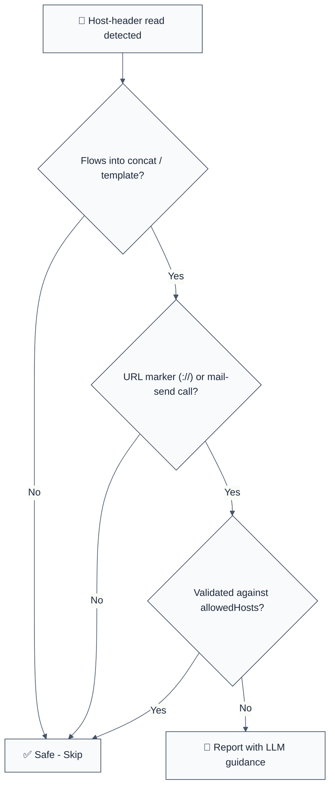

> **Keywords:** host header poisoning, password reset poisoning, X-Forwarded-Host, CWE-640, account takeover, reset link, verification link, express security, nodemailer, sendMail

<!-- @rule-summary -->

Disallow building absolute URLs (password-reset and verification links) from the Host or X-Forwarded-Host request header.
<!-- @/rule-summary -->

**CWE:** [CWE-640](https://cwe.mitre.org/data/definitions/640.html)  
**OWASP:** [A07:2021 – Identification and Authentication Failures](https://owasp.org/Top10/A07_2021-Identification_and_Authentication_Failures/)

Detects Host-header poisoning: absolute URLs — most critically password-reset and account-verification links — built from `req.headers.host`, `req.headers['x-forwarded-host']`, or `req.get('host')`. Both headers are attacker-controlled on any request that reaches the app directly, so a mailed link built from them can point the recovery token at an attacker-owned server. This rule is part of [`eslint-plugin-express-security`](https://www.npmjs.com/package/eslint-plugin-express-security) and provides LLM-optimized error messages.

**🚨 Security rule** | **💡 Provides LLM-optimized guidance** | **⚠️ Set to error in `recommended`**

## Quick Summary

| Aspect            | Details                                                                             |
| ----------------- | ----------------------------------------------------------------------------------- |
| **CWE Reference** | [CWE-640](https://cwe.mitre.org/data/definitions/640.html) (Weak Password Recovery) |
| **Severity**      | 🔴 HIGH (account takeover via reset-link poisoning)                                 |
| **Auto-Fix**      | ❌ Not available (💡 suggestion: use a configured origin)                           |
| **Category**      | Security                                                                            |
| **ESLint MCP**    | ✅ Optimized for ESLint MCP integration                                             |
| **Best For**      | Express apps that email password-reset, invite, or verification links               |

## Vulnerability and Risk

**Vulnerability:** The `Host` header (and `X-Forwarded-Host`, which most proxies pass through untouched) is chosen by the client. When a reset link is built as `'https://' + req.headers.host + '/reset?token=' + token`, an attacker requests a reset for the victim's email with `Host: evil.example` — and the victim receives a legitimate-looking email whose link delivers the reset token straight to the attacker.

**Risk:**

- **Account takeover:** The leaked reset token lets the attacker set a new password for the victim's account.
- **Silent exploitation:** The victim initiated nothing; a forged reset request plus one click on a real email from the real sender is enough.
- **Cache poisoning amplification:** Host-header-derived URLs stored in caches or emails persist the poisoned origin beyond a single request.

## Rule Details

The rule flags a host-header read (or a variable assigned from one in the same file) that participates in URL-building string concatenation or a template literal. "URL-building" means a static fragment contains `://` or starts with `//`, OR the string is an argument of a mail-send call (`sendMail` / `send` by default).



## Error Message Format

The rule provides **LLM-optimized error messages** with actionable security guidance:

```text
🔒 CWE-640 | Host-Header Poisoning (CWE-640) | HIGH
   A URL is built from req.headers['host'], which the client controls.
   Fix: Build absolute links from a server-side constant (e.g. process.env.PUBLIC_ORIGIN), never from request headers. | https://cwe.mitre.org/data/definitions/640.html
```

## Configuration

| Option             | Type       | Default                | Description                                                                  |
| :----------------- | :--------- | :--------------------- | :--------------------------------------------------------------------------- |
| `allowedHosts`     | `string[]` | `[]`                   | Trusted literal hosts — an if-guard comparing against one suppresses reports |
| `checkMailCallees` | `string[]` | `['sendMail', 'send']` | Callee names treated as mail-send sinks                                      |

### Example Configuration

```json
{
  "rules": {
    "express-security/no-host-header-in-links": [
      "error",
      {
        "allowedHosts": ["app.example.com"],
        "checkMailCallees": ["sendMail", "send", "deliver"]
      }
    ]
  }
}
```

## Examples

### ❌ Incorrect

```typescript
// ❌ Reset link built from the Host header
const resetUrl = 'https://' + req.headers.host + '/reset?token=' + token;

// ❌ X-Forwarded-Host is just as attacker-controlled
const origin = req.headers['x-forwarded-host'] || req.headers.host;
await mailer.sendMail({
  to: user.email,
  text: 'Recover here: https://' + origin + '/recover/' + token,
});

// ❌ Template literals are flagged too
const link = `https://${req.get('host')}/verify?code=${code}`;
```

### ✅ Correct

```typescript
// ✅ Origin is a deployment constant
const PUBLIC_ORIGIN = process.env.PUBLIC_ORIGIN || 'https://app.example.com';
const resetUrl = PUBLIC_ORIGIN + '/reset?token=' + encodeURIComponent(token);

// ✅ Host used only for logging — no URL building
console.log('incoming host: ' + req.headers.host);

// ✅ Host validated against an allowlist (with allowedHosts configured)
const host = req.headers.host;
if (host === 'app.example.com') {
  const url = 'https://' + host + '/reset';
}
```

## Security Impact

| Vulnerability             | CWE | OWASP    | CVSS | Impact                        |
| ------------------------- | --- | -------- | ---- | ----------------------------- |
| Weak Password Recovery    | 640 | A07:2021 | 8.1  | Account takeover              |
| Open Redirect (related)   | 601 | A01:2021 | 6.1  | Phishing amplification        |
| Cache Poisoning (related) | 444 | A05:2021 | 6.5  | Persistent poisoned responses |

## Why This Matters

### Real-World Exploits

Password-reset poisoning via the Host header is a classic, repeatedly rediscovered bug class — it has been reported against Django, WordPress plugins, and countless bespoke Express apps. The attack needs no victim interaction beyond clicking a genuine email from the genuine sender, which makes it far more convincing than ordinary phishing.

### Prevention Strategy

1. **Configured origin:** Read the public origin from configuration (`process.env.PUBLIC_ORIGIN`) — never from the request.
2. **Host allowlist at the edge:** Reject requests whose `Host` is not in a known set before they reach application code.
3. **Proxy hygiene:** Strip or overwrite `X-Forwarded-Host` at the first trusted proxy.

## Known False Negatives

The following patterns are **not detected** due to static analysis limitations:

### Cross-function flow

**Why**: Tracking is same-file, single-hop (variable assigned directly from a host read).

```typescript
// ❌ NOT DETECTED
function origin(req) {
  return req.headers.host;
}
const url = 'https://' + origin(req);
```

### Computed access chains

**Why**: `req['headers'].host` and `req.headers[name]` are not resolved.

```typescript
// ❌ NOT DETECTED
const h = req['headers'].host;
```

### URL construction APIs

**Why**: Only string concatenation and template literals are analyzed.

```typescript
// ❌ NOT DETECTED
const url = new URL(path, 'https://' + req.headers.host);
```

## Related Rules

- [`no-user-controlled-redirect`](./no-user-controlled-redirect.md) - Prevents open redirects from request data.
- [`no-error-details-in-response`](./no-error-details-in-response.md) - Prevents leaking stack traces.
- [`no-sensitive-data-in-query`](./no-sensitive-data-in-query.md) - Prevents secrets in query strings.

## Further Reading

- **[CWE-640: Weak Password Recovery Mechanism](https://cwe.mitre.org/data/definitions/640.html)**
- **[OWASP: Forgot Password Cheat Sheet](https://cheatsheetseries.owasp.org/cheatsheets/Forgot_Password_Cheat_Sheet.html)**
- **[PortSwigger: Password reset poisoning](https://portswigger.net/web-security/host-header/exploiting/password-reset-poisoning)**
