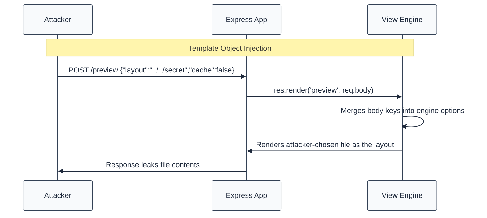
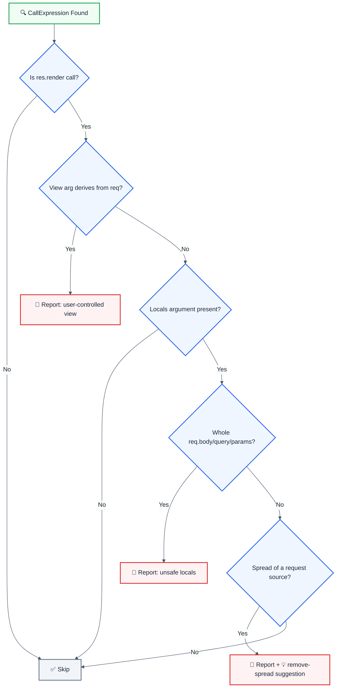

> **Keywords:** template injection, render locals, CWE-73, external control of file name or path, res.render, view engine, pug, ejs, path traversal, ESLint rule, LLM-optimized

<!-- @rule-summary -->

Disallow res.render() with locals or view names sourced wholesale from req.body / req.query / req.params
<!-- @/rule-summary -->

Detects template-object injection where `res.render()` receives locals wholly controlled by the request, or a view name derived from request input. This rule is part of [`eslint-plugin-express-security`](https://www.npmjs.com/package/eslint-plugin-express-security) and provides LLM-optimized error messages.

⚠️ This rule **_errors_** by default in the `recommended` config.

## Quick Summary

| Aspect            | Details                                                           |
| ----------------- | ----------------------------------------------------------------- |
| **CWE Reference** | CWE-73 (External Control of File Name or Path)                    |
| **Severity**      | 🔴 High                                                           |
| **Auto-Fix**      | 💡 Suggestion (removes the request-object spread)                 |
| **Category**      | Security                                                          |
| **Best For**      | Express.js apps with server-side templates (Pug, EJS, Handlebars) |

## Value & investment case

> Why this rule pays for itself. Framework: [`cicd-impact/philosophy.md`](../../../../cicd-impact/philosophy.md).

| Dimension                    | Value                                                                                                                                                                                                                                                                                   |
| :--------------------------- | :-------------------------------------------------------------------------------------------------------------------------------------------------------------------------------------------------------------------------------------------------------------------------------------- |
| **CWE**                      | [CWE-73](https://cwe.mitre.org/data/definitions/73.html) — External Control of File Name or Path                                                                                                                                                                                        |
| **Feedback-loop tier**       | Editor / pre-commit (sub-second) — cheapest layer per the [feedback-loop hierarchy](../../../../cicd-impact/philosophy.md#the-feedback-loop-hierarchy--why-a-high-end-static-analyzer-is-the-highest-leverage-investment)                                                               |
| **Defensive-layer leverage** | ~10× cheaper than unit-test · ~1,000× cheaper than production rollback · 10,000+× cheaper than customer disclosure ([cost-ratio anchors](../../../../cicd-impact/philosophy.md#deliverability-axis--quality-risk-and-ma-diligence))                                                     |
| **Niche relevance**          | **Critical:** B2C apps with server-rendered pages, CMS/marketplace platforms · **High:** B2B SaaS with templated emails/PDF exports · **Medium:** API-only services                                                                                                                     |
| **Investor-frame impact**    | `res.render(view, req.body)` hands the view engine its own configuration: a request key like `layout`, `settings` or `cache` can point the engine at attacker-chosen files, escalating to local file disclosure or (engine-dependent) RCE. Catch at lint-time removes the entire class. |

**Read also:** [`philosophy.md` §investor-frame](../../../../cicd-impact/philosophy.md#the-investor-frame--engineering-efficiency-as-a-portfolio-metric) · [`niche-presets.json`](../../../../cicd-impact/data/niche-presets.json) · [`analyzer-evaluation-framework.md`](../../../../cicd-impact/analyzer-evaluation-framework.md)

## Vulnerability and Risk

**Vulnerability:** Express merges the render locals object into the view-engine options. When the whole `req.body` / `req.query` / `req.params` object is forwarded — directly, via spread, or via a variable — every request key becomes an engine option.

**Risk:** An attacker posts `{"layout": "../../etc/passwd"}` (or `settings`, `cache`, `filename`, engine-specific keys) and reconfigures the template engine: local file disclosure, template-cache poisoning, and in some engines code execution. A user-controlled VIEW name additionally enables traversal into unintended templates.

## How the Attack Works



## Rule Logic Flow



## Detection Patterns

| Pattern                                   | Risk        | Description                                |
| ----------------------------------------- | ----------- | ------------------------------------------ |
| `res.render(view, req.body)`              | 🔴 Critical | Whole request object as locals             |
| `res.render(view, { ...req.query })`      | 🔴 Critical | Spread forwards every request key          |
| `const l = req.body; res.render(view, l)` | 🔴 High     | Whole object via single assignment         |
| `res.render(view, transform(req.body))`   | 🟡 High     | Unknown call forwarding the whole object   |
| `res.render(req.params.page)`             | 🔴 High     | User-controlled view name (path traversal) |
| `res.render('pages/' + req.query.p)`      | 🔴 High     | View path built from request input         |

## Examples

### ❌ Incorrect

```javascript
// Whole request object as locals - VULNERABLE
app.post('/preview', (req, res) => {
  res.render('preview', req.body);
});

// Spread forwards every request key - VULNERABLE
app.get('/newsletter', (req, res) => {
  res.render('newsletter', { ...req.query, generatedAt: Date.now() });
});

// Single assignment does not sanitize - VULNERABLE
const locals = req.body;
res.render('post', locals);

// User-controlled view name - VULNERABLE (path traversal)
res.render(req.query.view);
res.render(`pages/${req.params.name}`);
```

### ✅ Correct

```javascript
// Field-picking is THE safe pattern - SAFE
app.post('/preview', (req, res) => {
  res.render('preview', {
    title: String(req.body.title || ''),
    body: String(req.body.body || ''),
    authorName: String(req.body.authorName || 'anonymous'),
  });
});

// Static locals - SAFE
res.render('home', { title: 'Welcome' });

// Allowlisted sanitizer (see options) - SAFE
res.render('post', pick(req.body, ['title', 'body']));

// Fixed view names mapped from input - SAFE
const view = ALLOWED_VIEWS.has(req.query.tab) ? req.query.tab : 'default';
```

> Note: the last example assigns a single field (`req.query.tab`) — the rule
> flags view names _derived from request input_ like `res.render(req.query.tab)`;
> map input onto a fixed set of literals instead.

## Error Message Format

The rule provides **LLM-optimized error messages** (Compact 2-line format) with actionable security guidance:

```text
🔒 CWE-73 | Template Object Injection (CWE-73) | HIGH
   Fix: Pick only the fields the template needs into an explicit object literal | https://cwe.mitre.org/data/definitions/73.html
```

### Message Components

| Component                 | Purpose                | Example                                                   |
| :------------------------ | :--------------------- | :-------------------------------------------------------- |
| **Risk Standards**        | Security benchmarks    | [CWE-73](https://cwe.mitre.org/data/definitions/73.html)  |
| **Issue Description**     | Specific vulnerability | `Template Object Injection` / `User-Controlled View Path` |
| **Severity & Compliance** | Impact assessment      | `HIGH`                                                    |
| **Fix Instruction**       | Actionable remediation | `Pick only the fields the template needs`                 |
| **Technical Truth**       | Official reference     | [CWE-73](https://cwe.mitre.org/data/definitions/73.html)  |

## Configuration

```javascript
{
  rules: {
    "express-security/no-user-controlled-render-locals": ["error", {
      allowSanitizers: ["pick", "sanitizeLocals"]
    }]
  }
}
```

## Options

| Option | Type | Default | Description |
| ------ | ---- | ------- | ----------- |
| `allowSanitizers` | `string[]` | — | Callee names that sanitize locals (e.g. ["pick", "sanitizeLocals"]); calls to them are not flagged |

## Best Practices

### 1. Pick Fields, Never Forward Objects

```javascript
res.render('profile', {
  name: String(req.body.name || ''),
  bio: String(req.body.bio || ''),
});
```

### 2. Centralize a Sanitizer and Allowlist It

```javascript
// locals.js
export const pickLocals = (source, fields) =>
  Object.fromEntries(
    fields.filter((f) => f in source).map((f) => [f, String(source[f])]),
  );

// route — with allowSanitizers: ['pickLocals']
res.render('post', pickLocals(req.body, ['title', 'body']));
```

### 3. Map User Input to Fixed View Names

```javascript
const VIEWS = { news: 'pages/news', jobs: 'pages/jobs' };
res.render(VIEWS[req.query.tab] ?? 'pages/home');
```

## Related Rules

- [`no-user-controlled-redirect`](./no-user-controlled-redirect.md) - Open redirect from request input
- [`no-static-root-exposure`](./no-static-root-exposure.md) - Application root served statically

## Known False Negatives

The following patterns are **not detected** due to static analysis limitations:

### Reassignment After Declaration

**Why**: Only single-assignment `const`/`let` declarations are tracked.

```typescript
// ❌ NOT DETECTED - Reassigned later
let locals = {};
locals = req.body;
res.render('post', locals);
```

**Mitigation**: Prefer `const` with explicit field-picking.

### Cross-Function Flow

**Why**: The rule does not follow values through function boundaries.

```typescript
// ❌ NOT DETECTED - Locals built elsewhere
function buildLocals(req) {
  return req.body;
}
res.render('post', buildLocals(req));
```

**Mitigation**: Sanitize at the render call site; allowlist trusted helpers via `allowSanitizers`.

### Partial Object Forwarding

**Why**: A nested request object (`req.body.profile`) is a field access, and field-picking is treated as the safe pattern.

```typescript
// ❌ NOT DETECTED - Nested object still user-shaped
res.render('profile', req.body.profile);
```

**Mitigation**: Pick scalar fields, not sub-objects.

### Computed Source Properties

**Why**: `req['body']` uses a computed member access that is not matched.

```typescript
// ❌ NOT DETECTED - Computed access
res.render('post', req['body']);
```

**Mitigation**: Avoid computed access to request sources.

## Resources

- [CWE-73: External Control of File Name or Path](https://cwe.mitre.org/data/definitions/73.html)
- [OWASP A03:2021 – Injection](https://owasp.org/Top10/A03_2021-Injection/)
- [Express res.render() API](https://expressjs.com/en/4x/api.html#res.render)
- [PortSwigger: Server-Side Template Injection](https://portswigger.net/web-security/server-side-template-injection)
