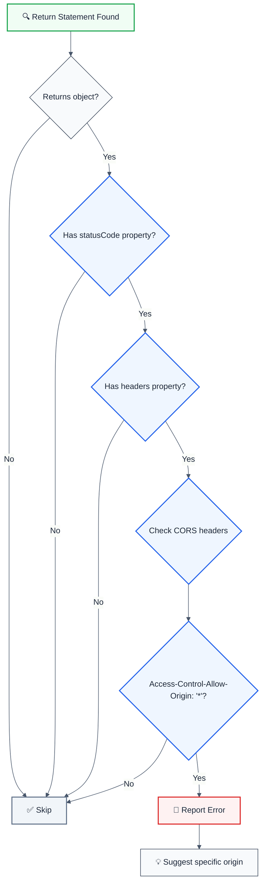

# no-permissive-cors-response

> **Keywords:** CORS, Lambda, API Gateway, CWE-942, security, Access-Control-Allow-Origin, wildcard, auto-fix

Detects permissive CORS headers in Lambda API Gateway responses. This rule is part of [`eslint-plugin-lambda-security`](https://www.npmjs.com/package/eslint-plugin-lambda-security).

⚠️ This rule **_errors_** by default in the `recommended` config.

## Quick Summary

| Aspect            | Details                                          |
| ----------------- | ------------------------------------------------ |
| **CWE Reference** | CWE-942 (Permissive Cross-domain Policy)         |
| **Severity**      | 🔴 High                                          |
| **Auto-Fix**      | ✅ Yes                                           |
| **Category**      | Security                                         |
| **Best For**      | Lambda functions returning API Gateway responses |

## Vulnerability and Risk

**Vulnerability:** Lambda functions that return responses with `Access-Control-Allow-Origin: *` allow any website to access the API.

**Risk:** Combined with credentials, attackers can steal authentication tokens or session data from users who visit malicious sites.

## Rule Logic Flow



## Examples

### ❌ Incorrect

```javascript
// Lambda handler with wildcard CORS - VULNERABLE
export const handler = async (event) => {
  return {
    statusCode: 200,
    headers: {
      'Access-Control-Allow-Origin': '*',
      'Content-Type': 'application/json',
    },
    body: JSON.stringify({ data: 'sensitive' }),
  };
};

// Also vulnerable in error responses
export const handler = async () => {
  return {
    statusCode: 500,
    headers: {
      'Access-Control-Allow-Origin': '*',
    },
    body: JSON.stringify({ error: 'Internal error' }),
  };
};
```

### ✅ Correct

```javascript
// Specific origin - SAFE
export const handler = async (event) => {
  return {
    statusCode: 200,
    headers: {
      'Access-Control-Allow-Origin': 'https://app.example.com',
      'Content-Type': 'application/json',
    },
    body: JSON.stringify({ data: 'sensitive' }),
  };
};

// Dynamic origin validation - SAFE
const ALLOWED_ORIGINS = [
  'https://app.example.com',
  'https://admin.example.com',
];

export const handler = async (event) => {
  const origin = event.headers?.origin || event.headers?.Origin;
  const allowedOrigin = ALLOWED_ORIGINS.includes(origin)
    ? origin
    : ALLOWED_ORIGINS[0];

  return {
    statusCode: 200,
    headers: {
      'Access-Control-Allow-Origin': allowedOrigin,
      Vary: 'Origin',
    },
    body: JSON.stringify({ data: 'sensitive' }),
  };
};
```

## Options

| Option         | Type      | Default | Description                         |
| -------------- | --------- | ------- | ----------------------------------- |
| `allowInTests` | `boolean` | `false` | Allow permissive CORS in test files |

```json
{
  "rules": {
    "lambda-security/no-permissive-cors-response": "error"
  }
}
```

## Best Practices

### 1. Use Environment Variable for Origin

```javascript
const ALLOWED_ORIGIN = process.env.CORS_ORIGIN || 'https://app.example.com';

return {
  statusCode: 200,
  headers: {
    'Access-Control-Allow-Origin': ALLOWED_ORIGIN,
  },
  body: JSON.stringify(data),
};
```

### 2. Add Vary Header for Dynamic Origins

```javascript
headers: {
  'Access-Control-Allow-Origin': validatedOrigin,
  'Vary': 'Origin'  // Important for caching
}
```

## Related Rules

- [`no-permissive-cors-middy`](./no-permissive-cors-middy.md) - CORS in Middy middleware

## Resources

- [CWE-942: Permissive Cross-domain Policy](https://cwe.mitre.org/data/definitions/942.html)
- [AWS API Gateway CORS](https://docs.aws.amazon.com/apigateway/latest/developerguide/how-to-cors.html)
