> **Keywords:** CORS, Lambda, API Gateway, CWE-942, security, Access-Control-Allow-Origin, wildcard, auto-fix

<!-- @rule-summary -->
Detects permissive CORS headers in Lambda API Gateway responses
<!-- @/rule-summary -->

**CWE:** [CWE-942](https://cwe.mitre.org/data/definitions/942.html)  
**OWASP Mobile:** [M8: Security Misconfiguration](https://owasp.org/www-project-mobile-top-10/)

Detects permissive CORS headers in Lambda API Gateway responses. This rule is part of [`eslint-plugin-lambda-security`](https://www.npmjs.com/package/eslint-plugin-lambda-security).

⚠️ This rule **_errors_** by default in the `recommended` config.

## Quick Summary

| Aspect            | Details                                          |
| ----------------- | ------------------------------------------------ |
| **CWE Reference** | CWE-942 (Permissive Cross-domain Policy)         |
| **Severity**      | 🔴 High                                          |
| **Auto-Fix**      | ✅ Yes                                           |
| **Category**   | Security |
| **Best For**      | Lambda functions returning API Gateway responses |

## Vulnerability and Risk

**Vulnerability:** Lambda functions that return responses with `Access-Control-Allow-Origin: *` allow any website to access the API.

**Risk:** Combined with credentials, attackers can steal authentication tokens or session data from users who visit malicious sites.

## Rule Logic Flow

```mermaid
%%{init: {
  'theme': 'base',
  'themeVariables': {
    'primaryColor': '#f8fafc',
    'primaryTextColor': '#1e293b',
    'primaryBorderColor': '#334155',
    'lineColor': '#475569'
  }
}}%%
flowchart TD
    A[🔍 Return Statement Found] --> B{Returns object?}
    B -->|No| C[✅ Skip]
    B -->|Yes| D{Has statusCode property?}
    D -->|No| C
    D -->|Yes| E{Has headers property?}
    E -->|No| C
    E -->|Yes| F{Check CORS headers}
    F --> G{Access-Control-Allow-Origin: '*'?}
    G -->|Yes| H[🚨 Report Error]
    G -->|No| C
    H --> I[💡 Suggest specific origin]

    classDef startNode fill:#f0fdf4,stroke:#16a34a,stroke-width:2px
    classDef errorNode fill:#fef2f2,stroke:#dc2626,stroke-width:2px
    classDef processNode fill:#eff6ff,stroke:#2563eb,stroke-width:2px
    classDef skipNode fill:#f1f5f9,stroke:#64748b,stroke-width:2px

    class A startNode
    class H errorNode
    class D,E,F,G processNode
    class C skipNode
```



## Examples

### ❌ Incorrect

```javascript
// Lambda handler with wildcard CORS - VULNERABLE
export const handler = async (event) => {
  return {
    statusCode: 200,
    headers: {
      'Access-Control-Allow-Origin': '*',
      'Content-Type': 'application/json',
    },
    body: JSON.stringify({ data: 'sensitive' }),
  };
};

// Also vulnerable in error responses
export const handler = async () => {
  return {
    statusCode: 500,
    headers: {
      'Access-Control-Allow-Origin': '*',
    },
    body: JSON.stringify({ error: 'Internal error' }),
  };
};
```

### ✅ Correct

```javascript
// Specific origin - SAFE
export const handler = async (event) => {
  return {
    statusCode: 200,
    headers: {
      'Access-Control-Allow-Origin': 'https://app.example.com',
      'Content-Type': 'application/json',
    },
    body: JSON.stringify({ data: 'sensitive' }),
  };
};

// Dynamic origin validation - SAFE
const ALLOWED_ORIGINS = [
  'https://app.example.com',
  'https://admin.example.com',
];

export const handler = async (event) => {
  const origin = event.headers?.origin || event.headers?.Origin;
  const allowedOrigin = ALLOWED_ORIGINS.includes(origin)
    ? origin
    : ALLOWED_ORIGINS[0];

  return {
    statusCode: 200,
    headers: {
      'Access-Control-Allow-Origin': allowedOrigin,
      Vary: 'Origin',
    },
    body: JSON.stringify({ data: 'sensitive' }),
  };
};
```

## Options

| Option         | Type      | Default | Description                         |
| -------------- | --------- | ------- | ----------------------------------- |
| `allowInTests` | `boolean` | `false` | Allow permissive CORS in test files |

```json
{
  "rules": {
    "lambda-security/no-permissive-cors-response": "error"
  }
}
```

## Best Practices

### 1. Use Environment Variable for Origin

```javascript
const ALLOWED_ORIGIN = process.env.CORS_ORIGIN || 'https://app.example.com';

return {
  statusCode: 200,
  headers: {
    'Access-Control-Allow-Origin': ALLOWED_ORIGIN,
  },
  body: JSON.stringify(data),
};
```

### 2. Add Vary Header for Dynamic Origins

```javascript
headers: {
  'Access-Control-Allow-Origin': validatedOrigin,
  'Vary': 'Origin'  // Important for caching
}
```

## Related Rules

- [`no-permissive-cors-middy`](./no-permissive-cors-middy.md) - CORS in Middy middleware

## Known False Negatives

The following patterns are **not detected** due to static analysis limitations:

### Headers from Variable

**Why**: Headers stored in variables are not analyzed.

```typescript
// ❌ NOT DETECTED - Headers from variable
const headers = { 'Access-Control-Allow-Origin': '*' };
return { statusCode: 200, headers, body: '...' };
```

**Mitigation**: Use inline headers. Validate config at startup.

### Headers from Spread

**Why**: Spread hides actual header values.

```typescript
// ❌ NOT DETECTED - Headers spread
const baseHeaders = getBaseHeaders(); // May include origin: '*'
return { statusCode: 200, headers: { ...baseHeaders }, body: '...' };
```

**Mitigation**: Explicitly define CORS headers inline.

### Response Factory Functions

**Why**: Response helpers are not recognized.

```typescript
// ❌ NOT DETECTED - Response factory
function createResponse(body) {
  return {
    statusCode: 200,
    headers: { 'Access-Control-Allow-Origin': '*' }, // Hidden
    body: JSON.stringify(body),
  };
}
export const handler = async () => createResponse({ data: 'test' });
```

**Mitigation**: Apply rule to response helper modules.

### API Gateway Configuration

**Why**: CORS configured at API Gateway level is not visible.

```typescript
// ❌ NOT DETECTED (correctly) - API Gateway handles CORS
// serverless.yml or SAM template has CORS: '*'
return { statusCode: 200, body: '...' };
```

**Mitigation**: Review API Gateway CORS configuration separately.

## Resources

- [CWE-942: Permissive Cross-domain Policy](https://cwe.mitre.org/data/definitions/942.html)
- [AWS API Gateway CORS](https://docs.aws.amazon.com/apigateway/latest/developerguide/how-to-cors.html)

## Error Message Format

The rule provides **LLM-optimized error messages** (Compact 2-line format) with actionable security guidance:

```text
🔒 CWE-942 OWASP:A01 CVSS:7.5 | CORS Misconfiguration detected | HIGH
   Fix: Review and apply the recommended fix | https://owasp.org/Top10/A01_2021/
```

### Message Components

| Component | Purpose | Example |
| :--- | :--- | :--- |
| **Risk Standards** | Security benchmarks | [CWE-942](https://cwe.mitre.org/data/definitions/942.html) [OWASP:A01](https://owasp.org/Top10/A01_2021-Injection/) CVSS Score |
| **Issue Description** | Specific vulnerability | `CORS Misconfiguration detected` |
| **Severity & Compliance** | Impact assessment | `HIGH` |
| **Fix Instruction** | Actionable remediation | `Follow the remediation steps below` |
| **Technical Truth** | Official reference | [OWASP Top 10](https://owasp.org/Top10/A01_2021-Injection/) |