> **Keywords:** no verbose error messages, information disclosure, security, ESLint rule, [CWE-209](https://cwe.mitre.org/data/definitions/209.html), error handling, stack trace, leak
> **CWE:** [CWE-209: Generation of Error Message Containing Sensitive Information](https://cwe.mitre.org/data/definitions/209.html)  
> **OWASP Mobile:** [OWASP Mobile Top 10 M4: Insufficient Input/Output Validation](https://owasp.org/www-project-mobile-top-10/)

ESLint Rule: no-verbose-error-messages. This rule is part of [`eslint-plugin-maintainability`](https://www.npmjs.com/package/eslint-plugin-maintainability).

## Quick Summary

| Aspect         | Details                                    |
| -------------- | ------------------------------------------ |
| **Severity**   | High (Information Disclosure)              |
| **Auto-Fix**   | ❌ No (requires custom error handling)     |
| **Category**   | Quality |
| **ESLint MCP** | ✅ Optimized for ESLint MCP integration    |
| **Best For**   | APIs and Backend-for-Frontend (BFF) layers |

## Vulnerability and Risk

**Vulnerability:** Verbose error reporting occurs when an application exposes internal details (like database queries, stack traces, or file paths) in response messages sent to the user.

**Risk:** Attackers can use these internal details to gain deep insights into the application's architecture, underlying technology stack, and potential weak points (like specific database versions or internal library names), which facilitates further attacks.

## Error Message Format

The rule provides **LLM-optimized error messages** (Compact 2-line format) with actionable security guidance:

```text
🔒 CWE-209 OWASP:M4 | Verbose Error Message detected | HIGH [InfoDisclosure,Recce]
   Fix: Do not expose raw error objects or stack traces to users; use generic messages | https://cwe.mitre.org/data/definitions/209.html
```

### Message Components

| Component                 | Purpose                | Example                                                                                                             |
| :------------------------ | :--------------------- | :------------------------------------------------------------------------------------------------------------------ |
| **Risk Standards**        | Security benchmarks    | [CWE-209](https://cwe.mitre.org/data/definitions/209.html) [OWASP:M4](https://owasp.org/www-project-mobile-top-10/) |
| **Issue Description**     | Specific vulnerability | `Verbose Error Message detected`                                                                                    |
| **Severity & Compliance** | Impact assessment      | `HIGH [InfoDisclosure,Recce]`                                                                                       |
| **Fix Instruction**       | Actionable remediation | `Do not expose raw error objects`                                                                                   |
| **Technical Truth**       | Official reference     | [Error Message Data Leak](https://cwe.mitre.org/data/definitions/209.html)                                          |

## Rule Details

This rule flags patterns where raw error objects (`err`, `error`), stack traces (`err.stack`), or generic database error objects are passed directly to response-sending methods.

```mermaid
%%{init: {
  'theme': 'base',
  'themeVariables': {
    'primaryColor': '#f8fafc',
    'primaryTextColor': '#1e293b',
    'primaryBorderColor': '#334155',
    'lineColor': '#475569',
    'c0': '#f8fafc',
    'c1': '#f1f5f9',
    'c2': '#e2e8f0',
    'c3': '#cbd5e1'
  }
}}%%
flowchart TD
    A[Error Caught] --> B{Sending to User?}
    B -->|Raw error object| C[🚨 High Risk Disclosure]
    B -->|Generic message| D[✅ Secure Error Response]
    C --> E[💡 Suggest centralized logger + generic ID]
```



### Why This Matters

| Issue                 | Impact                               | Solution                                                         |
| --------------------- | ------------------------------------ | ---------------------------------------------------------------- |
| 🕵️ **Reconnaissance** | System architecture leaked to actors | Use generic error messages (e.g., "Internal Server Error")       |
| 🚀 **Path Leakage**   | Absolute file paths exposed to users | Log detailed errors internally, but keep response bodies minimal |
| 🔒 **Compliance**     | Failure to protect system metadata   | Implement request correlation IDs for secure internal debugging  |

## Configuration

This rule has no configuration options in the current version.

## Examples

### ❌ Incorrect

```javascript
app.get('/user', async (req, res) => {
  try {
    const user = await db.query('...');
  } catch (err) {
    // ❌ EXPOSURE: Directly sending the error object
    res.status(500).send(err);

    // ❌ EXPOSURE: Specifically sending the stack trace
    console.error(err);
    res.json({ error: err.stack });
  }
});
```

### ✅ Correct

```javascript
app.get('/user', async (req, res) => {
  try {
    const user = await db.query('...');
  } catch (err) {
    // Log detailed error internally for developers
    logger.error('User query failed', { error: err, trace: err.stack });

    // ✅ SECURE: Send generic message with a correlation ID
    const errorId = generateErrorId();
    res.status(500).json({
      message: 'A system error occurred. Please try again later.',
      reference: errorId,
    });
  }
});
```

## Known False Negatives

The following patterns are **not detected** due to static analysis limitations:

### Proxy Errors

**Why**: If a backend proxy or gateway (like NGINX or an AWS API Gateway) is configured to return verbose errors, ESLint cannot detect this as it only scans application code.

**Mitigation**: Audit global infrastructure settings and ensure default error pages are generic.

### Custom Error Formatters

**Why**: If you use a custom error formatting library that _internally_ exposes sensitive data but the call site looks safe.

**Mitigation**: Rigorously audit any shared error-handling middleware for data leakage.

## References

- [CWE-209: Generation of Error Message Containing Sensitive Information](https://cwe.mitre.org/data/definitions/209.html)
- [OWASP Error Handling Cheat Sheet](https://cheatsheetseries.owasp.org/cheatsheets/Error_Handling_Cheat_Sheet.html)
- [Node.js Best Practices - Error Handling](https://github.com/goldbergyoni/nodebestpractices#2-error-handling-practices)
