> **Keywords:** require code minification, security, ESLint rule, [CWE-200](https://cwe.mitre.org/data/definitions/200.html), obfuscation, information disclosure, production hardening
> **CWE:** [CWE-200: Exposure of Sensitive Information](https://cwe.mitre.org/data/definitions/200.html)  
> **OWASP Mobile:** [OWASP Mobile Top 10 M8: Security Misconfiguration](https://owasp.org/www-project-mobile-top-10/)

ESLint Rule: require-code-minification. This rule is part of [`eslint-plugin-maintainability`](https://www.npmjs.com/package/eslint-plugin-maintainability).

## Quick Summary

| Aspect         | Details                                     |
| -------------- | ------------------------------------------- |
| **Severity**   | Low (Security Hardening)                    |
| **Auto-Fix**   | ❌ No (requires build tool configuration)   |
| **Category**   | Quality |
| **ESLint MCP** | ✅ Optimized for ESLint MCP integration     |
| **Best For**   | Web applications in production environments |

## Vulnerability and Risk

**Vulnerability:** Information disclosure occurs when production code is shipped without minification or obfuscation. Unminified code contains original variable names, comments, and structure that make it significantly easier for attackers to reverse-engineer and find vulnerabilities.

**Risk:** While not a primary vulnerability in itself, the lack of minification significantly reduces the "cost of attack" for reverse-engineering business logic, identifying hidden API endpoints, or finding vulnerable code patterns.

## Error Message Format

The rule provides **LLM-optimized error messages** (Compact 2-line format) with actionable security guidance:

```text
🔒 CWE-200 OWASP:M8 | Code Minification Required detected | LOW [Hardening]
   Fix: Ensure production build uses a minifier (e.g., Terser, Esbuild) | https://cwe.mitre.org/data/definitions/200.html
```

### Message Components

| Component                 | Purpose                | Example                                                                                                             |
| :------------------------ | :--------------------- | :------------------------------------------------------------------------------------------------------------------ |
| **Risk Standards**        | Security benchmarks    | [CWE-200](https://cwe.mitre.org/data/definitions/200.html) [OWASP:M8](https://owasp.org/www-project-mobile-top-10/) |
| **Issue Description**     | Specific vulnerability | `Code Minification Required detected`                                                                               |
| **Severity & Compliance** | Impact assessment      | `LOW [Hardening]`                                                                                                   |
| **Fix Instruction**       | Actionable remediation | `Ensure production build uses a minifier`                                                                           |
| **Technical Truth**       | Official reference     | [Exposure of Sensitive Info](https://cwe.mitre.org/data/definitions/200.html)                                       |

## Rule Details

This rule acts as a reminder that production deployments should always be minified. In many projects, this rule is configured to only run on production branches or during CI/CD to prevent accidental shipment of unminified source code.

```mermaid
%%{init: {
  'theme': 'base',
  'themeVariables': {
    'primaryColor': '#f8fafc',
    'primaryTextColor': '#1e293b',
    'primaryBorderColor': '#334155',
    'lineColor': '#475569',
    'c0': '#f8fafc',
    'c1': '#f1f5f9',
    'c2': '#e2e8f0',
    'c3': '#cbd5e1'
  }
}}%%
flowchart TD
    A[Build Configuration] --> B{Minification Active?}
    B -->|Yes| C[✅ Hardened Production Assets]
    B -->|No| D[🚨 Information Disclosure Risk]
    D --> E[💡 Enable Terser/Esbuild/SWC]
```



### Why This Matters

| Issue               | Impact                       | Solution                                                      |
| ------------------- | ---------------------------- | ------------------------------------------------------------- |
| 🕵️ **Reverse Eng.** | Logic and secrets exposed    | Strip comments and minify symbols                             |
| ⚡ **Performance**  | Larger bundle sizes          | Use production-ready build tools                              |
| 🔒 **Security**     | Reduced effort for attackers | Implement minification as part of a defense-in-depth strategy |

## Configuration

This rule accepts an options object to target specific environments:

```typescript
{
  "rules": {
    "maintainability/require-code-minification": ["warn", {
      "productionOnly": true, // Default: true. Only reports in production-like environments.
      "allowedEnvironments": ["production", "staging"]
    }]
  }
}
```

## Examples

### ❌ Incorrect

```javascript
// Production build manifest with unminified file tracking
const buildConfig = {
  minify: false, // ❌ HIGH RISK
  sourcemaps: true,
};
```

### ✅ Correct

```javascript
// Hardened production build configuration
const buildConfig = {
  minify: true,
  drop_console: true,
  drop_debugger: true,
};
```

## Known False Negatives

The following patterns are **not detected** due to static analysis limitations:

### Third-Party CDN Scripts

**Why**: This rule only checks your local build configuration/source. It cannot detect if external scripts you import are minified.

**Mitigation**: Always use `.min.js` versions of third-party libraries and implement Subresource Integrity (SRI).

### Dynamic Build Tools

**Why**: If your minification is handled by a separate pipeline (e.g., a custom Bash script) not visible to ESLint.

**Mitigation**: Use a central build manifest that is audited during the build process.

## References

- [CWE-200: Exposure of Sensitive Information](https://cwe.mitre.org/data/definitions/200.html)
- [Terser Documentation](https://terser.org/docs/api-reference)
- [Esbuild Minification](https://esbuild.github.io/api/#minify)
